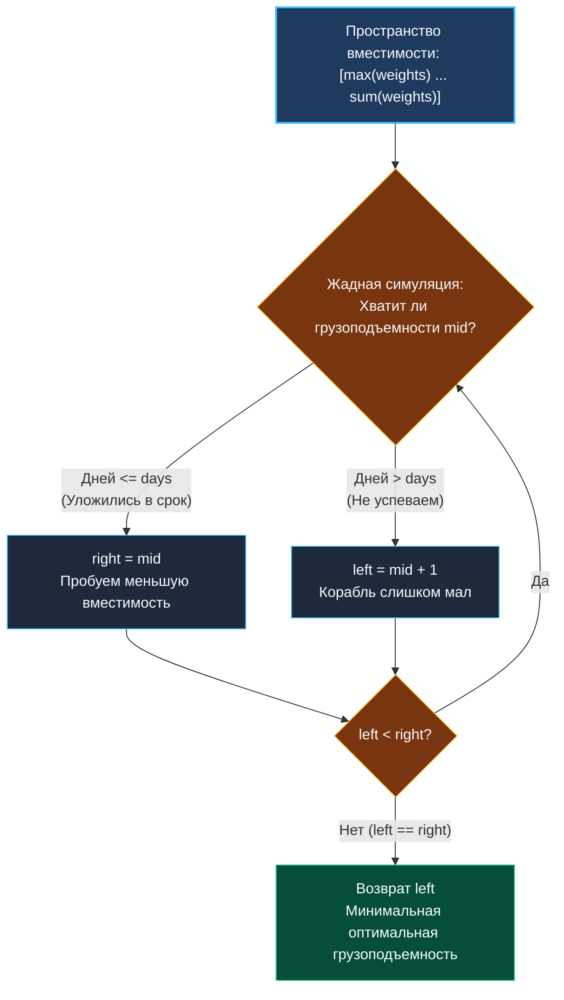

> *«Жадный алгоритм принимает лучшее решение в моменте, но именно глобальный поиск определяет границы его возможностей».*  
> — Дональд Кнут

В статье [[8. Koko Eating Bananas]] мы убедились, как бинарный поиск оптимизирует числовой параметр через замкнутую аналитическую формулу.

Однако в реальных бэкенд-сервисах предикат проверки редко сводится к элементарному суммированию. Значительно чаще функция валидации представляет собой **симуляцию физического или бизнес-процесса**.

Задача **Capacity To Ship Packages Within D Days** (LeetCode 1011) — классический образец такого синтеза. Здесь логарифмический поиск выступает в роли внешнего оптимизатора, а внутри каждого шага исполняется линейный жадный алгоритм упаковки (Greedy Simulation).

**Формулировка задачи:** На конвейере находится срез посылок с массами `weights`. Посылки обязаны грузиться на корабль **строго в исходном порядке следования** (нельзя менять местами или дробить грузы). Каждый рейс длится ровно один день, и корабль имеет фиксированную грузоподъемность $C$.  
Требуется найти **минимальную грузоподъемность $C$**, позволяющую перевезти все посылки не более чем за `days` дней.

---

## Архитектура: Определение инвариантов пространства поиска

Пространство возможных значений грузоподъемности $C$ монотонно:

$$C \in [\max(\text{weights}), \; \sum \text{weights}]$$

1. **Нижняя граница (`left = max(weights)`):** Корабль физически не способен разрезать посылку пополам. Следовательно, грузоподъемность не может быть меньше самой тяжелой посылки в списке. Если положить `left < max(weights)`, симуляция зависнет или станет невалидной.
2. **Верхняя граница (`right = sum(weights)`):** Если перевезти все посылки требуется за один день (`days = 1`), корабль обязан вместить весь груз сразу.
3. **Жадная симуляция (Предикат):** Для тестируемой грузоподъемности $C = mid$ мы последовательно наполняем корабль. Как только добавление следующей посылки превышает $C$, текущий корабль отправляется в плавание (день завершается), а посылка открывает следующий рейс. Если суммарное число дней $\le days$, грузоподъемность $mid$ допустима.



---

## Идиоматичная реализация на Go

```go
package main

// shipWithinDays находит минимальную грузоподъемность корабля
// для доставки всех посылок за days дней.
// Временная сложность: O(N * log(sum(weights) - max(weights)))
// Пространственная сложность: O(1)
func shipWithinDays(weights []int, days int) int {
	left, right := 0, 0

	// 1. Определение границ за один последовательный проход O(N)
	for _, w := range weights {
		if w > left {
			left = w // Нижняя граница: вес максимальной посылки
		}
		right += w   // Верхняя граница: сумма всех весов
	}

	// 2. Бинарный поиск оптимальной вместимости
	for left < right {
		mid := int(uint(left+right) >> 1)

		// 3. Жадный предикат: подсчет требуемых дней
		daysNeeded := 1
		currentLoad := 0

		for _, w := range weights {
			if currentLoad+w > mid {
				daysNeeded++
				currentLoad = 0
			}
			currentLoad += w
		}

		// 4. Сжатие границ
		if daysNeeded <= days {
			right = mid // Уложились, пробуем сделать корабль компактнее
		} else {
			left = mid + 1 // Превысили лимит дней, увеличиваем грузоподъемность
		}
	}

	return left
}
```

---

## Взгляд под капот: Mechanical Sympathy и аппаратный Prefetcher

Несмотря на то, что внутренний цикл симуляции `for _, w := range weights` исполняется $\approx 30$ раз, алгоритм работает феноменально быстро. Почему?

1. **Идеальный последовательный доступ (Spatial Locality):** Элементы среза `weights` расположены в оперативной памяти строго непрерывным блоком.
2. **Аппаратный Prefetcher CPU:** При первой итерации симуляции контроллер памяти процессора считывает линии кэша (Cache Lines по 64 байта). Распознав последовательный шаблон доступа, аппаратный префетчер упреждающе закачивает следующие участки массива в кэш L1/L2 еще до того, как код запросит их.
3. **Регистровая оптимизация:** Переменные `daysNeeded`, `currentLoad` и `mid` на протяжении всего цикла удерживаются в регистрах общего назначения (`RAX`, `RDX`, `RCX`). Операция сложения `currentLoad += w` не требует обращений в оперативную память.

В результате алгоритм трансформируется из потенциально медленного Memory-Bound в ультрабыстрый CPU-Bound, исполняемый со скоростью кэша процессора.

---

## Подводные камни и вопросы с собеседований

> [!WARNING] Ловушка: Инициализация нижней границы нулем
> Если инициализировать нижнюю границу наивно (`left = 1` или `left = 0`), алгоритм сломается.  
> Если $mid$ окажется меньше веса текущей посылки $w$, условие `currentLoad + w > mid` сработает, `currentLoad` сбросится в 0, а затем выполнится `currentLoad += w`. Получится, что в корабль погрузили посылку, превосходящую его максимальную грузоподъемность! Расчет дней станет невалидным.  
> Строгое равенство `left = max(weights)` — критический инвариант корректности жадной упаковки.

> [!INTERVIEW] Вопрос с собеседования: Батчинг в Message Queue и MTU
> **Вопрос:** Как этот алгоритм используется в сетевых протоколах и шинах данных?  
> **Ответ:** Ровно по этому принципу работает упаковка сетевых пакетов в Ethernet-кадры с фиксированным MTU (Maximum Transmission Unit, обычно 1500 байт), а также агрегация логов перед отправкой в Elastic/ClickHouse: сообщения накапливаются в батч до достижения лимита размера, после чего батч флашится, и начинается формирование нового.

---

## Резюме Кластера 09 (Бинарный поиск)

Мы завершили фундаментальное исследование бинарного поиска:
1. **Exact Match (`left <= right`):** Поиск точного элемента с ранним выходом.
2. **Lower Bound (`left < right`):** Поиск точки вставки, первого дефекта и минимального элемента в непрерывном пространстве ответов.
3. **Повернутые массивы:** Использование инварианта упорядоченной половины.
4. **Поиск по ответу:** Решение задач оптимизации через монотонные предикаты и жадные симуляции.

В следующем кластере мы перейдем к алгоритмам полного перебора с возвратом и ветвлением пространства состояний — разделу **Backtracking**: [[1. Теория. Backtracking]].