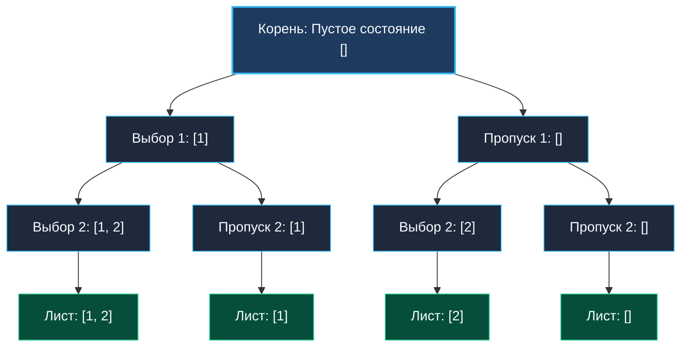

> *«Управление сложностью состоит в том, чтобы уметь исследовать путь до конца, а затем аккуратно стереть свои следы, если он оказался тупиком».*  
> — Брайан Керниган

**Backtracking (поиск с возвратом)** — это не просто рекурсивный перебор вариантов. Это строгая математическая техника исследования **дерева пространства состояний (State-Space Tree)**. 

В отличие от динамического программирования, где подзадачи многократно перекрываются и кэшируются в таблицах мемоизации, в поиске с возвратом каждая комбинация уникальна. Наша цель — построить все допустимые конфигурации или найти среди них оптимальную, отсекая (pruning) заведомо бесперспективные поддеревья задолго до того, как мы дойдем до листьев.

Для инженера на Go backtracking — это высший пилотаж владения рантаймом:
- как переиспользовать единый буфер среза и удерживать **$0$ паразитных аллокаций** на шагах спуска и отката;
- почему непрерывный стек горутины (Continuous Stack) делает рекурсию на Go на порядок дешевле классических потоков ОС;
- как семантика слайс-хидера (`SliceHeader`: указатель, длина, ёмкость) защищает от порчи данных при возврате из рекурсии;
- как правильно изолировать результаты через `Escape Analysis`.

---

## Анатомия Backtracking: Дерево решений и три фазы инварианта

Любой алгоритм поиска с возвратом моделирует обход дерева в глубину (DFS), где:
- **Корень** — пустое начальное состояние (нулевой выбор).
- **Внутренние вершины** — частичные префиксы решений.
- **Рёбра** — выбор очередного кандидата.
- **Листья** — завершенные валидные решения либо тупиковые ветви.

Каждый рекурсивный шаг подчиняется строгому триединству: **Выбор (Choose) $\rightarrow$ Исследование (Explore) $\rightarrow$ Откат (Unchoose)**.



---

## Канонический рекурсивный каркас на Go

В языке Go идиоматичным стандартом является использование локальной функции-замыкания (Closure) и переиспользование единственного слайса `path`:

```go
package main

// SubsetsTemplate демонстрирует эталонный каркас поиска с возвратом
func SubsetsTemplate(nums []int) [][]int {
	var result [][]int
	// Предвыделяем буфер под путь, чтобы избежать реаллокаций при спуске
	path := make([]int, 0, len(nums))

	var backtrack func(start int)
	backtrack = func(start int) {
		// 1. Фиксация результата: ОБЯЗАТЕЛЬНОЕ копирование!
		// Срез path мутирует на откатах, поэтому сохраняем независимый снимок
		snapshot := make([]int, len(path))
		copy(snapshot, path)
		result = append(result, snapshot)

		// 2. Перебор доступных вариантов
		for i := start; i < len(nums); i++ {
			// Фаза 1: Choose (добавляем элемент в текущий путь)
			path = append(path, nums[i])

			// Фаза 2: Explore (углубляемся в рекурсию)
			backtrack(i + 1)

			// Фаза 3: Unchoose / Backtrack (откатываем состояние назад)
			path = path[:len(path)-1]
		}
	}

	backtrack(0)
	return result
}
```

---

## Взгляд под капот: Mechanical Sympathy

### 1. Как `path[:len(path)-1]` работает на уровне памяти
Операция усечения среза `path = path[:len(path)-1]` не трогает физический массив в памяти!  
Срез в Go — это 24-байтовая структура в регистрах/стеке:
```go
type SliceHeader struct {
    Data unsafe.Pointer // Указатель на массив в памяти (8 байт)
    Len  int            // Длина (8 байт)
    Cap  int            // Емкость (8 байт)
}
```
При операции `path[:len(path)-1]` компилятор просто декрементирует поле `Len`. Никакой очистки байтов, никаких вызовов сборщика мусора, никакого копирования памяти. Следующий вызов `append` на этом уровне или в соседней ветке просто перезапишет старое значение по индексу `Len`. Это дает **абсолютно нулевые аллокации при откате**.

### 2. Стек горутины: 2 КБ против 8 МБ потока ОС
Классический системный поток Linux (pthread) резервирует под стек от 2 до 8 МБ виртуальной памяти. Глубокая рекурсия в языках вроде C или Java создает серьезные риски переполнения стека (StackOverflowError).  
В Go горутина стартует с крошечным непрерывным стеком размером **2 КБ** (в Go 1.4+ используется Continuous Stack вместо Segmented Stack).
- При углублении рекурсии, когда 2 КБ заполняются, рантайм Go (`runtime.morestack`) аллоцирует новый блок памяти вдвое большего размера (4 КБ, затем 8 КБ и т.д.), аккуратно копирует все стековые кадры и корректирует указатели.
- Для задач с глубиной $N \le 30$ глубина рекурсии составляет всего несколько десятков стековых фреймов, что идеально помещается в горячем кэше первого уровня (L1 Data Cache, 32-48 КБ) процессора.

### 3. Escape Analysis и неизбежная плата за результат
Почему мы обязаны делать `snapshot := make([]int, len(path)); copy(snapshot, path)`?
Если мы выполним наивное `result = append(result, path)`, то в массив результатов попадут множественные копии **заголовка слайса**, указывающие на один и тот же базовый массив памяти. После всех откатов массив `path` опустеет, и в `result` окажется набор пустых срезов!
Анализатор побега компилятора (`go build -gcflags="-m"`) обнаруживает, что `snapshot` сохраняется в срез `result`, который возвращается из внешней функции, и отправляет память под каждый `snapshot` в кучу (heap). Это единственная неизбежная аллокация в алгоритме.

---

## Pruning (Отсечение): Победа над экспонентой

Теоретическая сложность наивного перебора — факториальная $O(N!)$ или экспоненциальная $O(2^N)$. Без отсечения дерево состояний при $N=30$ содержит $2^{30} \approx 10^9$ вершин, что приведет к превышению лимита времени (Time Limit Exceeded).

**Отсечение (Pruning)** — это проверка инвариантов задачи, позволяющая выбросить целое поддерево еще до рекурсивного спуска:
1. **Отсечение по сумме:** если текущая сумма превысила `target`, а массив отсортирован по возрастанию, дальнейший перебор в цикле бессмысленен (`break`).
2. **Отсечение по оставшейся длине:** если для сбора комбинации длины $K$ в массиве осталось меньше элементов, чем требуется: `len(nums) - i < k - len(path)`, цикл немедленно прерывается.
3. **Отсечение дубликатов:** если входной массив отсортирован, пропуск одинаковых элементов на одном уровне дерева (`if i > start && nums[i] == nums[i-1] continue`) исключает генерацию изоморфных ветвей.

---

## Подводные камни и вопросы с собеседований

> [!WARNING] Ловушка: Передача слайса по указателю `*[]int`
> Кандидаты иногда пытаются передавать `path` по указателю: `backtrack(path *[]int)`.  
> Если внутри функции `append` вызовет реаллокацию массива (превышение `cap`), все вышестоящие фреймы рекурсии начнут видеть новый массив, что приведет к трудноуловимому искажению порядка отката.  
> **Идиоматичное правило:** Передавайте слайс по значению или используйте внешнюю переменную в замыкании с жестко фиксированной предварительной емкостью: `path := make([]int, 0, maxDepth)`.

> [!NOTE] Итеративный Backtracking против Рекурсивного
> В некоторых языках (Python, C++) рекурсивный поиск заменяют явным стеком `stack = []Frame`, чтобы избежать накладных расходов на вызовы функций. В Go компилятор отлично оптимизирует хвостовые и близкие к ним рекурсивные вызовы, а Continuous Stack минимизирует накладные расходы. Рекурсивный код на Go с замыканием значительно чище, компактнее и легче для чтения и сопровождения.

> [!INTERVIEW] Вопрос с собеседования: Алгоритм Девиса — Патнема — Логемана — Лавленда (DPLL)
> **Вопрос:** Как принципы Backtracking применяются в индустриальных SAT-солверах (Z3, minisat) и компиляторах?  
> **Ответ:** SAT-солверы проверяют выполнимость булевых формул с миллионами переменных. Они используют поиск с возвратом с продвинутым отсечением: unit propagation (распространение единичных дизъюнктов), pure literal elimination и non-chronological backtracking (прыжок назад сразу через десятки уровней к причине конфликта — conflict-driven clause learning).

---

## Резюме

Backtracking — это искусство контролируемого перебора:
- **Choose $\rightarrow$ Explore $\rightarrow$ Unchoose:** три фазы, гарантирующие чистоту состояния.
- **Zero Allocations на откате:** операция `path[:len(path)-1]` декрементирует `Len` без затрагивания памяти.
- **Deep Pruning:** правильное отсечение превращает экспоненциальный перебор в мгновенное решение.

В следующей статье мы применим этот каркас к классической комбинаторике: [[2. Генерация комбинаций]].