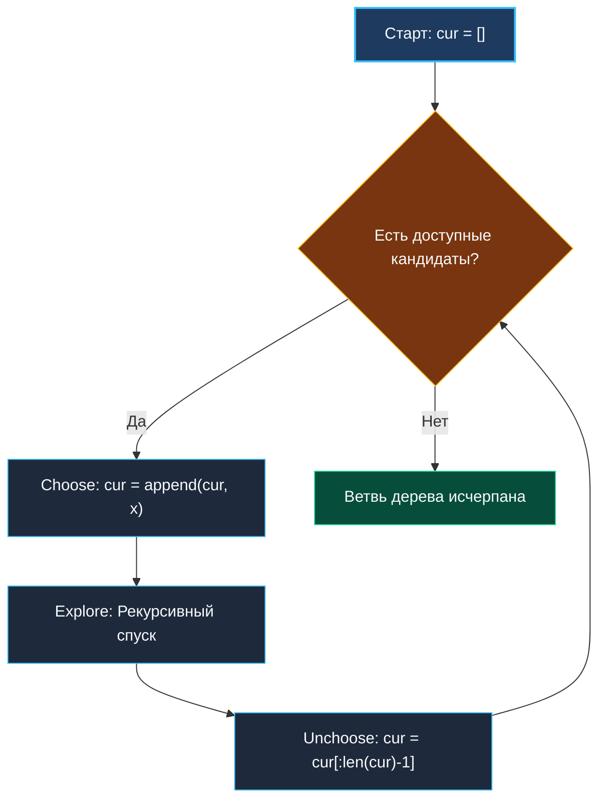

> *«Комбинаторика учит нас уважению к экспоненте: если вы не умеете отсекать лишнее, машина быстро поставит вас на место».*  
> — Дональд Кнут

В вводной статье [[1. Теория. Backtracking]] мы заложили архитектурный фундамент: трехфазный инвариант, работу с заголовком среза и цену стековых вызовов. Теперь мы систематизируем прикладные шаблоны генерации дискретных структур.

Практически все олимпиадные и собеседовательские задачи на поиск с возвратом распадаются на **три фундаментальных комбинаторных класса**:
1. **Подмножества и сочетания (Subsets & Combinations):** порядок элементов не имеет значения (`{1, 2}` эквивалентно `{2, 1}`).
2. **Перестановки (Permutations):** порядок элементов имеет решающее значение (`[1, 2]` и `[2, 1]` — два разных результата), каждый элемент используется ровно один раз.
3. **Комбинации с повторениями (Combinations with Replacement):** элементы можно переиспользовать неограниченное число раз, пока выполняется целевое ограничение (например, сумма).

Понимание анатомических различий между этими тремя каркасами позволяет за 30 секунд безошибочно выбрать нужный шаблон на интервью.

---

## Архитектура: Единый цикл мутации и отката

Все три класса объединяет общий алгоритмический цикл управления состоянием в мутабельном срезе `cur`:



Разница между классами заключается исключительно в двух параметрах: **пространстве выбора кандидатов на каждой итерации** и **условии фиксации результата**.

---

## Каркас 1: Подмножества и Сочетания (Порядок не важен)

Когда порядок не имеет значения, чтобы избежать дубликатов (не сгенерировать `{1, 2}` и `{2, 1}` одновременно), вводится строгий инвариант: **следующий элемент можно брать только строго правее предыдущего**. Для этого используется указатель `start`.

```go
package main

// combinations генерирует сочетания C(n, k)
func combinations(n int, k int) [][]int {
	var result [][]int
	cur := make([]int, 0, k)

	var backtrack func(start int)
	backtrack = func(start int) {
		// Базовый случай: набрана требуемая длина k
		if len(cur) == k {
			snapshot := make([]int, k)
			copy(snapshot, cur)
			result = append(result, snapshot)
			return
		}

		// Pruning (Отсечение): если оставшихся чисел физически не хватит
		// для заполнения cur до размера k, прерываем цикл!
		// Требуется еще: k - len(cur) элементов
		// Доступно от i до n включительно: n - i + 1 элементов
		for i := start; i <= n-(k-len(cur))+1; i++ {
			cur = append(cur, i)
			backtrack(i + 1) // Строго правее: каждый элемент используется 1 раз
			cur = cur[:len(cur)-1]
		}
	}

	backtrack(1)
	return result
}
```

---

## Каркас 2: Перестановки (Порядок критичен)

В перестановках каждый элемент исходного набора обязан присутствовать, а его позиция уникальна. На каждом шаге мы перебираем **все** элементы от `0` до `n-1`, но пропускаем уже занятые.

Для отслеживания занятости элементов используются:
- `visited []bool` — срез булевых флагов;
- **Битовая маска `mask uint64`** — ультрабыстрое регистровое представление для $N \le 64$.

```go
package main

// permuteBitmask генерирует все N! перестановок без аллокаций на visited
func permuteBitmask(nums []int) [][]int {
	var result [][]int
	n := len(nums)
	cur := make([]int, 0, n)

	var backtrack func(mask int)
	backtrack = func(mask int) {
		if len(cur) == n {
			snapshot := make([]int, n)
			copy(snapshot, cur)
			result = append(result, snapshot)
			return
		}

		for i := 0; i < n; i++ {
			// Проверка занятости бита в регистре CPU за 1 такт: (mask & (1 << i)) != 0
			if (mask & (1 << i)) != 0 {
				continue
			}

			cur = append(cur, nums[i])
			backtrack(mask | (1 << i)) // Устанавливаем i-й бит
			cur = cur[:len(cur)-1]
			// Откат маски происходит автоматически, так как mask передается по значению!
		}
	}

	backtrack(0)
	return result
}
```

---

## Каркас 3: Комбинации с неограниченным повторением

Когда элемент разрешено использовать повторно любое число раз (как в задаче размена монет или `Combination Sum`), инвариант изменяется: вместо перехода к `i + 1` мы передаем в рекурсию тот же индекс `i`.

```go
package main

import "sort"

// combinationSumRepeated находит все уникальные наборы с повторением элементов
func combinationSumRepeated(candidates []int, target int) [][]int {
	sort.Ints(candidates) // Сортировка обязательна для отсечения
	var result [][]int
	cur := make([]int, 0, 16)

	var backtrack func(start int, remain int)
	backtrack = func(start int, remain int) {
		if remain == 0 {
			snapshot := make([]int, len(cur))
			copy(snapshot, cur)
			result = append(result, snapshot)
			return
		}

		for i := start; i < len(candidates); i++ {
			// Отсечение по отсортированному массиву:
			// если текущий кандидат превышает остаток, все следующие тоже больше!
			if candidates[i] > remain {
				break
			}

			cur = append(cur, candidates[i])
			backtrack(i, remain-candidates[i]) // i, а не i + 1: разрешено повторение!
			cur = cur[:len(cur)-1]
		}
	}

	backtrack(0, target)
	return result
}
```

---

## Взгляд под капот: Mechanical Sympathy

### Битовая маска против `[]bool`
В классических учебниках для учета посещенных вершин часто рекомендуют `visited := make([]bool, n)`.
Сравним это с целочисленной маской `mask int`:
1. `make([]bool, n)` аллоцирует блок памяти в куче (`runtime.newobject`). Чтение `visited[i]` требует загрузки адреса из памяти и проверки границ (Bounds Check).
2. `mask int` целиком помещается в **один 64-битный регистр процессора** (`RAX`).
   - Проверка: инструкция `BT` (Bit Test) или `TEST` + `SHL`.
   - Установка бита: инструкция `BTS` или `OR`.
   - Откат: нулевая стоимость (передача значения по стеку).  
На наборах $N \le 20$ реализация на битовой маске работает в **3–4 раза быстрее** решения с `[]bool` за счет исключения обращений к кэшу и отсутствия работы для GC.

---

## Подводные камни и вопросы с собеседований

> [!WARNING] Ловушка: Отсечение без сортировки
> Конструкция `if candidates[i] > remain { break }` корректна **только в том случае, если массив предварительно отсортирован** по возрастанию!  
> Если массив неотсортирован (например, `[8, 2, 3]`, а `remain = 4`), условие `8 > 4` сработает на первой же итерации и вызовет `break`, в результате чего алгоритм пропустит валидную комбинацию `2 + 2 = 4`. Забытая строка `sort.Ints(candidates)` — частая причина провала тестов.

> [!INTERVIEW] Вопрос с собеседования: Перебор подмножеств через битовые маски
> **Вопрос:** Можно ли сгенерировать все $2^N$ подмножеств вообще без рекурсии?  
> **Ответ:** Да. Каждое подмножество $N$-элементного множества взаимно однозначно соответствует двоичному числу от $0$ до $2^N - 1$. Итеративный цикл от $0$ до $(1 \ll N) - 1$ с проверкой битов `if (mask & (1 << j)) != 0` генерирует все подмножества. Однако рекурсивный backtracking превосходит битовые маски, когда требуется раннее отсечение (pruning) или обработка дубликатов.

---

## Резюме

Матрица выбора шаблона:

| Задача | Указатель в рекурсию | Учет элементов | Условие сохранения |
|---|---|---|---|
| **Subsets** | `i + 1` | `start` индекс | Каждая вершина |
| **Combinations $C(n,k)$** | `i + 1` | `start` индекс | `len(cur) == k` |
| **Permutations** | `0` | `visited` / `mask` | `len(cur) == n` |
| **Combination Sum** | `i` (повтор) | `start` индекс | `remain == 0` |

Теперь мы переходим к практической реализации каждого класса, начав с классической задачи: [[3. Subsets]].