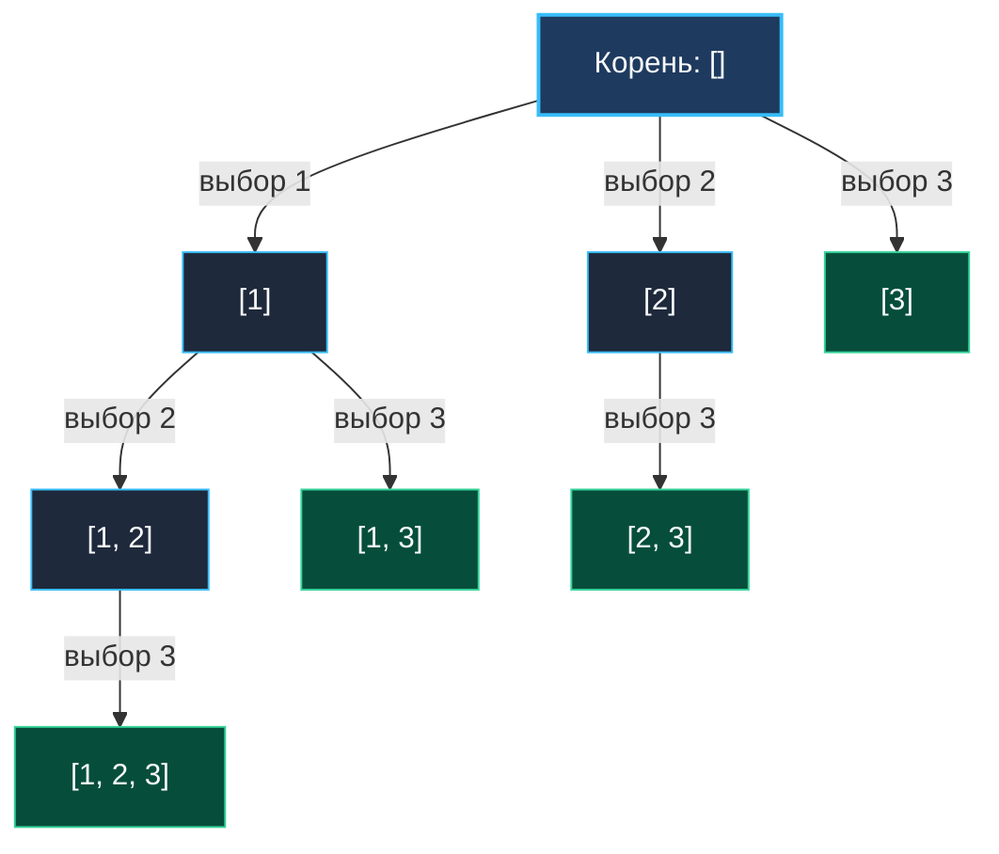

> *«Всякое множество содержит в себе все свои части, и мудрость состоит в том, чтобы перечислить их, ни разу не повторившись».*  
> — Бертран Рассел

Задача **Subsets** (LeetCode 78) — фундаментальная азбука комбинаторного поиска.  
**Условие:** Дан целочисленный срез `nums`, все элементы которого **строго уникальны**. Требуется вернуть булеан множества (степенное множество, Power Set) — список всех возможных подмножеств (включая пустое).

На этом примере senior-инженер демонстрирует эталонную культуру работы со структурами данных Go: как развернуть экспоненциальное пространство состояний $O(2^N)$ с **абсолютно нулевыми промежуточными аллокациями** и почему предварительное выделение емкости буфера спасает стек от фрагментации.

---

## Архитектура: Дерево пространства состояний для `nums = [1, 2, 3]`

Существует два равноправных взгляда на генерацию степенного множества:
1. **Бинарное дерево (Include / Exclude):** для каждого элемента мы делаем ровно два выбора: берем его в подмножество или пропускаем.
2. **N-арное дерево префиксов (Start-loop):** каждая вершина дерева сохраняется как валидное подмножество, а ребра представляют выбор следующего элемента с индексом `i >= start`.

Ниже представлено дерево состояний алгоритма со счетчиком `start` для массива `[1, 2, 3]`:



Каждый узел этого дерева (включая корень `[]`) представляет собой уникальное подмножество. Всего генерируется ровно $2^3 = 8$ подмножеств:  
`[]`, `[1]`, `[1, 2]`, `[1, 2, 3]`, `[1, 3]`, `[2]`, `[2, 3]`, `[3]`.

---

## Идиоматичная реализация на Go

```go
package main

// subsets генерирует все подмножества уникального набора чисел.
// Временная сложность: O(N * 2^N)
// Пространственная сложность: O(N) дополнительной памяти (стек + буфер path)
func subsets(nums []int) [][]int {
	n := len(nums)
	// Всего подмножеств ровно 2^n: предвыделяем емкость слайса результатов
	totalSubsets := 1 << n
	result := make([][]int, 0, totalSubsets)

	// Буфер текущего пути: емкость n гарантирует 0 реаллокаций при спуске!
	path := make([]int, 0, n)

	var backtrack func(start int)
	backtrack = func(start int) {
		// 1. Каждая вершина дерева состояний — валидное подмножество
		snapshot := make([]int, len(path))
		copy(snapshot, path)
		result = append(result, snapshot)

		// 2. Исследование вариантов: берем кандидатов строго правее start
		for i := start; i < n; i++ {
			path = append(path, nums[i]) // Choose
			backtrack(i + 1)             // Explore
			path = path[:len(path)-1]    // Unchoose (откат за 0 нс)
		}
	}

	backtrack(0)
	return result
}
```

---

## Взгляд под капот: Mechanical Sympathy

### 1. `path := make([]int, 0, n)` — устранение скрытых аллокаций
Если написать наивное `var path []int`, начальная емкость будет равна 0.  
По мере спуска в рекурсию рантайм Go при `append` будет последовательно выделять массивы емкостью 1, 2, 4, 8... Каждый такой шаг — это аллокация в куче и копирование старых данных.  
Инициализация `make([]int, 0, n)` гарантирует:
- Базовый массив создается ровно один раз.
- Глубина рекурсии никогда не превысит $n$.
- Все операции `append` и `path[:len(path)-1]` на всех $2^N$ ветвях дерева происходят **strictly in-place** в одном предварительно выделенном блоке памяти.

### 2. Сравнение с битовыми масками (Bitmask Alternative)
Подмножества можно генерировать итеративно без рекурсии через битовую маску:
```go
func subsetsBitmask(nums []int) [][]int {
    n := len(nums)
    total := 1 << n
    res := make([][]int, total)
    for mask := 0; mask < total; mask++ {
        sub := make([]int, 0, bits.OnesCount(uint(mask)))
        for i := 0; i < n; i++ {
            if (mask & (1 << i)) != 0 {
                sub = append(sub, nums[i])
            }
        }
        res[mask] = sub
    }
    return res
}
```
**Сравнение производительности:**
- Решение на битовых масках выигрывает в предсказуемости конвейера (нет рекурсивных вызовов), но ограничено $N \le 64$.
- Backtracking-подход универсален: он масштабируется на деревья с условиями раннего отсечения (pruning) и дубликатами, где перебор всех $2^N$ масок был бы расточительным.

---

## Подводные камни и вопросы с собеседований

> [!WARNING] Ловушка: Забытый снимок состояния
> Строка:
> ```go
> result = append(result, path) // КАТАСТРОФА
> ```
> В срез `result` добавляется заголовок слайса `path`, указывающий на единый внутренний массив. После всех откатов длина `path` станет равной 0. В итоге `result` будет содержать $2^N$ пустых слайсов!  
> Создание независимой копии `snapshot := make([]int, len(path)); copy(snapshot, path)` обязательно.

> [!INTERVIEW] Вопрос с собеседования: Временная сложность копирования
> **Вопрос:** Почему общая сложность равна $O(N \cdot 2^N)$, а не $O(2^N)$?  
> **Ответ:** Всего существует $2^N$ подмножеств. Но добавление каждого подмножества требует создания его копии. Средняя длина подмножества равна $N / 2$. Суммарное количество операций копирования элементов памяти составляет:
> $$\sum_{k=0}^{N} k \binom{N}{k} = N \cdot 2^{N-1} = O(N \cdot 2^N)$$
> Копирование данных в выходной массив доминирует по времени выполнения.

---

## Резюме

**Subsets** — каноническая модель поиска с возвратом:
- $2^N$ вершин дерева состояний проходятся за $O(N \cdot 2^N)$ с единым предварительно выделенным буфером.
- Декремент длины `path[:len(path)-1]` реализует мгновенный откат без давления на сборщик мусора.

Но что произойдет, если во входном массиве появятся повторяющиеся числа? Ветви начнут дублировать друг друга. Как предотвратить комбинаторный взрыв при наличии дубликатов — разбираем в следующей статье: [[4. Subsets II]].