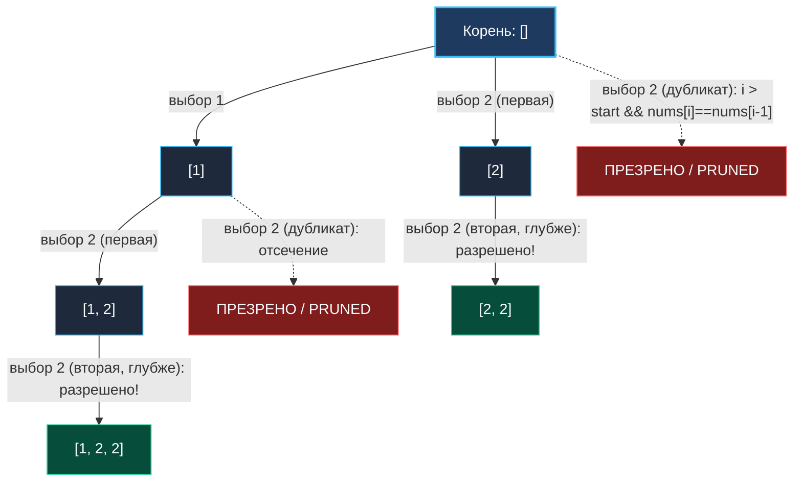

> *«Избавиться от повторений постфактум может любой; истинное мастерство состоит в том, чтобы не порождать их вовсе».*  
> — Брайан Керниган

В задаче [[3. Subsets]] все элементы исходного среза были уникальны. Однако в реальных данных дубликаты неизбежны.

Задача **Subsets II** (LeetCode 90) проверяет инженерную зрелость разработчика:  
**Условие:** Дан целочисленный срез `nums`, который может содержать **дублирующиеся элементы**. Требуется вернуть все уникальные подмножества (степенное множество). Результирующий список не должен содержать одинаковых подмножеств в любом порядке.

Наивный программист сгенерирует все $2^N$ комбинаций и профильтрует их через `map[string]struct{}`. Senior-инженер отсечет генерацию изоморфных ветвей **в момент их зарождения**, сохранив линейную память и нулевой оверхед по аллокациям.

---

## Архитектура: Инвариант пропуска на одном уровне дерева

Рассмотрим массив `nums = [1, 2, 2]`.  
Если мы отсортируем срез, одинаковые элементы расположатся строго рядом:



### Разгадка условия `i > start && nums[i] == nums[i-1]`
Почему именно `i > start`, а не `i > 0`?
- **По горизонтали (на одном уровне дерева рекурсии):**  
  Когда `i > start`, это означает, что мы уже попробовали запустить ветвь с элементом `nums[i-1]` на текущей позиции. Если текущий `nums[i] == nums[i-1]`, то запуск новой ветви с тем же числом породит абсолютно идентичное поддерево! Мы обязаны сделать `continue`.
- **По вертикали (вглубь рекурсии):**  
  Когда рекурсия переходит на следующий уровень, параметр `start` становится равным `i + 1`. На первом шаге нового уровня текущий индекс `i` равен `start` (`i == start`). Условие `i > start` оказывается ложным, и алгоритм **беспрепятственно берет второй дубликат в подмножество**.

Благодаря этому подмножество `[2, 2]` формируется без проблем, но комбинация `{первая 2}` и `{вторая 2}` как два изолированных подмножества никогда не дублируются!

---

## Идиоматичная реализация на Go

```go
package main

import "sort"

// subsetsWithDup генерирует все уникальные подмножества из массива с дубликатами.
// Временная сложность: O(N * 2^N) в худшем случае, существенно меньше при дубликатах
// Пространственная сложность: O(N) дополнительной памяти под стек и буфер path
func subsetsWithDup(nums []int) [][]int {
	// 1. Сортировка обязательна: группирует одинаковые числа в непрерывный кластер
	sort.Ints(nums)

	n := len(nums)
	var result [][]int
	path := make([]int, 0, n)

	var backtrack func(start int)
	backtrack = func(start int) {
		// Сохраняем снимок текущего уникального состояния
		snapshot := make([]int, len(path))
		copy(snapshot, path)
		result = append(result, snapshot)

		for i := start; i < n; i++ {
			// Отсекаем дубликаты на одном горизонтальном уровне дерева
			if i > start && nums[i] == nums[i-1] {
				continue
			}

			path = append(path, nums[i])
			backtrack(i + 1)
			path = path[:len(path)-1] // Откат
		}
	}

	backtrack(0)
	return result
}
```

---

## Взгляд под капот: Mechanical Sympathy

### Почему фильтрация через `map[string]struct{}` — антипаттерн
Рассмотрим, что происходит в памяти при «наивном» решении с мапой:
1. Каждое из $2^N$ подмножеств сериализуется в строку (например, через `fmt.Sprint` или конкатенацию байт). Это вызывает от 1 до 3 аллокаций в куче на каждое подмножество.
2. Строка передается в хэш-таблицу `map`. Рантайм Go вычисляет хэш по алгоритму AES-NI / Wyhash (`runtime.aeshash`), разрешает коллизии в бакетах и аллоцирует узлы карты в куче.
3. GC испытывает колоссальное давление, очищая сотни тысяч короткоживущих строк.

Наше решение с сортировкой и условием `i > start && nums[i] == nums[i-1]`:
- Сортировка `sort.Ints` работает in-place по алгоритму pdqsort (Pattern-Defeating Quicksort) с $O(1)$ дополнительной памяти.
- Проверка `nums[i] == nums[i-1]` — это одна процессорная инструкция `CMP` регистров без единого выхода в память.
- Алгоритм **в принципе не посещает** дублирующиеся ветви, экономя такты CPU и память.

---

## Подводные камни и вопросы с собеседований

> [!WARNING] Ловушка: Ошибка условия `i > 0`
> Если написать `if i > 0 && nums[i] == nums[i-1] { continue }`, алгоритм отсечет второй дубликат не только по горизонтали, но и по вертикали!  
> В результате вы никогда не сможете собрать подмножества, содержащие два одинаковых числа: массив `[2, 2]` вернет `[[], [2]]` вместо `[[], [2], [2, 2]]`.

> [!INTERVIEW] Вопрос с собеседования: Связь с формулой мультимножеств
> **Вопрос:** Сколько всего уникальных подмножеств существует у массива, содержащего $k_1$ копий первого числа, $k_2$ копий второго и $k_m$ копий $m$-го числа?  
> **Ответ:** Каждое число $x_j$ может входить в подмножество от $0$ до $k_j$ раз (всего $k_j + 1$ независимый вариант). Общее число уникальных подмножеств равно:
> $$\prod_{j=1}^{m} (k_j + 1)$$
> Наш backtracking с отсечением посещает ровно столько узлов, сколько предсказывает эта комбинаторная формула, демонстрируя оптимальность обхода.

---

## Резюме

**Subsets II** демонстрирует фундаментальный закон эффективного поиска с возвратом:
- Сортировка переводит хаотичные дубликаты в предсказуемые кластеры.
- Условие `i > start && nums[i] == nums[i-1]` блокирует повторные ветви на одном уровне выбора.
- Отсечение экономит память и процессорное время, обходясь без тяжелых `map`.

В следующей лекции мы переходим к классу задач, где порядок элементов критичен — генерации **перестановок**: [[5. Permutations]].