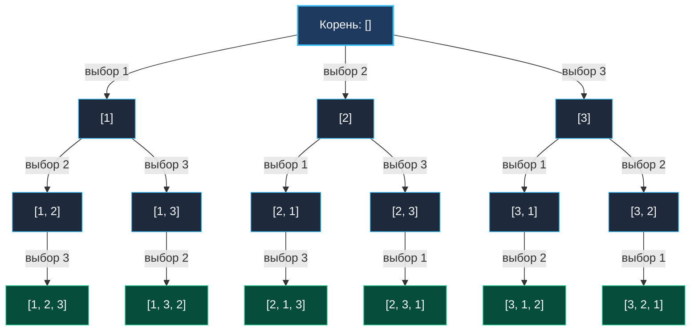

> *«Порядок имеет значение только тогда, когда мы способны различить его последствия».*  
> — Чарльз Хоар

В задачах [[3. Subsets]] и [[4. Subsets II]] порядок элементов не имел значения: подмножества `{1, 2}` и `{2, 1}` считались эквивалентными, а переход `i + 1` гарантировал выбор только «вправо».

Задача **Permutations** (LeetCode 46) открывает принципиально другой комбинаторный класс:  
**Условие:** Дан срез различных целых чисел `nums`. Требуется вернуть **все возможные перестановки** (всего $N!$ штук).

В перестановках порядок следования элементов критичен. Каждый элемент обязан войти в результирующий набор ровно один раз, но стоять он может на любой позиции.

---

## Архитектура: Дерево пространства состояний для `nums = [1, 2, 3]`

На каждом шаге мы выбираем любой еще не использованный элемент из исходного множества. Дерево решений для массива `[1, 2, 3]` содержит ровно $3! = 6$ листьев:



---

## Идиоматичная реализация на Go

Существует два равноправных подхода: классический с трекингом флагов `visited` и компактный in-place swap. На собеседовании ожидается первый как наиболее расширяемый на задачи с дубликатами.

```go
package main

// permute генерирует все N! перестановок уникального массива.
// Временная сложность: O(N * N!)
// Пространственная сложность: O(N) под стек и буфер path
func permute(nums []int) [][]int {
	n := len(nums)
	if n == 0 {
		return nil
	}

	var result [][]int
	path := make([]int, 0, n)
	visited := make([]bool, n) // Флаги занятости элементов

	var backtrack func()
	backtrack = func() {
		// Базовый случай: собрана полная перестановка длины n
		if len(path) == n {
			snapshot := make([]int, n)
			copy(snapshot, path)
			result = append(result, snapshot)
			return
		}

		// Перебираем ВСЕ элементы, пропуская уже использованные
		for i := 0; i < n; i++ {
			if visited[i] {
				continue
			}

			// Choose
			visited[i] = true
			path = append(path, nums[i])

			// Explore
			backtrack()

			// Unchoose (откат обоих инвариантов)
			path = path[:len(path)-1]
			visited[i] = false
		}
	}

	backtrack()
	return result
}
```

---

## Взгляд под капот: Mechanical Sympathy

### 1. `visited []bool` против Битовой маски `mask int`
В решении выше `visited` выделяется в куче один раз (`make([]bool, n)`). Чтение `visited[i]` требует загрузки адреса из L1 Data Cache.  
Для $N \le 64$ битовая маска целиком укладывается в регистр процессора:
```go
// Проверка бита: (mask & (1 << i)) != 0
// Установка бита: mask | (1 << i)
```
- Инструкция x86-64 `BT` (Bit Test) или `AND` выполняется за 1 такт CPU в ALU.
- Не требуется выделять память под массив флагов.
- Откат маски происходит автоматически: значение передается в рекурсивную функцию по значению (на регистре `RDX`), поэтому при возврате из функции старое значение маски мгновенно восстанавливается без явных операций!

### 2. In-Place Swap: алгоритм с $O(1)$ вспомогательной памяти
Если интервьюер просит решение без дополнительного массива `visited` и среза `path`:
```go
func permuteSwap(nums []int) [][]int {
    var result [][]int
    var backtrack func(start int)
    backtrack = func(start int) {
        if start == len(nums) {
            snapshot := make([]int, len(nums))
            copy(snapshot, nums)
            result = append(result, snapshot)
            return
        }
        for i := start; i < len(nums); i++ {
            nums[start], nums[i] = nums[i], nums[start] // Swap
            backtrack(start + 1)
            nums[start], nums[i] = nums[i], nums[start] // Un-swap
        }
    }
    backtrack(0)
    return result
}
```
Swap-подход элегантен, но имеет недостаток: порядок генерируемых перестановок не является лексикографическим, а адаптация под массивы с дубликатами требует дополнительной дедупликации.

---

## Подводные камни и вопросы с собеседований

> [!WARNING] Ловушка: Забытый сброс флага `visited[i] = false`
> В Subsets откат затрагивал только длину среза `path[:len(path)-1]`. В Permutations у нас **два связанных состояния**: `path` и `visited`. Забытая строка `visited[i] = false` навсегда исключит элемент $i$ из рассмотрения для всех последующих ветвей, разрушив перебор.

> [!INTERVIEW] Вопрос с собеседования: Временная сложность факториала
> **Вопрос:** Почему сложность алгоритма равна $O(N \cdot N!)$?  
> **Ответ:** Дерево перестановок содержит ровно $N!$ листьев. Количество внутренних вершин дерева:
> $$1 + N + N(N-1) + \dots + \frac{N!}{1!} \approx e \cdot N! = O(N!)$$
> В каждом листе мы копируем массив длины $N$ в результат, что занимает $O(N)$ времени. Итоговая сложность составляет строго $O(N \cdot N!)$. При $N = 10$ это $36$ миллионов операций, что выполняется за доли секунды, но при $N = 12$ количество операций превышает $5$ миллиардов, требуя перехода к жадным или динамическим эвристикам.

---

## Резюме

**Permutations** демонстрирует управление порядком следования:
- Цикл перебирает всех кандидатов от $0$ до $n-1$.
- Флаги `visited` гарантируют, что каждый элемент входит в перестановку ровно один раз.
- Откат восстанавливает как срез `path`, так и булеву маску `visited`.

Что делать, если в исходном наборе чисел присутствуют дубликаты (например, `[1, 1, 2]`)? Обычный `visited` сгенерирует одинаковые перестановки. Решение этой задачи мы разберем в следующей статье: [[6. Permutations II]].