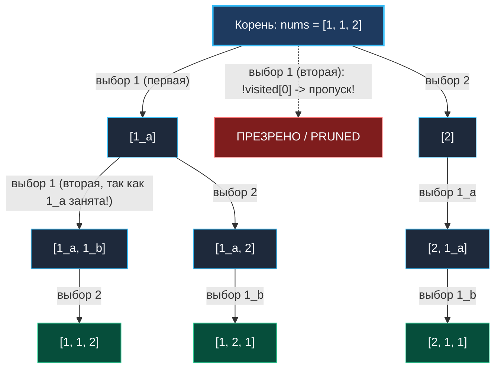

> *«Когда элементы неразличимы, порядок их выбора становится иллюзией, порождающей дубликаты».*  
> — Дональд Кнут

В задаче [[5. Permutations]] все элементы входного массива были строго уникальны, благодаря чему каждая ветвь дерева перестановок порождала уникальную последовательность.

Задача **Permutations II** (LeetCode 47) поднимает планку требований:  
**Условие:** Дан срез целых чисел `nums`, который может содержать **повторяющиеся элементы** (дубликаты). Требуется вернуть все **уникальные перестановки** без повторений.

Наивный подход «сгенерировать все $N!$ перестановок и запихнуть в `map`» для массива из 8 одинаковых нулей выполнит $40\,320$ рекурсивных спусков ради единственного очевидного ответа `[0, 0, 0, 0, 0, 0, 0, 0]`. Senior-инженер обязан отсечь генерацию изоморфных перестановок на уровне условий рекурсивного цикла.

---

## Архитектура: Инвариант порядка следования одинаковых чисел

Чтобы не сгенерировать одинаковые перестановки, мы должны ввести искусственное правило:  
**Если в массиве есть несколько одинаковых чисел (например, две единицы: $1_a$ и $1_b$), мы разрешаем использовать их только в строго фиксированном порядке: сначала $1_a$, и только после нее — $1_b$.**

Если мы попытаемся поставить $1_b$ на текущую позицию в тот момент, когда $1_a$ еще свободна (`!visited[a]`), это означает попытку начать альтернативную ветвь с тем же значением числа. Такая ветвь будет абсолютно идентична той, где первой стояла $1_a$. Мы обязаны ее пропустить!



Всего для `[1, 1, 2]` существует ровно $\frac{3!}{2! \cdot 1!} = 3$ уникальные перестановки:  
`[1, 1, 2]`, `[1, 2, 1]`, `[2, 1, 1]`.

---

## Идиоматичная реализация на Go

```go
package main

import "sort"

// permuteUnique генерирует все уникальные перестановки массива с дубликатами.
// Временная сложность: O(N * K), где K — число уникальных перестановок
// Пространственная сложность: O(N) дополнительной памяти под стек и буфер path
func permuteUnique(nums []int) [][]int {
	n := len(nums)
	if n == 0 {
		return nil
	}

	// 1. Сортировка обязательна: объединяет одинаковые числа в непрерывные серии
	sort.Ints(nums)

	var result [][]int
	path := make([]int, 0, n)
	visited := make([]bool, n)

	var backtrack func()
	backtrack = func() {
		if len(path) == n {
			snapshot := make([]int, n)
			copy(snapshot, path)
			result = append(result, snapshot)
			return
		}

		for i := 0; i < n; i++ {
			// Элемент уже задействован на текущем пути
			if visited[i] {
				continue
			}

			// Отсечение дубликата: если предыдущий дубликат еще не взят,
			// мы не имеем права начинать ветвь с текущего!
			if i > 0 && nums[i] == nums[i-1] && !visited[i-1] {
				continue
			}

			// Choose
			visited[i] = true
			path = append(path, nums[i])

			// Explore
			backtrack()

			// Unchoose
			path = path[:len(path)-1]
			visited[i] = false
		}
	}

	backtrack()
	return result
}
```

---

## Взгляд под капот: Mechanical Sympathy

### Разгадка условия `!visited[i-1]` против `visited[i-1]`
Это один из самых частых вопросов на Senior-собеседованиях:
- Что будет, если написать `visited[i-1]` вместо `!visited[i-1]`?
- **Ответ:** Как ни странно, код с `visited[i-1]` тоже вернет все уникальные перестановки! Но он будет исследовать дерево решений в обратном порядке (брать дубликаты с конца к началу). Однако вариант с `!visited[i-1]` обладает колоссальным преимуществом в производительности:
  - При `!visited[i-1]` отсечение происходит **на самом верхнем уровне дерева**. Мы отбрасываем дублирующую ветку еще до того, как сделали в нее рекурсивный шаг.
  - При `visited[i-1]` отсечение происходит только глубоко в листьях, что заставляет процессор обходить существенно больше бесполезных узлов.

---

## Подводные камни и вопросы с собеседований

> [!WARNING] Ловушка: Забытая предварительная сортировка
> Условие `nums[i] == nums[i-1]` предполагает, что все одинаковые элементы расположены строго последовательно.  
> Если массив неотсортирован (например, `[1, 2, 1]`), одинаковые единицы разделены двойкой. Проверка `nums[i] == nums[i-1]` ни разу не сработает, и алгоритм вернет дублирующиеся перестановки. `sort.Ints(nums)` — первый и обязательный шаг.

> [!INTERVIEW] Вопрос с собеседования: Мультиномиальный коэффициент
> **Вопрос:** Сколько уникальных перестановок существует для мультимножества с кратностями элементов $k_1, k_2, \dots, k_m$?  
> **Ответ:** Это задается мультиномиальным коэффициентом:
> $$P(N; k_1, \dots, k_m) = \frac{N!}{k_1! \cdot k_2! \dots k_m!}$$
> Для массива из 8 одинаковых чисел $\frac{8!}{8!} = 1$. Наш алгоритм благодаря `!visited[i-1]` выполняет ровно 8 шагов спуска и завершает работу за доли микросекунды, тогда как наивный перебор совершает $40\,320$ аллокаций.

---

## Резюме

**Permutations II** — вершина мастерства дедупликации в перестановках:
- Сортировка кластеризует одинаковые значения.
- Условие `i > 0 && nums[i] == nums[i-1] && !visited[i-1]` обеспечивает канонический порядок обхода одинаковых элементов, срезая бесполезные поддеревья под корень.

Теперь мы перейдем к задачам, где порядок не важен, но элементы разрешено использовать неограниченное число раз: [[7. Combination Sum]].