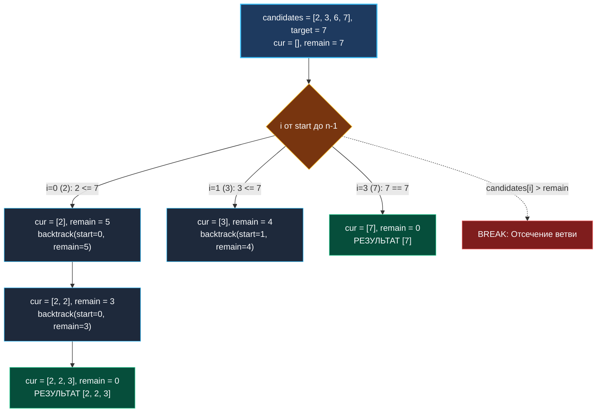

> *«Бесконечные возможности требуют жестких границ; лишь установив предел, мы получаем ответ».*  
> — Брайан Керниган

В предыдущих лекциях мы изучили генерацию подмножеств и перестановок, где каждый элемент использовался не более одного раза.

Задача **Combination Sum** (LeetCode 39) переводит поиск с возвратом в новую плоскость:  
**Условие:** Дан срез **уникальных** положительных целых чисел `candidates` и целевое число `target`. Требуется найти все уникальные наборы чисел, сумма которых равна `target`. Одно и то же число разрешено использовать **неограниченное число раз**. Порядок чисел в наборе значения не имеет.

Поскольку элементы можно брать бесконечно, наивный перебор моментально приведет к бесконечной рекурсии. Это первая задача, где **раннее отсечение (Deep Pruning)** выступает не просто оптимизацией, а обязательным условием завершимости алгоритма.

---

## Архитектура: Инварианты пространства решений

Чтобы гарантировать уникальность комбинаций (не сгенерировать `[2, 2, 3]` и `[3, 2, 2]` одновременно) и избежать зацикливания:
1. **Неубывающий порядок выбора (`start = i`):** На каждом шаге мы разрешаем брать только элементы с индексом $\ge i$. Это гарантирует, что числа в любой сгенерированной комбинации упорядочены по неубыванию ($2 \le 2 \le 3$).
2. **Сортировка входного массива:** Мы предварительно сортируем `candidates` по возрастанию.
3. **Мгновенное отсечение по сумме (`break`):** Если для текущего элемента `candidates[i] > remain`, то в силу отсортированности массива **все последующие кандидаты заведомо больше остатка**. Мы не просто делаем `continue`, мы немедленно прерываем весь цикл `break`, срезая огромное поддерево!



---

## Идиоматичная реализация на Go

```go
package main

import "sort"

// combinationSum находит все уникальные комбинации с суммой target.
// Временная сложность: O(N^(T/M)), где T — target, M — минимальный кандидат
// Пространственная сложность: O(T/M) глубина стека и буфера path
func combinationSum(candidates []int, target int) [][]int {
	// 1. Сортировка — основа мгновенного отсечения ветвей
	sort.Ints(candidates)

	var result [][]int
	// Буфер максимальной глубины target / min(candidates)
	path := make([]int, 0, target/candidates[0]+1)

	var backtrack func(start int, remain int)
	backtrack = func(start int, remain int) {
		// Базовый случай: цель достигнута в точности
		if remain == 0 {
			snapshot := make([]int, len(path))
			copy(snapshot, path)
			result = append(result, snapshot)
			return
		}

		for i := start; i < len(candidates); i++ {
			// Отсечение (Pruning): в отсортированном срезе текущий и все последующие
			// элементы больше остатка — немедленно выходим из цикла!
			if candidates[i] > remain {
				break
			}

			// Choose
			path = append(path, candidates[i])

			// Explore: передаем тот же индекс i (разрешено брать этот же элемент)
			backtrack(i, remain-candidates[i])

			// Unchoose
			path = path[:len(path)-1]
		}
	}

	backtrack(0, target)
	return result
}
```

---

## Взгляд под капот: Mechanical Sympathy

### Цена `break` против `continue` в цикле перебора
Сравним поведение двух вариантов кода:
1. **Без сортировки:**
   ```go
   if candidates[i] > remain { continue }
   ```
   Процессор вынужден на каждой итерации выполнять проверку условия и итерироваться по всему массиву `candidates` до конца. Для каждого элемента выполняется jump.
2. **С сортировкой и `break`:**
   ```go
   if candidates[i] > remain { break }
   ```
   Как только условие выполнилось, цикл завершается немедленно. При больших `candidates` (например, `[2, 3, 5, 7, 11, 13, ... 97]`) при остатке `remain = 4` цикл сделает всего 2 итерации вместо десятков! Предсказатель ветвлений CPU спекулятивно завершает цикл, экономя такты и разгружая кэш команд L1i.

---

## Подводные камни и вопросы с собеседований

> [!WARNING] Ловушка: Передача `start = i + 1`
> Если передать в рекурсию `backtrack(i + 1, ...)`, алгоритм превратится в задачу **Combination Sum II** (LeetCode 40), где каждое число можно использовать не более одного раза.  
> Для неограниченного использования числа текущий указатель обязан оставаться на той же позиции: `backtrack(i, remain - candidates[i])`.

> [!INTERVIEW] Вопрос с собеседования: Backtracking против Dynamic Programming
> **Вопрос:** В задаче Coin Change 2 (LeetCode 518) требуется найти *количество* способов набрать сумму, и мы используем динамическое программирование за $O(N \cdot \text{target})$. Почему здесь мы используем Backtracking?  
> **Ответ:** Когда требуется найти **количество** способов, подзадачи перекрываются, и DP оптимально объединяет их за полиномиальное время. Но когда условие требует **перечислить все конкретные списки комбинаций**, количество этих списков само по себе экспоненциально. Никакое DP не может сгенерировать $K$ списков быстрее, чем за время $O(K \cdot L)$. Backtracking здесь математически оптимален.

---

## Резюме

**Combination Sum** иллюстрирует силу отсечений в комбинаторике:
- Предварительная сортировка массива превращает `continue` в спасительный `break`.
- Инвариант `start = i` обеспечивает уникальность наборов без использования `map`.
- Предвыделенный буфер `path` минимизирует аллокации при рекурсивном спуске.

В следующей задаче мы покидаем одномерные массивы и переходим к поиску пути на двумерной координатной сетке: [[8. Word Search]].