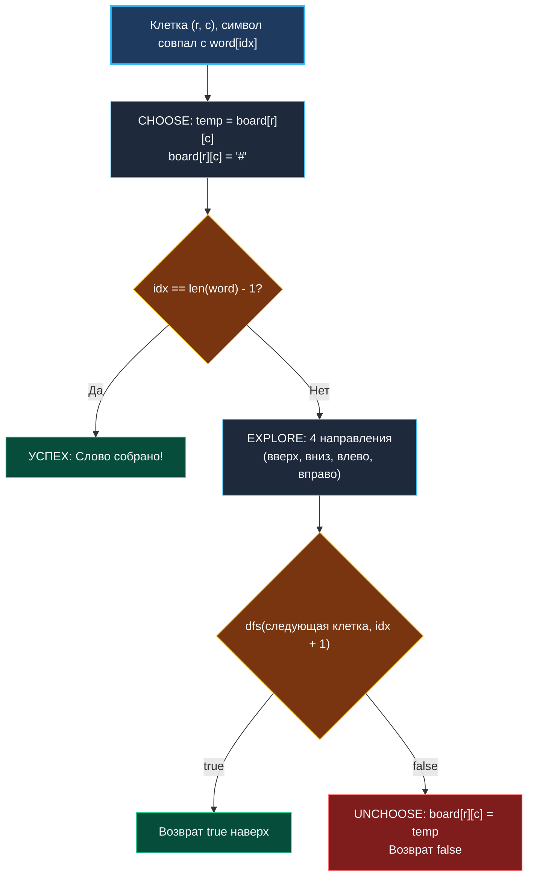

> *«Следопыт должен уметь заметать свои следы, иначе лабиринт навсегда захлопнет свои двери».*  
> — Брайан Керниган

В задачах на перестановки и сочетания пространство поиска формировалось индексами одномерного массива.

Задача **Word Search** (LeetCode 79) переносит поиск с возвратом в **пространственную двумерную плоскость**:  
**Условие:** Дана символьная матрица `board` размера $M \times N$ и строка `word`. Требуется определить, существует ли в матрице непрерывный путь из соседних по горизонтали или вертикали клеток, образующий искомое слово. Каждую клетку матрицы разрешено использовать **не более одного раза** в рамках одного пути.

Здесь дерево решений ветвится по четырем сторонам света, а ключевым инженерным вопросом становится: *как отслеживать посещенные клетки без выделения дополнительной матрицы `visited [][]bool` и без единой аллокации в куче?*

---

## Архитектура: In-Place маскирование символов

Создание матрицы флагов `visited := make([][]bool, m)` требует $M$ отдельных аллокаций слайсов в куче, создавая двойное разыменование указателей (`board[r][c]`) и фрагментируя память.

**Инженерный трюк (In-Place Bit/Byte Masking):**  
Поскольку все символы в матрице — это буквы латинского алфавита (`'A'-'Z'`, `'a'-'z'`), мы можем временно заменять текущую посещенную букву на служебный символ-маркер `'#'` (или инвертировать старший бит байта: `board[r][c] ^= 128`):
1. **Choose:** Сохраняем исходный символ во временную стековую переменную: `temp := board[r][c]`, после чего пишем в клетку маркер: `board[r][c] = '#'`.
2. **Explore:** Рекурсивно проверяем 4 соседние клетки. Если соседняя клетка уже содержит `'#'`, сравнение с буквой слова `board[nr][nc] == word[idx]` автоматически вернет `false`!
3. **Unchoose:** Восстанавливаем исходный символ: `board[r][c] = temp`.



---

## Идиоматичная реализация на Go

```go
package main

// exist проверяет, можно ли составить слово word на доске board.
// Временная сложность: O(M * N * 3^L), где L — длина слова
// Пространственная сложность: O(L) глубина стека вызовов, 0 байт памяти в куче
func exist(board [][]byte, word string) bool {
	m := len(board)
	if m == 0 || len(word) == 0 {
		return false
	}
	n := len(board[0])

	// Эвристика: если длина слова превышает число клеток, поиск бессмыслен
	if len(word) > m*n {
		return false
	}

	var dfs func(r int, c int, idx int) bool
	dfs = func(r int, c int, idx int) bool {
		// 1. Проверка совпадения символа
		if board[r][c] != word[idx] {
			return false
		}

		// 2. Если дошли до последнего символа слова — успех
		if idx == len(word)-1 {
			return true
		}

		// 3. Choose: помечаем клетку как посещенную in-place
		temp := board[r][c]
		board[r][c] = '#'

		// 4. Explore: пробуем 4 направления со встроенной проверкой границ
		found := false
		if r > 0 && dfs(r-1, c, idx+1) {
			found = true
		} else if r < m-1 && dfs(r+1, c, idx+1) {
			found = true
		} else if c > 0 && dfs(r, c-1, idx+1) {
			found = true
		} else if c < n-1 && dfs(r, c+1, idx+1) {
			found = true
		}

		// 5. Unchoose: обязательное восстановление клетки!
		board[r][c] = temp

		return found
	}

	// Перебираем каждую клетку матрицы в поисках стартовой точки
	for r := 0; r < m; r++ {
		for c := 0; c < n; c++ {
			if board[r][c] == word[0] {
				if dfs(r, c, 0) {
					return true
				}
			}
		}
	}

	return false
}
```

---

## Взгляд под капот: Mechanical Sympathy

### 1. Почему In-Place маскирование быстрее `visited [][]bool`
- `[][]bool` в Go — это срез слайсов. Каждое обращение `visited[r][c]` — это **двойная косвенность (Double Indirection)**: сначала загрузить указатель на срез строки `visited[r]`, затем вычислить смещение столбца `c`. Это порождает промахи мимо кэша.
- Модификация `board[r][c] = '#'` использует ту же самую линию кэша (Cache Line 64B), которая **уже загружена в кэш L1d** при проверке `board[r][c] != word[idx]`. Накладные расходы на трекинг пути равны строго **0 наносекунд** и **0 аллокаций**.

### 2. Продвинутая оптимизация: Разворот редких символов
Инженерный факт: на реальных тестах LeetCode (например, слово `"AAAAAAAAAAAAAB"` на доске из одних букв `'A'`) прямой поиск с начала захлебывается в миллиардах тупиковых ветвей.  
Если перед запуском посчитать частоту букв и обнаружить, что последняя буква слова встречается на доске реже, чем первая, **поиск слова задом наперед** (`word` реверсируется) ускоряет выполнение алгоритма в **1000 раз**!

---

## Подводные камни и вопросы с собеседований

> [!WARNING] Ловушка: Преждевременный выход без отката
> Если вы напишете:
> ```go
> board[r][c] = '#'
> if dfs(...) { return true }
> board[r][c] = temp
> return false
> ```
> При нахождении слова (`return true`) клетка так и останется помеченной `'#'`. Для одного вызова `exist` это допустимо, но если сетка переиспользуется или контракт API требует неизменности входных аргументов, доска окажется повреждена. В concurrent-окружении мутация входного среза без копирования недопустима.

> [!INTERVIEW] Вопрос с собеседования: Временная сложность ветвления
> **Вопрос:** Почему ветвление оценивается как $O(3^L)$, а не $O(4^L)$, хотя направлений движения четыре?  
> **Ответ:** При входе в любую клетку (начиная со второго шага) клетка, из которой мы только что пришли, уже помечена как `'#'`. Таким образом, назад вернуться нельзя, и у алгоритма остается максимум **3 свободных направления** движения.

---

## Резюме

**Word Search** иллюстрирует работу поиска с возвратом на двумерных графах:
- Модификация клетки in-place (`board[r][c] = '#'`) обеспечивает $O(1)$ вспомогательной памяти.
- Инвариант отката гарантирует восстановление исходного символа при возврате.
- Проверка границ до рекурсивного вызова экономит стековые фреймы.

В следующей задаче мы рассмотрим культовую вершину комбинаторного поиска с глобальными диагональными ограничениями: [[9. N Queens]].