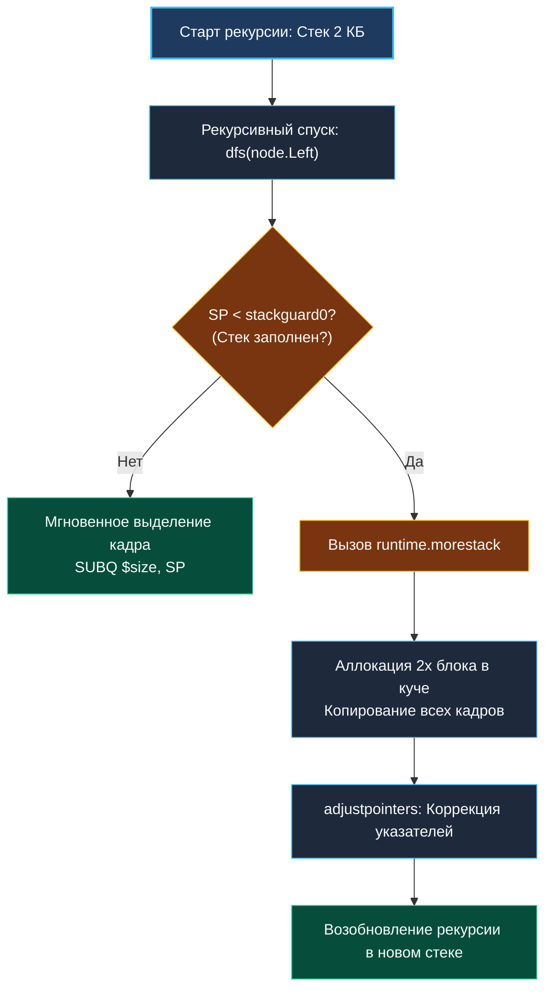

> *«Рекурсия прекрасна своей математической ясностью, но машина знает только стек — и горе тому, кто забудет о его границах».*  
> — Никлаус Вирт

В теоретическом введении [[1. Теория. DFS]] мы определили поиск в глубину как стратегию обхода графов и деревьев. На бумаге рекурсивная запись выглядит безупречно: две строки вызова для левого и правого потомка.

Однако в реальном production-коде на Go за каждой строкой рекурсивного вызова стоит суровая физика рантайма: смещение регистра указателя стека `RSP`, проверки `runtime.morestack`, копирование непрерывных стековых сегментов и кэш-промахи.

Для senior-инженера выбор между рекурсивным и итеративным DFS — это не вопрос эстетики, а **строгий инженерный расчет**: оценка максимальной глубины $H$, учет модели памяти горутин и гарантия защиты от исчерпания ресурсов (OOM).

---

## Архитектура: Стек вызовов горутины под капотом

В классических языках со статическим стеком потоков ОС (C, C++, Java) под каждый поток операционной системы выделяется фиксированный виртуальный блок от 1 до 8 МБ. Если рекурсия уходит на глубину 100 000 кадров, программа падает с жестким сигналом `SIGSEGV / StackOverflowError`.

В Go архитектура принципиально иная:
1. **Стартовый размер стека (2 КБ):** Каждая новая горутина стартует с крошечным непрерывным стеком (Continuous Stack) размером ровно 2048 байт.
2. **Пролог функции и проверка границы:** Компилятор Go (`cmd/compile`) вставляет в начало каждой функции ассемблерную инструкцию сравнения:
   ```x86asm
   CMPQ SP, 16(R14)   ; Сравнение текущего SP со stackguard0 в структуре горутины g
   JBE  morestack      ; Если места мало — прыжок в рантайм
   ```
3. **Удвоение и копирование (`runtime.morestack`):** Если текущего стекового фрейма недостаточно:
   - Рантайм аллоцирует новый непрерывный блок памяти вдвое большего размера (4 КБ, затем 8 КБ, 16 КБ и т.д. вплоть до 1 ГБ на 64-битных системах).
   - Все стековые кадры физически копируются в новый блок.
   - Рантайм обходит все указатели на стеке и корректирует их адреса (`runtime.adjustpointers`).
   - Старый сегмент освобождается.



---

## Итеративный DFS: Эмуляция стека на срезе (Zero-Copy)

Если граф представляет собой вырожденную цепочку из $10^6$ вершин (например, граф транзакций в блокчейне или глубокая иерархия зависимостей пакетов), рекурсивный DFS заставит рантайм Go выполнить десятки реаллокаций стека горутины, раздув его до сотен мегабайт.

**Итеративный подход** переносит управление состоянием в пользовательский срез `stack := make([]T, 0, capacity)`.

### 1. Итеративный Preorder (Прямой обход)
```go
package main

// PreorderTraversalIterative обходит дерево в порядке Узел -> Левый -> Правый
func PreorderTraversalIterative(root *TreeNode) []int {
	if root == nil {
		return nil
	}

	var result []int
	// Стек с предварительно выделенной емкостью
	stack := make([]*TreeNode, 0, 64)
	stack = append(stack, root)

	for len(stack) > 0 {
		// Pop: извлечение вершины стека
		n := len(stack) - 1
		node := stack[n]
		stack = stack[:n]

		result = append(result, node.Val)

		// LIFO: сначала кладем правого, чтобы левый обработался первым!
		if node.Right != nil {
			stack = append(stack, node.Right)
		}
		if node.Left != nil {
			stack = append(stack, node.Left)
		}
	}

	return result
}
```

### 2. Итеративный Inorder (Левый -> Узел -> Правый)
Для Binary Search Tree центрированный обход возвращает элементы строго по возрастанию:
```go
package main

// InorderTraversalIterative возвращает элементы дерева в отсортированном порядке
func InorderTraversalIterative(root *TreeNode) []int {
	var result []int
	stack := make([]*TreeNode, 0, 64)
	curr := root

	for curr != nil || len(stack) > 0 {
		// Шаг 1: Спуск до упора влево
		for curr != nil {
			stack = append(stack, curr)
			curr = curr.Left
		}

		// Шаг 2: Извлечение самого глубокого левого узла
		n := len(stack) - 1
		curr = stack[n]
		stack = stack[:n]

		result = append(result, curr.Val)

		// Шаг 3: Переход в правое поддерево
		curr = curr.Right
	}

	return result
}
```

---

## Взгляд под капот: Mechanical Sympathy

### 1. Почему `stack = stack[:len(stack)-1]` не аллоцирует память
В итеративном DFS операция Pop уменьшает длину слайса, сохраняя `cap`.  
Пока глубина обхода укладывается в предварительно выделенную емкость, операции `append` и `pop` происходят строго in-place:
- Никаких вызовов `runtime.newobject`
- Никакого давления на GC
- Непрерывный массив `stack` целиком кэшируется в L1d-кэше ядра CPU.

### 2. Сравнительный бенчмарк: Рекурсия vs Итерация

| Параметр | Рекурсивный DFS | Итеративный DFS (`[]*TreeNode`) |
|---|---|---|
| **Вызовы функций** | `CALL` / `RET` на каждый узел | 1 вызов функции, плоский цикл `for` |
| **Проверка переполнения** | Проверка `CMPQ SP` в прологе | Проверка `len(stack) > 0` |
| **Память на узел** | Стековый кадр ($\sim 32-48$ байт) | 8 байт (один указатель в срезе) |
| **Поведение при $H = 100\,000$** | Копирование стека $\approx 16$ раз | 1 аллокация при создании среза |
| **Приостановка (Итератор)** | Сложно (требует горутины и каналов) | Тривиально (сохранение состояния в структуре) |

---

## Подводные камни и вопросы с собеседований

> [!WARNING] Ловушка: Утечка памяти при Pop указателей
> Если срез хранит не просто примитивы, а тяжелые структуры по значению, операция `stack = stack[:len(stack)-1]` оставляет данные в физической памяти нижележащего массива до следующего `append`.  
> Если обход завершен, а стек долго удерживается в памяти, обнуляйте отсеченный элемент:
> ```go
> stack[len(stack)-1] = nil // Даем GC очистить узел
> stack = stack[:len(stack)-1]
> ```

> [!INTERVIEW] Вопрос с собеседования: Превращение рекурсии в хвостовую (Tail Call Optimization)
> **Вопрос:** Поддерживает ли компилятор Go оптимизацию хвостовой рекурсии (TCO)?  
> **Ответ:** Нет, компилятор Go (`gc`) намеренно не выполняет автоматическую оптимизацию хвостовой рекурсии, чтобы сохранять точные и консистентные трассировки стека (Stack Traces) при паниках и профилировании (`pprof`). Любой алгоритм, требующий $O(1)$ стека, в Go обязан переписываться на явный цикл `for`.

---

## Резюме

Понимание взаимосвязи рекурсии и стека формирует зрелый инженерный подход:
- Рекурсия идеальна для сбалансированных деревьев и коротких путей ($H \le 10^4$).
- Итеративный стек на слайсе незаменим для глубоких графов и системных компонентов ядра.
- Предвыделение емкости среза полностью устраняет аллокации в цикле обхода.

Теперь мы готовы перейти к практическому решению задач на поиск в глубину. Начнем с классики подсчета компонент связности на матрицах: [[3. Number of Islands]].