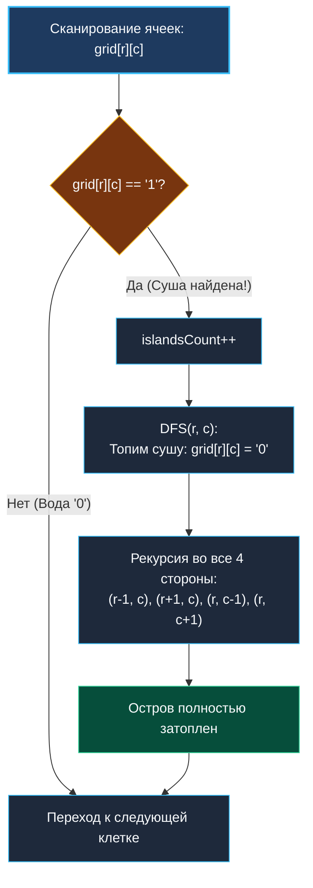

> *«Остров — это лишь часть материка, которую скрыли под собой поднявшиеся воды».*  
> — Джон Донн

Задача **Number of Islands** (LeetCode 200) — абсолютная классика алгоритмических интервью, проверяющая навык моделирования пространственных графов.

**Условие:** Дана двумерная матрица символов `grid` размера $M \times N$, состоящая из `'1'` (суша) и `'0'` (вода). Островом считается группа соседних по горизонтали или вертикали единиц, со всех сторон окруженная водой или границами карты. Требуется определить общее число островов.

Эта задача служит базовым шаблоном для анализа компонент связности. Она появляется в энциклопедии в трех взаимосвязанных контекстах:
- в данном кластере как демонстрация **поиска в глубину на сетке**;
- в кластере графов [[5. Number of Islands]] как нахождение компонент связности в неориентированном графе;
- в кластере матриц [[2. DFS и BFS на матрицах]] как техника работы с 2D-координатами.

---

## Архитектура: In-Place «затопление» (Sink Pattern)

Выделение дополнительной булевой матрицы `visited [][]bool` требует $O(M \cdot N)$ памяти и порождает двойное разыменование указателей.

Если условие допускает мутацию входных данных, самым идиоматичным и быстрым подходом в Go является паттерн **затопления острова (Sink Algorithm)**:
1. Сканируем матрицу обычными вложенными циклами `r` и `c`.
2. Как только натыкаемся на `'1'`, мы инкрементируем счетчик найденных островов `islandsCount++`.
3. Немедленно запускаем DFS из клетки `(r, c)`, который рекурсивно обходит всех 4-связных соседей и **перекрашивает `'1'` в `'0'`** («топит» сушу в воду).
4. Когда DFS завершается, весь текущий остров целиком погружен под воду. Сканер продолжает движение по матрице и гарантированно не посчитает повторно клетки этого острова!



---

## Идиоматичная реализация на Go

### 1. Канонический рекурсивный вариант
```go
package main

// numIslands возвращает число островов на карте
// Временная сложность: O(M * N)
// Пространственная сложность: O(M * N) в худшем случае (змеевидный остров на стеке)
func numIslands(grid [][]byte) int {
	if len(grid) == 0 || len(grid[0]) == 0 {
		return 0
	}

	m, n := len(grid), len(grid[0])
	count := 0

	var dfs func(r, c int)
	dfs = func(r, c int) {
		// Проверка выхода за границы и фильтрация воды
		if r < 0 || r >= m || c < 0 || c >= n || grid[r][c] == '0' {
			return
		}

		// Топим текущую клетку суши in-place
		grid[r][c] = '0'

		// Обходим 4 направления
		dfs(r+1, c)
		dfs(r-1, c)
		dfs(r, c+1)
		dfs(r, c-1)
	}

	for r := 0; r < m; r++ {
		for c := 0; c < n; c++ {
			if grid[r][c] == '1' {
				count++
				dfs(r, c)
			}
		}
	}

	return count
}
```

### 2. Итеративный стек на срезе (Zero-Allocations)
Для гигантских вырожденных сеток ($300 \times 300$, где один остров закручен змейкой на $90\,000$ шагов), рекурсивный стек вызовет многократное копирование стека горутины. Итеративная реализация использует один предвыделенный срез:

```go
package main

type point struct{ r, c int }

func numIslandsIterative(grid [][]byte) int {
	if len(grid) == 0 || len(grid[0]) == 0 {
		return 0
	}
	m, n := len(grid), len(grid[0])
	count := 0

	// Выделяем память под стек один раз на всю работу функции
	stack := make([]point, 0, 1024)

	for r := 0; r < m; r++ {
		for c := 0; c < n; c++ {
			if grid[r][c] == '1' {
				count++
				grid[r][c] = '0'
				stack = stack[:0] // Обнуляем длину, сохраняя емкость cap!
				stack = append(stack, point{r, c})

				for len(stack) > 0 {
					last := len(stack) - 1
					p := stack[last]
					stack = stack[:last]

					// Проверяем 4 соседей
					neighbors := [4]point{
						{p.r + 1, p.c}, {p.r - 1, p.c},
						{p.r, p.c + 1}, {p.r, p.c - 1},
					}

					for _, nb := range neighbors {
						if nb.r >= 0 && nb.r < m && nb.c >= 0 && nb.c < n && grid[nb.r][nb.c] == '1' {
							grid[nb.r][nb.c] = '0' // Топим ПЕРЕД добавлением в стек!
							stack = append(stack, nb)
						}
					}
				}
			}
		}
	}

	return count
}
```

---

## Взгляд под капот: Mechanical Sympathy

### 1. In-Place мутация и кэш-линии
Матрица `grid` представляет собой набор срезов `[]byte`.
- Поскольку байты `'1'` и `'0'` занимают по 1 байту, в одну строку L1-кэша процессора (64 байта) помещается 64 соседних столбца одной строки!
- При горизонтальном перемещении `dfs(r, c+1)` процессор считывает байты прямо из кэша первого уровня L1d с задержкой $\sim 1$ нс.
- Замена `'1'` на `'0'` мутирует тот же байт в горячем кэше, не вызывая аллокаций в куче.

### 2. Защита от дубликатов в итеративном стеке
Обратите внимание на строку: `grid[nb.r][nb.c] = '0'` **до** вызова `stack = append(stack, nb)`.  
Если помечать клетку затопленной только при *извлечении* из стека (`pop`), соседние клетки добавят одну и ту же клетку в стек до 4 раз, вызвав лавинообразный рост размера стека. Затопление в момент обнаружения исключает дублирование.

---

## Подводные камни и вопросы с собеседований

> [!WARNING] Ловушка: Мутация входного аргумента
> В продакшене сигнатура `numIslands(grid [][]byte)` мутирует данные вызывающей стороны. Если клиенту требуется сохранить исходную карту, сетку необходимо предварительно клонировать либо использовать `visited [][]bool`. На собеседовании обязательно озвучьте: *«Я использую in-place затопление для экономии $O(M \cdot N)$ памяти. Допустимо ли менять входной срез в условиях вашей системы?»*.

> [!INTERVIEW] Вопрос с собеседования: DFS против BFS и Union-Find
> **Вопрос:** В чем разница производительности DFS, BFS и Disjoint Set Union (Union-Find) для этой задачи?  
> **Ответ:** 
> - **DFS/BFS** работают за строгое линейное время $O(M \cdot N)$ за один проход по матрице.
> - **Union-Find** (разбираемый в [[3. Number of Connected Components]]) работает чуть медленнее ($O(M \cdot N \cdot \alpha(MN))$), но незаменим в **динамических сценариях** (Number of Islands II), когда клетки суши добавляются в реальном времени по одной (стриминг), и пересчитывать всю матрицу с нуля через DFS нецелесообразно.

---

## Резюме

**Number of Islands** — золотой стандарт пространственного поиска в глубину:
- Моделирование неявного графа на координатной сетке.
- Паттерн «затопления» in-place гарантирует нулевые аллокации памяти.
- Простая трансформация в итеративный стек гарантирует защиту от глубокой рекурсии.

В следующей лекции мы перейдем к графам общего вида со сложной топологией и циклическими ссылками: [[4. Clone Graph]].