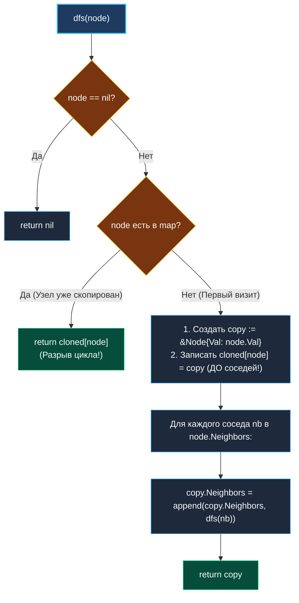

> *«Истинное клонирование структуры состоит не в копировании узлов, а в точном воспроизведении взаимосвязей между ними».*  
> — Брайан Керниган

Задача **Clone Graph** (LeetCode 133) — классический водораздел между простым обходом структур данных и их архитектурным конструированием.

**Условие:** Дан указатель на вершину связного неориентированного графа. Каждая вершина содержит целочисленное значение `Val` и список смежных вершин `Neighbors []*Node`. Требуется вернуть глубокую копию (Deep Copy) графа — полностью новый граф с идентичной топологией, не разделяющий с оригиналом ни одного указателя.

Если при обходе деревьев мы двигались строго от корня к листьям в отсутствие циклов, то в графах общего вида ребра образуют двусторонние петли и циклы ($A \leftrightarrow B$). Попытка наивного рекурсивного создания узлов моментально обрушит рантайм в бесконечную рекурсию.

---

## Архитектура: Словарь клонов как инвариант разрешения циклов

Ключевой архитектурный инструмент глубокого копирования — хеш-таблица сопоставления:

$$\text{cloned} : \text{map}[*\text{Node}]*\text{Node}$$

Она одновременно выполняет две критические функции:
1. **Множество `visited`:** предотвращает повторный заход в уже обработанные вершины.
2. **Таблица разрешения ссылок (Memoization):** хранит соответствие между оригинальным указателем и вновь созданным объектом в куче.



---

## Идиоматичная реализация на Go

```go
package main

type Node struct {
	Val       int
	Neighbors []*Node
}

// cloneGraph создает полную глубокую копию графа с сохранением циклических связей.
// Временная сложность: O(V + E) — посещаем каждую вершину и ребро ровно один раз
// Пространственная сложность: O(V) под хеш-таблицу и стек вызовов
func cloneGraph(node *Node) *Node {
	if node == nil {
		return nil
	}

	// Словарь для связывания оригиналов с клонами
	cloned := make(map[*Node]*Node)

	var dfs func(n *Node) *Node
	dfs = func(n *Node) *Node {
		if n == nil {
			return nil
		}

		// Если узел уже был склонирован ранее — немедленно возвращаем клон
		if clone, exists := cloned[n]; exists {
			return clone
		}

		// ВАЖНО: Регистрируем клон в map ДО рекурсивного обхода соседей!
		// Это гарантирует корректный возврат указателя при обратных ребрах.
		copyNode := &Node{
			Val:       n.Val,
			Neighbors: make([]*Node, 0, len(n.Neighbors)),
		}
		cloned[n] = copyNode

		// Рекурсивно клонируем все смежные вершины
		for _, neighbor := range n.Neighbors {
			copyNode.Neighbors = append(copyNode.Neighbors, dfs(neighbor))
		}

		return copyNode
	}

	return dfs(node)
}
```

---

## Взгляд под капот: Mechanical Sympathy

### 1. Хеширование указателей в `map[*Node]*Node`
В Go тип ключа `*Node` является 64-битным адресом памяти:
- Для хеширования указателей рантайм использует сверхбыструю функцию `memhash64` (прямое перемешивание 8 байт адреса через регистры ALU).
- Сравнение ключей при коллизиях — это простая инструкция `CMPQ` двух чисел, без разыменования указателей и без чтения полей структуры.
- Сложность поиска `cloned[n]` составляет $O(1)$ с минимальной константой процессорного времени.

### 2. Сборка мусора и циклические ссылки (GC Tracing vs Refcounting)
В языках со счетчиками ссылок (Python `PyObject`, C++ `std::shared_ptr`) взаимные ссылки двух узлов ($A \leftrightarrow B$) создают классическую утечку памяти (Memory Leak), требуя вмешательства тяжелого cycle detector'а.  
В Go сборщик мусора использует алгоритм **Tri-color Mark & Sweep**:
- GC начинает трассировку исключительно с корневых объектов (Root Set: глобальные переменные, стек горутины).
- Если на граф больше нет внешних ссылок из активных горутин, весь циклический граф признается недостижимым и целиком освобождается за один проход сборщика.

---

## Подводные камни и вопросы с собеседований

> [!WARNING] Ловушка: Порядок регистрации в `cloned`
> Если написать создание копии так:
> ```go
> copyNode := &Node{Val: n.Val}
> for _, nb := range n.Neighbors {
>     copyNode.Neighbors = append(copyNode.Neighbors, dfs(nb))
> }
> cloned[n] = copyNode // ПОЗДНО! Бесконечная рекурсия
> ```
> При первом же цикле (например, узел $A$ ссылается на $B$, а $B$ ссылается на $A$) рекурсия из $B$ вызовет `dfs(A)`. Поскольку $A$ еще не добавлен в `cloned`, алгоритм создаст второй клон $A'$, затем второй клон $B'$ и упадет с паникой переполнения памяти! Запись `cloned[n] = copyNode` обязана предшествовать циклу обхода соседей.

> [!INTERVIEW] Вопрос с собеседования: Клонирование без рекурсии (BFS)
> **Вопрос:** Как реализовать глубокое клонирование графа через очередь (BFS)?  
> **Ответ:** 
> 1. Помещаем стартовый узел в очередь `queue := []*Node{node}` и регистрируем в `cloned[node] = &Node{Val: node.Val}`.
> 2. В цикле `len(queue) > 0` извлекаем `curr`.
> 3. Для каждого соседа `nb`: если его еще нет в `cloned`, создаем клон, пишем в `cloned[nb]` и кладем `nb` в очередь.
> 4. Добавляем `cloned[nb]` в список соседей `cloned[curr].Neighbors`.  
> BFS гарантирует отсутствие глубокого стека вызовов при одинаковой асимптотике $O(V + E)$.

---

## Резюме

**Clone Graph** учит технике изоморфного воспроизведения графов:
- Хеш-таблица сопоставления указателей `map[*Node]*Node` разрушает циклы.
- Регистрация клона в словаре *до* перехода к соседям — обязательный инвариант корректности.
- Рантайм Go эффективно работает с циклическими графами в куче благодаря трехцветной маркировке GC.

В следующей задаче мы возвращаемся к деревьям и исследуем накопление числовых инвариантов вдоль ветвей: [[5. Path Sum]].