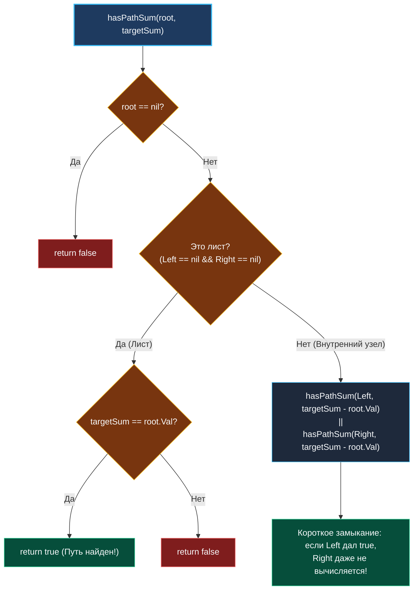

> *«Каждый шаг по дереву уменьшает расстояние до цели, если мы точно знаем, сколько нам осталось пройти».*  
> — Брайан Керниган

В задачах обхода графов мы часто искали компоненты связности или воспроизводили топологию.

Задача **Path Sum** (LeetCode 112) демонстрирует классический **Preorder-спуск с вычитанием целевого инварианта**:  
**Условие:** Задано бинарное дерево и целевое число `targetSum`. Требуется определить, существует ли непрерывный путь **от корня до листового узла** (у которого оба потомка `nil`), сумма значений в котором в точности равна `targetSum`.

Задача элементарна по формулировке, но служит лакмусовой бумажкой алгоритмической строгости: понимает ли кандидат определение листа в дереве и умеет ли он избегать ловушек с отрицательными числами.

---

## Архитектура: Инвариант убывающего остатка

Вместо того чтобы передавать вниз накапливаемую сумму `currentSum` и на листе выполнять сравнение `currentSum == targetSum`, мы используем изящную декомпозицию:  
**На каждом шаге спуска мы уменьшаем целевую сумму на значение текущего узла:**

$$\text{remain} = \text{targetSum} - \text{node.Val}$$

Критерий успеха на листе:  
Узел `node` является листом (`node.Left == nil && node.Right == nil`), и оставшаяся сумма в точности равна его значению (`targetSum == node.Val`).



---

## Идиоматичная реализация на Go

Код умещается всего в 6 строк идиоматичного Go, не требуя вспомогательных замыканий и выделения структур:

```go
package main

type TreeNode struct {
	Val   int
	Left  *TreeNode
	Right *TreeNode
}

// hasPathSum проверяет наличие пути от корня к листу с суммой targetSum.
// Временная сложность: O(N) в худшем случае, существенно меньше при раннем успехе
// Пространственная сложность: O(H) памяти стека вызовов (H — высота дерева)
func hasPathSum(root *TreeNode, targetSum int) bool {
	// Базовый случай: пустое дерево не содержит путей
	if root == nil {
		return false
	}

	// Проверка листа: оба потомка обязаны отсутствовать
	if root.Left == nil && root.Right == nil {
		return targetSum == root.Val
	}

	// Рекурсивный шаг с вычитанием значения текущего узла.
	// Оператор || реализует short-circuit evaluation: если левое поддерево
	// нашло путь, правое поддерево вообще не вызывается!
	newTarget := targetSum - root.Val
	return hasPathSum(root.Left, newTarget) || hasPathSum(root.Right, newTarget)
}
```

---

## Взгляд под капот: Mechanical Sympathy

### 1. Регистровый ABI (Go 1.17+) и нулевые аллокации
В современном рантайме Go аргументы функций передаются через регистры CPU:
- `root` передается в регистре `RAX`.
- `targetSum` передается в регистре `RBX`.
- Вычитание `newTarget := targetSum - root.Val` компилируется в одну инструкцию `SUBQ`.
- Результат `bool` возвращается в регистре `AL`.  
Функция не выделяет ни одного байта в куче (0 B/op, 0 allocs/op) и исполняется на предельной скорости процессорного кэша.

### 2. Short-Circuit оптимизация конвейера
Благодаря оператору `||` (логическое ИЛИ) процессор выполняет условный переход:
- Если вызов `hasPathSum(root.Left, ...)` вернул `true`, правая ветка дерева целиком отбрасывается.
- Конвейер процессора избегает сотен рекурсивных спусков, если искомый путь лежит в левой половине кроны дерева.

---

## Подводные камни и вопросы с собеседований

> [!WARNING] Ловушка: Преждевременное отсечение при `targetSum < 0`
> В задачах вроде `Combination Sum` мы делали `if target < 0 return`.  
> В бинарном дереве значения узлов **могут быть отрицательными** (например, корень $10$, потомок $-15$, лист $5$, цель $0$). Если вы напишете `if targetSum < 0 return false`, код выдаст ложный отрицательный ответ на отрицательных узлах! Отсечение по знаку допустимо только тогда, когда условие явно гарантирует строгую неотрицательность значений всех узлов.

> [!INTERVIEW] Вопрос с собеседования: Что такое «Лист» (Leaf)?
> **Вопрос:** Почему нельзя просто написать `if root == nil { return targetSum == 0 }`?  
> **Ответ:** Дерево `[1, 2]` (узел 1 имеет левого потомка 2, а правый `nil`) при поиске `targetSum = 1` при такой логике ошибочно вернул бы `true` для правого отсутствующего потомка! Но узел 1 **не является листом**, так как у него есть левый потомок. Листом признается только тот узел, у которого одновременно `Left == nil` и `Right == nil`.

---

## Резюме

**Path Sum** демонстрирует элегантность функционального рекурсивного спуска:
- Модель вычитания `targetSum - root.Val` сокращает число переменных до необходимого минимума.
- Строгий инвариант листового узла исключает ложные срабатывания на полупустых ветвях.
- Регистровая передача аргументов обеспечивает околонулевые накладные расходы рантайма.

Теперь мы готовы перейти к одной из сложнейших задач этого семейства (LeetCode Hard), где путь не обязан начинаться в корне и заканчиваться в листе: [[6. Binary Tree Maximum Path Sum]].