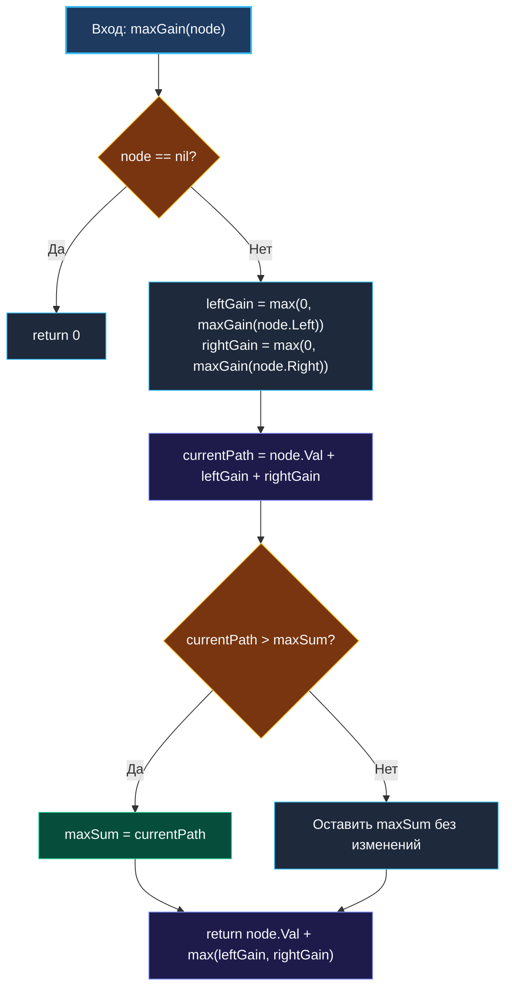

> *«Есть два способа создания архитектуры программы: сделать её настолько простой, чтобы в ней очевидно не было дефектов, либо настолько запутанной, чтобы в ней не было очевидных дефектов. Первый путь несравненно труднее».*  
> — Чарльз Эркюль Хоар

**LeetCode 124. Binary Tree Maximum Path Sum.** Дано бинарное дерево с произвольными (в том числе отрицательными) целыми числами в узлах. **Путь** определяется как последовательность узлов, в которой любая пара соседних узлов соединена ребром графа, причём ни один узел не посещается дважды (путь не может ветвиться). Сумма пути — сумма значений всех входящих в него узлов. Требуется найти **максимальную сумму пути** среди всех возможных путей в дереве. Путь обязан содержать хотя бы один узел и не обязан проходить через корень.

Это классическая задача уровня Hard, открывающая перед инженером фундаментальный паттерн: **Postorder DFS с разделением локального оптимума и глобального агрегата**. В отличие от линейных обходов ([[5. Path Sum]]), здесь дерево требует вычисления снизу вверх (bottom-up), где каждый узел принимает решение: что вернуть родителю для продолжения пути наверх, а какую дугу замкнуть внутри себя, сравнив её с историческим максимумом. С точки зрения механической симпатии Go задача идеально ложится на стек горутины, не требуя ни единой аллокации в куче.

---

### 1. Анатомия пути: раздвоение против продолжения

Главная ментальная ловушка задачи — забыть определение простого пути в теории графов. Путь — это линейная цепочка вершин. Если узел объединяет левое и правое поддеревья, образуя вершину («арку»), этот путь **не может быть продлён выше к его родителю**, иначе в узле возникло бы разветвление (степень вершины равнялась бы 3).

```
         Случай А: Арка (Вершина пути)               Случай Б: Продолжение родителю
              [Родитель]                                      [Родитель]
                  |  (нельзя соединить!)                           | (только одна ветвь!)
               [ Node ]                                         [ Node ]
               /      \                                         /      \
           [Left]    [Right]                                [Left]    [Right]
         (путь замкнут в Node)                          (выбираем лучшую ветвь)
  currentSum = Node + Left + Right               maxGain = Node + max(Left, Right)
```

Отсюда рождается строгое разделение двух понятий:
1. **`currentPathSum` (Локальная арка):** `node.Val + leftGain + rightGain`. Узел выступает наивысшей точкой (апексом) пути. Это значение конкурирует за звание глобального максимума `maxSum`.
2. **`maxGain(node)` (Вклад наверх):** `node.Val + max(leftGain, rightGain)`. Узел возвращает своему родителю максимальную сумму полупути, начинающегося в `node` и спускающегося строго в одну сторону.

Если поддерево приносит отрицательный суммарный вклад, мы вольны **не включать его в путь вообще**. В коде это выражается элегантной операцией отсечения (pruning): `max(0, gain)`.

---

### 2. Вопросы интервьюеру перед реализацией

- **Может ли дерево быть пустым (`root == nil`)?**  
  *Ответ:* По спецификации LeetCode дерево гарантированно содержит от $1$ до $3 \cdot 10^4$ узлов. Если бы дерево могло быть пустым, возврат `0` мог бы быть некорректен при наличии отрицательных узлов.
- **Могут ли все узлы дерева быть отрицательными?**  
  *Ответ:* Да, например дерево из одного узла `[-3]` или `[-2, -1]`. Это ключевой момент: начальное значение глобального максимума обязано быть `math.MinInt`, а не `0`. Максимальный путь в таком случае — единственный узел с наименьшим модулем (например, `-1`).
- **Может ли путь состоять ровно из одного узла?**  
  *Ответ:* Да, один изолированный узел является валидным путём длины 0 (по рёбрам) со значением узла.
- **Допустимо ли модифицировать исходное дерево?**  
  *Ответ:* Нет, обход должен быть чистым чтением.

---

### 3. Идиоматическая реализация на Go

В современном Go (начиная с версии 1.21) функция `max` входит в число встроенных (`builtin`), что избавляет от необходимости писать собственные хелперы.

```go
package main

import (
	"math"
)

// TreeNode представляет узел бинарного дерева.
type TreeNode struct {
	Val   int
	Left  *TreeNode
	Right *TreeNode
}

// maxPathSum находит максимальную сумму любого пути в дереве.
// Временная сложность: O(N) — каждый узел посещается ровно один раз.
// Пространственная сложность: O(H) — глубина стека вызовов, где H — высота дерева.
func maxPathSum(root *TreeNode) int {
	if root == nil {
		return 0
	}

	// Инициализируем минимально возможным int, так как все узлы
	// в дереве могут иметь отрицательные значения (например, [-3]).
	maxSum := math.MinInt

	var maxGain func(node *TreeNode) int
	maxGain = func(node *TreeNode) int {
		if node == nil {
			return 0
		}

		// Рекурсивный обход поддеревьев (Postorder: Left, Right, Node).
		// Обрезаем ветви с отрицательной суммой: если поддерево уходит в минус,
		// выгоднее вообще не включать его в наш путь (берём 0).
		leftGain := max(0, maxGain(node.Left))
		rightGain := max(0, maxGain(node.Right))

		// 1. Кандидат на глобальный максимум: путь, вершиной которого является node.
		// Он объединяет самого себя и обе ветви (арка).
		currentPath := node.Val + leftGain + rightGain
		if currentPath > maxSum {
			maxSum = currentPath
		}

		// 2. Вклад для родителя: узел может отдать наверх только одну
		// из своих ветвей, чтобы не допустить разветвления пути.
		return node.Val + max(leftGain, rightGain)
	}

	maxGain(root)
	return maxSum
}
```

---

### 4. Визуализация логики алгоритма



---

### 5. Пошаговая трассировка на сложном примере

Рассмотрим дерево, где отрицательный корень разделяет два прибыльных поддерева:
```
       [-10]
       /   \
     [9]   [20]
          /    \
        [15]   [7]
```

1. **Лист `9`:**
   - `leftGain = 0`, `rightGain = 0`.
   - `currentPath = 9 + 0 + 0 = 9` $\rightarrow$ `maxSum = 9`.
   - Возврат родителю: `9 + max(0, 0) = 9`.
2. **Лист `15`:**
   - `currentPath = 15` $\rightarrow$ `maxSum = 15`. Возврат родителю: `15`.
3. **Лист `7`:**
   - `currentPath = 7` $\rightarrow$ `maxSum = 15`. Возврат родителю: `7`.
4. **Узел `20`:**
   - `leftGain = max(0, 15) = 15`, `rightGain = max(0, 7) = 7`.
   - `currentPath = 20 + 15 + 7 = 42` $\rightarrow$ `maxSum = 42`.
   - Возврат родителю: `20 + max(15, 7) = 20 + 15 = 35`.
5. **Корень `-10`:**
   - `leftGain = max(0, 9) = 9`, `rightGain = max(0, 35) = 35`.
   - `currentPath = -10 + 9 + 35 = 34`. Так как $34 < 42$, `maxSum` остаётся равным `42`.
   - Возврат: `-10 + 35 = 25`.

**Итог:** максимальный путь равен **42** (цепочка `15 -> 20 -> 7`), и он даже не затронул корень дерева.

---

### 6. Механическая симпатия: стек, регистры и escape analysis

С точки зрения внутреннего устройства Go рантайма:
1. **Замыкание и Escape Analysis:**  
   Переменная `maxSum` объявлена во внешней функции и захватывается замыканием `maxGain`. Компилятор Go (`go build -gcflags="-m"`) анализирует время жизни `maxSum`. Поскольку замыкание не переживает вызов `maxPathSum` и не возвращается наружу, компилятор размещает переменную на стеке текущего фрейма, передавая в `maxGain` лишь указатель на регистре (в ABIInternal).
2. **Zero-Allocation Execution:**  
   Функция не создаёт объектов в куче: нет ни слайсов, ни динамических структур. Аллокаций: **0 B/op, 0 allocs/op**.
3. **Ветвление и CMOV:**  
   Конструкция `max(0, gain)` компилируется на x86-64 в пару инструкций `TESTQ` / `CMOVL` (условная пересылка данных), предотвращая сброс конвейера инструкций процессора из-за неверного предсказания перехода (Branch Misprediction).

---

### 7. Граничные случаи (Edge Cases)

- **Все вершины отрицательные:**  
  Дерево `[-3, -2, -5]`.  
  Благодаря `maxSum := math.MinInt`, вершина `-2` обновит `maxSum` до `-2`. Обрезание `max(0, -3)` вернёт `0`, не давая ухудшить результат суммированием с соседними отрицательными узлами. Ответ: `-2`.
- **Дерево-бамбук (вырожденное в список):**  
  Высота $H = N$. Глубина рекурсии достигнет $N$. В Go начальный стек горутины равен 2 КБ. При $N = 3 \cdot 10^4$ фреймы займут около 1–2 МБ. Рантайм Go плавно расширит стек через процедуру `runtime.morestack` без паники по Stack Overflow.

> [!INTERVIEW]
> **Вопрос интервьюера:** «Почему для `maxSum` нельзя взять начальное значение `0`?»  
> **Ответ кандидата:** «Потому что по условию задачи путь обязан содержать хотя бы один узел. Если все узлы дерева имеют отрицательные значения (например, корень равен `-5`), то максимальная сумма пути равна `-5`. Если инициализировать `maxSum = 0`, функция ошибочно вернёт `0`, что соответствует пустому пути, запрещённому условием».

---

### Резюме для интервью

| Критерий | Значение | Пояснение |
|---|---|---|
| **Время** | $O(N)$ | Каждый узел дерева посещается ровно один раз |
| **Память** | $O(H)$ | Глубина стека вызовов ($O(\log N)$ в сбалансированном, $O(N)$ в вырожденном) |
| **Аллокации** | $0$ байт | Вся работа выполняется на регистрах и стеке горутины |
| **Ключевой инвариант** | Разделение арки и полупути | Арка обновляет глобальный максимум; полупуть возвращается наверх |

В следующей задаче — [[7. Lowest Common Ancestor]] — мы применим аналогичную философию постобхода (Postorder DFS), но вместо агрегации числовых сумм научимся передавать наверх топологические маркеры обнаружения узлов.