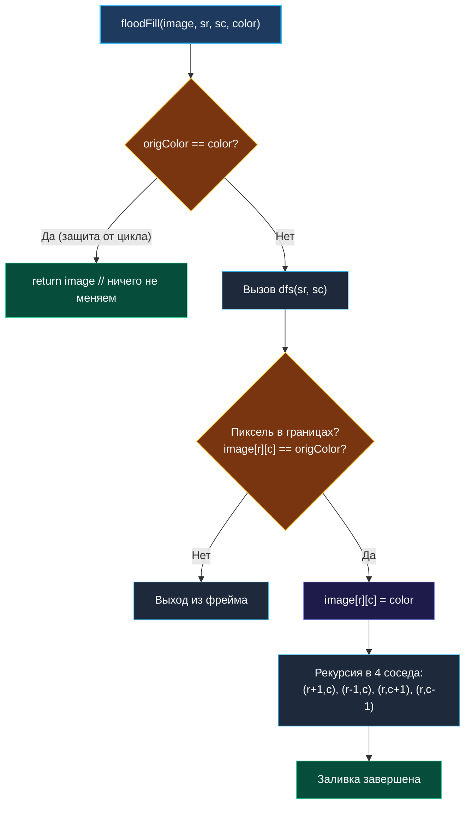

> *«Настоящая проблема заключается не в том, чтобы заставить машину работать быстро, а в том, чтобы сделать программу ясной. Как только код становится простым и прозрачным, оптимизировать его не составляет никакого труда».*  
> — Брайан Керниган

**LeetCode 733. Flood Fill.** Дано двумерное растровое изображение `image` размером $M \times N$, представленное целочисленной матрицей, а также координаты стартовой точки `(sr, sc)` и целевой цвет `color`. Требуется выполнить операцию «заливки» (аналог инструмента «Ведро краски» в графических редакторах): изменить цвет стартового пикселя и всех связных с ним пикселей того же исходного цвета по четырем направлениям (север, юг, запад, восток) на `color`.

Эта задача завершает кластер **DFS (Поиск в глубину)** и служит идеальным концептуальным мостом к кластеру **BFS (Поиск в ширину)**. На первый взгляд тривиальная задача скрывает классическую ловушку бесконечной рекурсии и ставит перед инженером фундаментальный системный вопрос: *что произойдет со стеком горутины, если залить однородный холст размером $1000 \times 1000$ пикселей?*

---

### 1. Архитектура алгоритма и критическая ловушка

Алгоритм заливки работает по принципу диффузии: мы сохраняем цвет исходного пикселя `origColor = image[sr][sc]`, меняем его на `color` и рекурсивно вызываем функцию для всех четырех соседей, чей цвет равен `origColor`.

```
         (r-1, c)   [Север]
            ▲
            │
(r, c-1) ◄──┼──► (r, c+1)   [Запад / Восток]
            │
            ▼
         (r+1, c)   [Юг]
```

> [!WARNING]
> **Критический подводный камень (Infinite Recursion):**  
> Что произойдет, если стартовый пиксель **уже имеет цвет `color`** (`image[sr][sc] == color`)?  
> Если не сделать ранний выход `if origColor == color { return image }`, алгоритм попытается перекрасить цвет `C` в цвет `C`. При проверке соседа он увидит цвет `C`, сочтет его подходящим и запустит рекурсию снова, бесконечно прыгая между соседними клетками вплоть до исчерпания памяти и фатального сбоя программы.

---

### 2. Вопросы интервьюеру перед реализацией

- **Может ли матрица быть пустой?**  
  *Ответ:* Гарантируется $M, N \ge 1$.
- **Разрешена ли модификация исходного массива (in-place)?**  
  *Ответ:* Да, мы возвращаем тот же срез `image`, модифицированный на месте. Это устраняет необходимость аллоцировать $M \times N$ новой памяти.
- **Считаются ли диагональные пиксели связными?**  
  *Ответ:* Нет, только 4-связность (по горизонтали и вертикали).
- **Нужен ли отдельный массив `visited`?**  
  *Ответ:* Нет! Сам факт изменения цвета пикселя `image[r][c] = color` автоматически помечает клетку как посещённую, так как её цвет больше не равен `origColor`.

---

### 3. Идиоматическая реализация на Go

#### Вариант А: Рекурсивный DFS (лаконичный и быстрый для умеренных сеток)

```go
package main

// floodFill выполняет 4-связную заливку области исходного цвета на newColor.
// Временная сложность: O(M * N) в худшем случае (посещение всех пикселей).
// Пространственная сложность: O(M * N) — глубина стека вызовов при змеевидной форме области.
func floodFill(image [][]int, sr int, sc int, color int) [][]int {
	origColor := image[sr][sc]

	// Ключевая защита: если исходный цвет уже равен целевому,
	// заливка не требуется. Иначе неизбежна бесконечная рекурсия!
	if origColor == color {
		return image
	}

	m, n := len(image), len(image[0])

	var dfs func(r, c int)
	dfs = func(r, c int) {
		// Проверка выхода за границы матрицы и совпадения цвета
		if r < 0 || r >= m || c < 0 || c >= n || image[r][c] != origColor {
			return
		}

		// Помечаем пиксель на месте (in-place)
		image[r][c] = color

		// 4 направления обхода
		dfs(r+1, c) // низ
		dfs(r-1, c) // верх
		dfs(r, c+1) // право
		dfs(r, c-1) // лево
	}

	dfs(sr, sc)
	return image
}
```

#### Вариант Б: Итеративный BFS с очередью (производственный стандарт против переполнения стека)

Когда размер холста велик (например, изображение $2000 \times 2000$), рекурсивный DFS рискует создать цепочку из миллионов фреймов. Итеративный BFS переносит нагрузку со стека горутины в кольцевой буфер или срез в куче.

```go
func floodFillBFS(image [][]int, sr int, sc int, color int) [][]int {
	origColor := image[sr][sc]
	if origColor == color {
		return image
	}

	m, n := len(image), len(image[0])
	
	// Очередь координат (r, c), упакованных в структуру для zero-pointer GC
	type point struct{ r, c int }
	queue := make([]point, 0, 64)
	queue = append(queue, point{r: sr, c: sc})

	// Помечаем сразу при постановке в очередь!
	image[sr][sc] = color

	dirs := [4][2]int{{1, 0}, {-1, 0}, {0, 1}, {0, -1}}

	for len(queue) > 0 {
		curr := queue[0]
		queue = queue[1:]

		for _, d := range dirs {
			nr, nc := curr.r+d[0], curr.c+d[1]
			if nr >= 0 && nr < m && nc >= 0 && nc < n && image[nr][nc] == origColor {
				// Маркировка ДО добавления предотвращает дубликаты в очереди!
				image[nr][nc] = color
				queue = append(queue, point{r: nr, c: nc})
			}
		}
	}

	return image
}
```

---

### 4. Визуализация логики работы алгоритма



---

### 5. Механическая симпатия: Память, Кэш-линии и Go Runtime

1. **Row-Major Layout и L1 Data Cache:**  
   В Go двумерный срез `[][]int` — это массив срезов. Каждая строка матрицы лежит в памяти последовательно. При обходе по горизонтали (`c + 1`, `c - 1`) процессор читает соседние ячейки из той же кэш-линии L1 (64 байта вмещают 8 элементов `int`). При вертикальных шагах происходит прыжок на другую строку, что чаще приводит к кэш-миссам.
2. **Стек горутины против кучи:**  
   Каждый рекурсивный вызов `dfs` создает фрейм на стеке горутины (~32–48 байт). При матрице $500 \times 500$ ($250\,000$ пикселей) худший случай (спиральная форма заливки) потребует около 10 МБ памяти. Стек горутины расширяется автоматически через `runtime.morestack`, но интенсивное перераспределение стека вызывает задержки рантайма.
3. **Маркировка в BFS:**  
   В BFS-варианте критично перекрашивать пиксель `image[nr][nc] = color` **в момент добавления в очередь**, а не в момент извлечения. Если отложить покраску до извлечения, одна и та же соседняя клетка будет добавлена в очередь всеми 4 соседями, вызвав взрывной рост потребления памяти до $O(4^{depth})$.

---

### 6. Сравнение подходов

| Параметр | Рекурсивный DFS | Итеративный BFS |
|---|---|---|
| **Сложность по времени** | $O(M \cdot N)$ | $O(M \cdot N)$ |
| **Память в худшем случае** | $O(M \cdot N)$ (стек вызовов) | $O(\text{периметр фронта}) \le O(M \cdot N)$ |
| **Устойчивость к Stack Overflow** | Риск при огромных сетках ($N > 10^5$) | Абсолютная устойчивость |
| **Сложность кода** | 10 строк, предельная простота | Требует явной структуры очереди |

---

### Резюме для интервью

- **Ключевой инвариант:** проверка `origColor == color` на входе предотвращает бесконечную рекурсию.
- **Zero-alloc трюк:** изменение цвета клетки на месте (`in-place`) избавляет от потребности в таблице `visited` и снижает потребление памяти до нуля (не считая стека/очереди).
- **Связность графа:** матрица рассматривается как неявный неориентированный граф с максимальной степенью вершин $d = 4$.

На этом мы завершаем кластер **DFS (Поиск в глубину)**. Все ключевые темы — обратная связь в деревьях, сбор глобального максимума, топологический поиск LCA и заливка матриц — изучены. В следующей главе мы переходим к кластеру **BFS (Поиск в ширину)** и начнем с фундаментальной теории: [[1. Теория. BFS]].