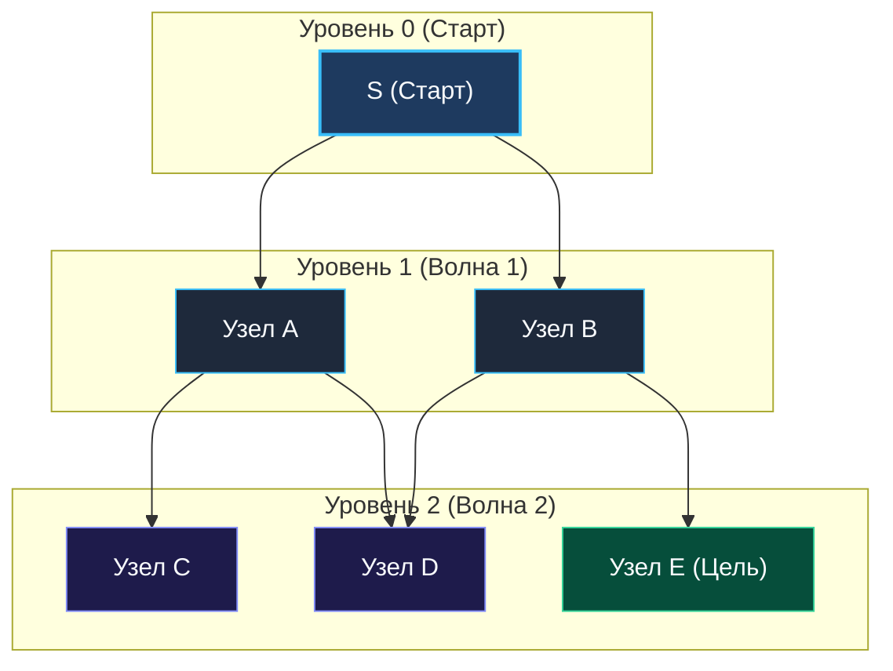
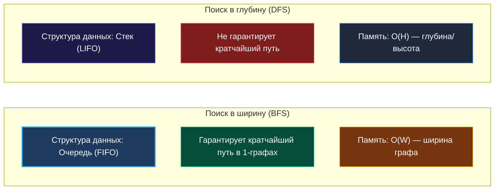

> *«Простейшие методы часто оказываются самыми глубокими: исследуя мир концентрическими кругами, мы находим кратчайший путь прежде, чем успеем заблудиться в лабиринте».*  
> — Эдсгер Вибе Дейкстра

Поиск в ширину (**Breadth-First Search, BFS**) — фундаментальный алгоритм теории графов, исследующий вершины по принципу концентрических волн. Если поиск в глубину ([[1. Теория. DFS|DFS]]) устремляется вглубь по первой попавшейся ветке до самого тупика, то BFS методично проверяет всех непосредственных соседей стартовой точки (шаг 1), затем соседей соседей (шаг 2) и так далее.

В архитектуре высоконагруженных бэкенд-систем BFS — это не просто инструмент обхода лабиринтов на алгоритмических секциях. На принципах BFS построены:
- **Сетевая маршрутизация (OSPF, Dijkstra):** поиск кратчайших сетевых путей с минимальным числом транзитных узлов (хопов).
- **Service Discovery & Load Balancing:** распространение gossip-протоколов (HashiCorp Memberlist / Consul) и поиск ближайших реплик в топологии ЦОД.
- **Распределенные социальные графы:** поиск графа связей через $K$ рукопожатий (LinkedIn, Facebook).
- **Сборка мусора в рантаймах (Tracing GC):** волновой обход живых объектов в алгоритмах трёхцветной маркировки (Tri-color marking), где плотная очередь гарантирует отличную пространственную локальность кэша процессора.

---

### 1. Анатомия алгоритма: FIFO-очередь и маркировка фронта

Классический алгоритм BFS опирается на строгий инвариант: **вершины извлекаются в порядке неубывания их расстояния от начальной вершины**. Для этого используется очередь первого входа — первого выхода (**FIFO**).

```
  Волна 0 (Старт)          Волна 1 (Шаг 1)            Волна 2 (Шаг 2)
      [ S ]       ───►      [ A ]   [ B ]     ───►     [ C ] [ D ] [ E ]
   дистанция: 0              дистанция: 1                дистанция: 2
```

#### Канонический волновой инвариант BFS
1. В момент, когда обрабатывается вершина на расстоянии $d$, в очереди могут находиться только вершины на расстоянии $d$ и $d + 1$.
2. В невзвешенном графе (где вес каждого ребра равен $1$) первый момент достижения целевой вершины $T$ гарантирует нахождение **кратчайшего пути**.

---

### 2. Визуализация волнового фронта BFS



---

### 3. Mechanical Sympathy в Go: Ловушка `queue = queue[1:]`

При реализации очереди в Go разработчики нередко совершают грубейшую ошибку, наивно отрезая первый элемент слайса:

```go
// АНТИПАТТЕРН: Скрытая утечка памяти и деградация GC!
queue := []*Node{root}

for len(queue) > 0 {
    curr := queue[0]
    queue = queue[1:] // ОПАСНО!
    // ...
}
```

> [!WARNING]
> **Почему `queue[1:]` приводит к утечке памяти?**  
> Срез в Go — это заголовок (`SliceHeader`) из трёх машинных слов: указатель на базовый массив (`Data`), длина (`Len`) и вместимость (`Cap`).  
> Выражение `queue = queue[1:]` лишь сдвигает указатель `Data` вправо на 8 байт и уменьшает `Len` и `Cap`. Базовый массив в куче **не освобождается**, а указатели на уже «удалённые» узлы остаются в памяти до тех пор, пока жив хотя бы один срез, ссылающийся на этот массив!  
> В результате сборщик мусора Go (GC) **не может освободить из памяти ни один пройденный узел**, удерживаемый старыми ячейками массива. При обходе графа на $1\,000\,000$ узлов это приводит к стремительному раздуванию кучи (Heap Bloat) и OOM-панике.

#### Как реализовать очередь в Go эффективно: три подхода

1. **Сдвиг индекса головы (`head` pointer):**  
   Самый простой и быстрый способ для алгоритмических задач. Срез растёт через `append`, а чтение идёт по индексу `head`. При исчерпании очереди базовый массив можно переиспользовать через `queue = queue[:0]`.
2. **Зануление пройденных указателей:**  
   Если в очереди лежат указатели (`*Node`), перед сдвигом `head` ячейку обнуляют: `queue[head] = nil`, чтобы GC мог забрать пройденный узел.
3. **Кольцевой буфер (Ring Buffer):**  
   Производственный стандарт для бесконечных очередей фиксированной емкости, исключающий любые аллокации в цикле.

```go
package main

// Queue представляет zero-alloc очередь на базе среза с занулением ссылок.
type Queue[T any] struct {
	data []T
	head int
}

func NewQueue[T any](initialCap int) *Queue[T] {
	return &Queue[T]{
		data: make([]T, 0, initialCap),
	}
}

func (q *Queue[T]) Push(val T) {
	q.data = append(q.data, val)
}

func (q *Queue[T]) Pop() T {
	val := q.data[q.head]
	var zero T
	q.data[q.head] = zero // Зануляем ячейку для помощи Garbage Collector
	q.head++

	// Если вся очередь вычитана, сбрасываем указатели в начало
	if q.head == len(q.data) {
		q.data = q.data[:0]
		q.head = 0
	}
	return val
}

func (q *Queue[T]) Len() int {
	return len(q.data) - q.head
}

func (q *Queue[T]) IsEmpty() bool {
	return q.head == len(q.data)
}
```

---

### 4. Почему непрерывный слайс превосходит `container/list`

В стандартной библиотеке Go есть пакет `container/list`, реализующий классический двусвязный список. Однако в высокопроизводительном коде его использовать **категорически не рекомендуется**:

| Характеристика | `container/list` (Двусвязный список) | Очередь на базе `[]T` (Срез Go) |
|---|---|---|
| **Аллокации в куче** | $1$ аллокация `Element` на каждый `PushBack` | $0$ аллокаций после амортизации емкости |
| **Кэш-локальность L1** | Ужасная (узлы хаотично разбросаны в куче) | Превосходная (непрерывный блок памяти) |
| **Pointer Chasing** | Каждый шаг — прыжок по указателям `prev`/`next` | Прямая индексация через `base + offset` |
| **Удар по GC** | Миллион мелких объектов в куче | Один непрерывный массив под срез |

Современный процессор за один такт загружает из оперативной памяти в кэш-линию L1 блок размером 64 байта (8 указателей или целых чисел). При чтении последовательного среза следующие 7 элементов уже находятся в L1d кэше с нулевой задержкой!

---

### 5. Сравнение фундаментальных характеристик: BFS vs DFS



| Параметр | Поиск в ширину (BFS) | Поиск в глубину (DFS) |
|---|---|---|
| **Структура памяти** | Очередь (FIFO) | Стек вызовов или явный срез (LIFO) |
| **Кратчайший путь** | Всегда находит первым в невзвешенном графе | Не гарантирует (может блуждать по длинной ветке) |
| **Пространственная сложность** | $O(W)$, где $W$ — максимальная ширина слоя | $O(H)$, где $H$ — максимальная глубина дерева |
| **Расход памяти на сбалансированном дереве** | $O(N/2) = O(N)$ на последнем слое | $O(\log N)$ на фреймы рекурсии |
| **Применение** | Кратчайшие расстояния, волновые алгоритмы, уровни | Бэктрекинг, топологическая сортировка, поиск компонент |

---

### 6. Собеседование: ключевые вопросы и ловушки

> [!INTERVIEW]
> **Вопрос интервьюера:** «Что произойдёт с BFS, если граф взвешенный (длины рёбер различны)? Найдёт ли он кратчайший путь?»  
> **Ответ:** «Нет! BFS опирается на предположение, что каждый переход стоит ровно $1$. Если ребро $S \rightarrow B$ имеет вес $10$, а путь $S \rightarrow A \rightarrow B$ суммарно стоит $1 + 1 = 2$, классический BFS сначала пойдет в $B$ напрямую за $1$ шаг и ошибочно зафиксирует вес $10$. Для взвешенных графов BFS обобщается до **алгоритма Дейкстры**, где FIFO-очередь заменяется на очередь с приоритетом (Min-Heap)».

> [!INTERVIEW]
> **Вопрос интервьюера:** «В какой момент узел графа должен помечаться в `visited` — при добавлении в очередь или при извлечении из неё?»  
> **Ответ:** «Строго в момент **добавления в очередь**! Если отложить маркировку до момента извлечения из очереди, несколько соседних узлов добавят одну и ту же не посещённую вершину в очередь множество раз. Это вызовет лавинообразный рост размера очереди и деградацию памяти до $O(V^2)$ или экспоненты».

---

### Резюме

1. **Инвариант BFS:** Послойное волновое расширение фронта гарантирует поиск кратчайшего пути в невзвешенных графах за $O(V + E)$ времени.
2. **Очередь в Go:** Избегайте наивного `queue[1:]`. Используйте скользящий индекс `head` с занулением ссылок для бережного отношения к GC.
3. **Память:** Потребление памяти пропорционально ширине графа ($O(W)$). На полных бинарных деревьях на последнем уровне скапливается до $50\%$ всех узлов дерева.

В следующей статье мы подробно изучим ключевой паттерн решения задач на деревья — послойную обработку: [[2. Обход по уровням]].