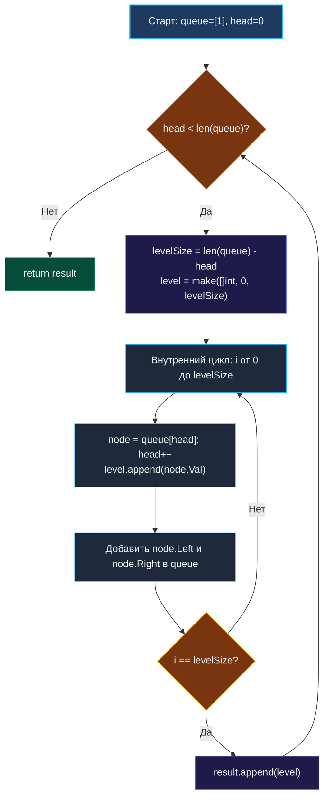

> *«Структуры данных определяют алгоритмы, а не наоборот. Правильно организованные уровни абстракции делают код простым и самоочевидным».*  
> — Роб Пайк

Обход по уровням (**Level Order Traversal**) — канонический архитектурный паттерн применения поиска в ширину ([[1. Теория. BFS|BFS]]) к древовидным структурам. Если базовый BFS последовательно «выплёвывает» элементы в один плоский поток, то в подавляющем большинстве реальных задач требуется сохранить топологическую структуру слоёв: сгруппировать вершины по глубине `[[1], [2, 3], [4, 5, 6, 7]]`.

В архитектуре распределённых бэкенд-систем этот паттерн отражает обработку любых иерархических моделей:
- **Организационные структуры и RBAC:** каскадное распространение политик доступа от головных подразделений к дочерним отделам.
- **Пакетные запросы к базам данных (Batching / DataLoaders):** решение проблемы $N+1$ запросов. Вместо того чтобы для каждого узла отправлять отдельный SQL-запрос за его детьми, мы делаем один агрегирующий запрос `WHERE parent_id IN (...)` сразу для всех узлов текущего слоя.
- **Модель Bulk Synchronous Parallel (BSP):** послойная параллельная обработка графов в Apache Spark (GraphX) и Google Pregel.

---

### 1. Архитектурная дилемма: как элегантно разделять уровни?

Исторически инженеры пытались решить задачу разделения уровней тремя способами:

1. **Две раздельные очереди (Ping-Pong Buffers):**  
   Чтение узлов ведётся из очереди `currentLevel`, а их потомки складываются в очередь `nextLevel`. По завершении слоя очереди меняются местами.  
   *Минус:* удвоенные накладные расходы на управление структурами данных и лишние аллокации.
2. **Использование служебных маркеров-разделителей (Sentinels):**  
   В очередь помещается специальное значение `nil`, обозначающее границу слоя.  
   *Минус:* загрязняет типизированную очередь искусственными значениями и требует разветвлённых проверок `if node == nil`.
3. **Паттерн «Снимок размера очереди» (Queue Snapshot — Золотой стандарт):**  
   В начале каждого внешнего шага цикла мы фиксируем моментальный размер очереди: `levelSize := len(queue)`. Затем выполняем внутренний цикл ровно `levelSize` раз. Все дети, добавляемые в процессе, попадают в конец очереди и **не влияют на границу текущего слоя**.

```
Итерация 1:
   Очередь: [ 1 ]             ──► levelSize = 1, обрабатываем 1 узел, добавляем [2, 3]

Итерация 2:
   Очередь: [ 2, 3 ]          ──► levelSize = 2, обрабатываем 2 узла, добавляем [4, 5, 6, 7]

Итерация 3:
   Очередь: [ 4, 5, 6, 7 ]    ──► levelSize = 4, обрабатываем 4 узла...
```

---

### 2. Идиоматическая реализация на Go: Срез со скользящей головой

Чтобы избежать скрытой утечки памяти от выражения `queue = queue[1:]` (подробно разобранной в [[1. Теория. BFS]]), в высокопроизводительном Go-коде мы используем непрерывный срез со смещением индекса головы `head`.

```go
package main

// TreeNode представляет узел бинарного дерева.
type TreeNode struct {
	Val   int
	Left  *TreeNode
	Right *TreeNode
}

// levelOrder выполняет послойную группировку узлов дерева.
// Временная сложность: O(N) — каждый узел обрабатывается ровно 1 раз.
// Пространственная сложность: O(N) — максимальная ширина слоя W <= N/2.
func levelOrder(root *TreeNode) [][]int {
	if root == nil {
		return nil
	}

	// Очередь на базе плоского среза
	queue := []*TreeNode{root}
	head := 0
	result := make([][]int, 0, 16)

	for head < len(queue) {
		// КЛЮЧЕВОЙ МОМЕНТ: фиксируем размер текущего уровня
		levelSize := len(queue) - head

		// Предаллоцируем срез под элементы слоя точно заданного размера
		level := make([]int, 0, levelSize)

		// Обрабатываем строго элементы текущего слоя
		for i := 0; i < levelSize; i++ {
			node := queue[head]
			queue[head] = nil // Очищаем ссылку, помогая GC
			head++

			level = append(level, node.Val)

			if node.Left != nil {
				queue = append(queue, node.Left)
			}
			if node.Right != nil {
				queue = append(queue, node.Right)
			}
		}

		result = append(result, level)
	}

	return result
}
```

---

### 3. Визуализация пошаговой работы алгоритма



---

### 4. Механическая симпатия: Память, GC и Предаллокация

1. **Эффект `make([]int, 0, levelSize)`:**  
   Если инициализировать срез без указания емкости (`var level []int`), Go начинает с емкости 0, затем при росте последовательно аллоцирует блоки на 1, 2, 4, 8 элементов. При обходе слоя из $1024$ узлов рантайм выполнит около 10 реаллокаций и копирований памяти в куче. Точная передача емкости `levelSize` сокращает число аллокаций до **ровно одной на весь слой**.
2. **Зануление ссылок `queue[head] = nil`:**  
   Поскольку базовый массив среза `queue` живет в течение всего времени работы функции, без зануления пройденных ячеек все узлы дерева удерживались бы в памяти вплоть до финального выхода из функции. Зануление позволяет GC освобождать узлы верхних слоев еще до завершения обхода всего дерева.
3. **Амортизированная сложность среза очереди:**  
   Срез `queue` удваивает свою емкость при исчерпании, что гарантирует амортизированную стоимость добавления $O(1)$ за операцию `append`.

---

### 5. Семейство задач на базе паттерна Level Order

Освоив послойный снимок, вы мгновенно решаете целый спектр олимпиадных и прикладных задач:

- **Zigzag Level Order:** обход «змейкой» (слой слева направо, следующий справа налево).  
  *Решение:* собираем уровень стандартно, а для нечётных уровней разворачиваем срез за $O(K)$ на месте двумя указателями.
- **Right Side View (Вид дерева справа):**  
  *Решение:* в каждом слое берем последний элемент: `level[len(level)-1]`.
- **Average of Levels (Среднее значение на слое):**  
  *Решение:* суммируем элементы в рамках внутреннего цикла и делим на `levelSize`.
- **Maximum Width of Binary Tree:**  
  *Решение:* помещаем в очередь пару `(node, index)`, вычисляя ширину слоя как `lastIndex - firstIndex + 1`.

---

### Резюме для интервью

> [!INTERVIEW]
> **Каверзный вопрос:** «Зачем нужен внутренний цикл `for i := 0; i < levelSize; i++`, если можно обойтись одним внешним циклом `while len(queue) > 0` и счетчиком глубины?»  
> **Ответ:** «Использование двух вложенных циклов разделяет ответственности: внешний цикл отвечает за смену уровней, а внутренний — за изолированную обработку элементов одного слоя. Это позволяет предаллоцировать память под конкретный слой `make([]int, 0, levelSize)`, атомарно зафиксировать его границы и производить агрегации (сумма, минимум, разворот) прямо по месту, не загромождая алгоритм дополнительными структурами данных».

В следующей практической статье мы закрепим этот паттерн на канонической задаче: [[3. Binary Tree Level Order Traversal]].