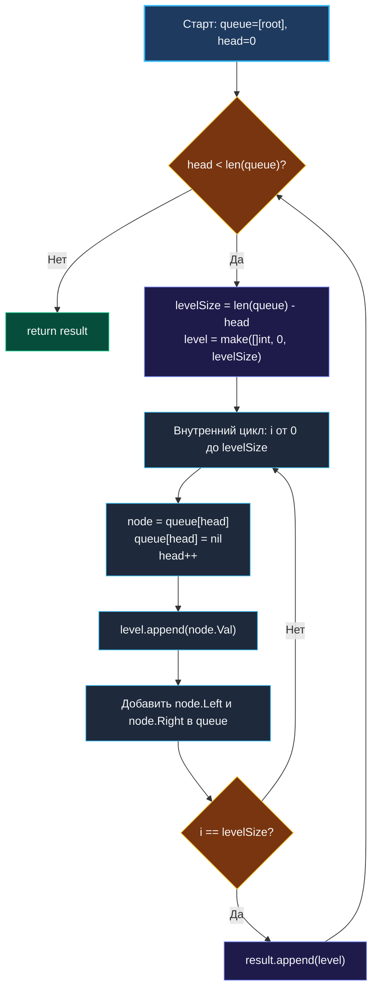

> *«Отладка кода вдвое сложнее, чем его первоначальное написание. Поэтому, если вы пишете код настолько умно, насколько способны, вы по определению недостаточно сообразительны, чтобы его отлаживать».*  
> — Брайан Керниган

**LeetCode 102. Binary Tree Level Order Traversal.** Дано бинарное дерево. Требуется вернуть значения его узлов в виде двумерного среза `[][]int`, сгруппированного по уровням (слева направо для каждого горизонтального слоя дерева).

Если в обзорных главах ([[1. Теория. BFS]] и [[2. Обход по уровням]]) мы сформулировали теоретические принципы волнового обхода, то задача 102 — это эталонный полигон для проверки навыков Senior Go-инженера. На реальном собеседовании от кандидата ждут не просто рабочего цикла, а глубокого понимания механической симпатии: предотвращения утечек памяти при работе со срезами, минимизации реаллокаций памяти (`0 allocs/op` на промежуточных операциях) и снижения задержек сборщика мусора (GC).

---

### 1. Архитектурный каркас: снимок слоя и скользящее окно

Главная опасность наивной реализации поиска в ширину — смешивание узлов разных уровней в едином плоском цикле. Решение задачи опирается на инвариант **«Снимка размера уровня» (Queue Snapshot)**:

1. В начале обработки каждого горизонтального слоя мы фиксируем количество узлов, находящихся в очереди прямо сейчас: `levelSize := len(queue) - head`.
2. Мы выполняем ровно `levelSize` шагов внутреннего цикла, извлекая элементы текущего уровня и добавляя их дочерние узлы в конец очереди.
3. Поскольку дети добавляются за пределы зафиксированного диапазона `[head, head + levelSize)`, они гарантированно попадут только в следующий уровень.

```
                   [ 3 ]              Уровень 0: [3]
                  /     \
                [ 9 ]  [ 20 ]         Уровень 1: [9, 20]
                       /    \
                     [15]   [ 7 ]     Уровень 2: [15, 7]
```

---

### 2. Вопросы интервьюеру перед написанием кода

- **Что возвращать, если корень дерева `nil`?**  
  *Ответ:* Пустой срез `nil` или `[][]int{}`. В Go идиоматично возвращать `nil`, так как срез с нулевым значением корректно сериализуется в JSON как `[]` или `null` в зависимости от тегов.
- **Каков максимальный размер дерева?**  
  *Ответ:* До $2000$ узлов. Это означает, что максимальная ширина слоя составит до $1000$ элементов.
- **Могут ли значения в узлах быть отрицательными?**  
  *Ответ:* Да, значения лежат в диапазоне $[-1000, 1000]$. Это не влияет на логику группировки.

---

### 3. Идиоматическая реализация на Go

```go
package main

// TreeNode представляет узел бинарного дерева.
type TreeNode struct {
	Val   int
	Left  *TreeNode
	Right *TreeNode
}

// levelOrder выполняет горизонтальный обход бинарного дерева по слоям.
// Временная сложность: O(N) — посещение каждого узла ровно 1 раз.
// Пространственная сложность: O(N) — максимальный размер очереди (до N/2 узлов на нижнем слое).
func levelOrder(root *TreeNode) [][]int {
	if root == nil {
		return nil
	}

	// Инициализируем очередь срезом достаточной начальной емкости
	queue := []*TreeNode{root}
	head := 0
	result := make([][]int, 0, 16)

	for head < len(queue) {
		// 1. Фиксируем снимок размера текущего горизонтального слоя
		levelSize := len(queue) - head

		// 2. Предаллоцируем срез под элементы слоя точно заданного размера
		level := make([]int, 0, levelSize)

		// 3. Обрабатываем строго levelSize узлов текущего слоя
		for i := 0; i < levelSize; i++ {
			node := queue[head]
			queue[head] = nil // Очищаем ссылку: защита от удержания объектов в GC!
			head++

			level = append(level, node.Val)

			if node.Left != nil {
				queue = append(queue, node.Left)
			}
			if node.Right != nil {
				queue = append(queue, node.Right)
			}
		}

		result = append(result, level)
	}

	return result
}
```

---

### 4. Визуализация логики алгоритма



---

### 5. Механическая симпатия: Память, Pointer Chasing и GC

1. **Защита от Pointer Retention (`queue[head] = nil`):**  
   Когда мы сдвигаем индекс `head++`, ячейка `queue[head-1]` физически остаётся внутри базового массива среза `queue`. Если не записать туда `nil`, сборщик мусора рантайма Go будет видеть живой указатель на узел `*TreeNode`, удерживая в памяти как сам узел, так и всю его структуру до момента завершения функции `levelOrder`. Для деревьев из сотен тысяч узлов это приводит к колоссальным просадкам памяти.
2. **Предаллокация `make([]int, 0, levelSize)`:**  
   Зная точное число элементов на слое, мы выделяем память ровно один раз. Без этого вызов `append` приводил бы к каскадным реаллокациям базового массива через функцию `runtime.growslice`, порождая мусор в куче.
3. **Кэш-локальность и Pointer Chasing:**  
   Узлы дерева аллоцированы в куче независимо. Чтение `node.Left` и `node.Right` неизбежно вызывает промахи кэша процессора L1/L2 (Cache Miss), так как адреса в куче разрознены. Однако наша очередь `queue` представляет собой монолитный непрерывный срез, поэтому итерация по индексам `queue[head]` выполняется процессором с максимальной эффективностью предвыборки (Hardware Prefetcher).

---

### 6. Собеседование: Вариации и трюки

> [!INTERVIEW]
> **Вопрос интервьюера:** «Как модифицировать этот алгоритм для задачи **Zigzag Level Order Traversal** (LeetCode 103), где чётные уровни должны идти слева направо, а нечётные — справа налево?»  
>
> **Ответ кандидата:**  
> «Очередь и порядок обхода детей в BFS трогать **категорически нельзя**, иначе нарушится топологический порядок следующих слоёв. Мы сохраняем стандартный обход слева направо. Единственное изменение: перед добавлением готового среза `level` в `result` мы проверяем чётность текущего слоя:
> ```go
> if len(result)%2 == 1 {
>     slices.Reverse(level) // Разворот на месте за O(K) без аллокаций
> }
> result = append(result, level)
> ```
> Использование функции `slices.Reverse` из стандартного пакета Go 1.21+ выполняет разворот на месте за $O(K)$ без выделения дополнительной памяти».

---

### Резюме для интервью

| Параметр | Значение | Пояснение |
|---|---|---|
| **Временная сложность** | $O(N)$ | Каждый узел дерева помещается в очередь и извлекается ровно 1 раз |
| **Пространственная сложность** | $O(W) \le O(N)$ | Максимальная ширина очереди на нижнем слое полного дерева |
| **Аллокации на слой** | Ровно 1 | За счёт `make([]int, 0, levelSize)` |
| **Сборщик мусора (GC)** | Защищён | Явное зануление указателей `queue[head] = nil` |

В следующей задаче — [[4. Minimum Depth of Binary Tree]] — мы увидим, как послойный BFS обеспечивает мгновенный ранний выход (Early Exit) для поиска кратчайшего расстояния до первого листа дерева.