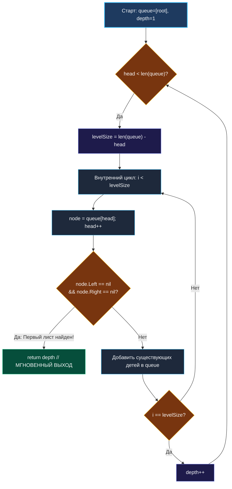

> *«Преждевременная оптимизация — корень всех зол, однако умение остановиться в тот самый момент, когда цель достигнута, отличает выдающегося инженера от посредственного».*  
> — Дональд Кнут

**LeetCode 111. Minimum Depth of Binary Tree.** Дано бинарное дерево. Требуется найти его **минимальную глубину** — количество узлов на кратчайшем пути от корневого узла до ближайшего листового узла (узла, у которого нет ни левого, ни правого потомка).

Эта задача — хрестоматийный пример того, как выбор парадигмы обхода графа кардинально меняет вычислительную сложность и задержку (Latency) системы. Если для задачи подсчета максимальной глубины дерева одинаково хорошо подходят как DFS, так и BFS, то в задаче о минимальной глубине **поиск в ширину (BFS) безоговорочно доминирует** благодаря возможности мгновенного раннего завершения (**Early Exit**).

---

### 1. Архитектурный батл: BFS против DFS

Представьте несбалансированное дерево из $1\,000\,000$ узлов, у которого на глубине 3 находится лист, а правая ветвь уходит на миллион узлов вниз.

```
                  [ 1 ]               Уровень 1
                 /     \
              [ 2 ]   [ 3 ]           Уровень 2
             /            \
          [ 4 ] (ЛИСТ!)  [ 5 ]        Уровень 3: НАЙДЕН ЛИСТ! ВЫХОД!
                          /
                        ... (еще 999 995 узлов вниз)
```

- **Подход DFS (Поиск в глубину):**  
  Обязан обойти **все $1\,000\,000$ узлов** дерева, спускаясь до самого дна каждого поддерева, чтобы вычислить `min(leftDepth, rightDepth)`. Сложность: строго $O(N)$ времени, $10^6$ вызовов функций, сотни килобайт стека.
- **Подход BFS (Поиск в ширину):**  
  Двигаясь концентрическими кругами от корня, алгоритм проверит узел 1, затем узлы 2 и 3, и на 3-м уровне наткнется на узел 4 без потомков.  
  Алгоритм **немедленно возвращает 3 и завершает работу**, посетив всего $1 + 2 + 2 = 5$ узлов вместо миллиона! Сложность: $O(2^{\text{minDepth}}) \ll O(N)$.

---

### 2. Коварная ловушка формулировки: что считается листом?

Большинство кандидатов на собеседованиях совершают классическую ошибку при попытке написать рекурсивный DFS:

```go
// ГРУБАЯ ОШИБКА: Так писать нельзя!
func minDepthWrong(root *TreeNode) int {
    if root == nil {
        return 0
    }
    // Если у узла есть только правый потомок, minDepth(root.Left) вернет 0,
    // и функция ошибочно решит, что глубина равна 0 + 1 = 1!
    return 1 + min(minDepthWrong(root.Left), minDepthWrong(root.Right))
}
```

> [!WARNING]
> **Определение листа в теории графов:**  
> Лист — это узел, у которого **нет ни одного ребенка** (`node.Left == nil && node.Right == nil`).  
> Если у корня нет левого ребенка, но есть правая ветка из 100 узлов, путь не может закончиться в пустом левом поддереве! Минимальная глубина такого дерева равна 101, а ошибочный DFS-код выше вернёт 1.

**Преимущество BFS:** Алгоритм поиска в ширину полностью защищён от этой ловушки, так как проверка на лист выполняется прямо и декларативно:
```go
if node.Left == nil && node.Right == nil {
    return depth // Нашли первый же лист!
}
```

---

### 3. Идиоматическая реализация на Go (BFS Early Exit)

```go
package main

// TreeNode представляет узел бинарного дерева.
type TreeNode struct {
	Val   int
	Left  *TreeNode
	Right *TreeNode
}

// minDepth находит минимальную глубину дерева с помощью BFS.
// Временная сложность: O(V_visited) <= O(N), в лучшем случае O(1).
// Пространственная сложность: O(W) — ширина очереди на уровне найденного листа.
func minDepth(root *TreeNode) int {
	if root == nil {
		return 0
	}

	queue := []*TreeNode{root}
	head := 0
	depth := 1 // Корень дерева находится на глубине 1

	for head < len(queue) {
		levelSize := len(queue) - head

		// Сканируем текущий слой
		for i := 0; i < levelSize; i++ {
			node := queue[head]
			queue[head] = nil // Помогаем GC
			head++

			// ПРОВЕРКА НА ЛИСТ: если потомков нет, это ближайший лист!
			if node.Left == nil && node.Right == nil {
				return depth // Мгновенный выход!
			}

			if node.Left != nil {
				queue = append(queue, node.Left)
			}
			if node.Right != nil {
				queue = append(queue, node.Right)
			}
		}

		depth++
	}

	return depth
}
```

---

### 4. Визуализация волнового поиска с ранним выходом



---

### 5. Механическая симпатия: Экономия ресурсов CPU и RAM

1. **Экономия тактов CPU на вызовах функций:**  
   В DFS каждый уровень рекурсии требует инструкций процессора `CALL`, сохранения регистров и проверки границ стека (`runtime.morestack`). В BFS цикл плоский, компилируется в простые инструкции безусловного перехода `JMP`, а при срабатывании `return depth` выполнение немедленно завершается.
2. **Мгновенное освобождение кучи:**  
   Когда срабатывает ранний выход `return depth`, функция выходит, и срез `queue` становится недостижимым. Сборщик мусора Go забирает маленький массив очереди за доли микросекунды, так как мы даже не успели выделить память под миллионы глубоких узлов.
3. **Hardware Prefetcher Friendly:**  
   Поскольку мы читаем узлы из очереди подряд, предвыборщик процессора (Hardware Prefetcher) заранее подтягивает элементы очереди в кэш-линии L1/L2.

---

### 6. Собеседование: Как правильно написать DFS (если настоял интервьюер)

Если интервьюер говорит: *«Отлично, BFS оптимален. А теперь напишите корректный DFS»*, покажите класс:

```go
func minDepthDFS(root *TreeNode) int {
	if root == nil {
		return 0
	}
	// Если левого поддерева нет — ищем лист только в правом!
	if root.Left == nil {
		return 1 + minDepthDFS(root.Right)
	}
	// Если правого поддерева нет — ищем лист только в левом!
	if root.Right == nil {
		return 1 + minDepthDFS(root.Left)
	}
	// Есть оба потомка — берем минимум из двух путей
	return 1 + min(minDepthDFS(root.Left), minDepthDFS(root.Right))
}
```

---

### Резюме для интервью

| Характеристика | Поиск в ширину (BFS) | Поиск в глубину (DFS) |
|---|---|---|
| **Время в лучшем случае** | $O(1)$ (если корень или его ребенок — лист) | $O(N)$ (обязан обойти всё дерево) |
| **Время в худшем случае** | $O(N)$ (лист на самом глубоком уровне) | $O(N)$ |
| **Память в худшем случае** | $O(W) \le O(N/2)$ | $O(H) \le O(N)$ |
| **Риск ошибки в определении листа** | Нулевой (явная проверка `Left == nil && Right == nil`) | Высокий (нужно обрабатывать `nil`-ветви) |

В следующей задаче — [[5. Word Ladder]] — мы покинем мир деревьев и погрузимся в графы словарных состояний, где BFS решает сложнейшую комбинаторную задачу поиска кратчайшей цепочки мутаций.