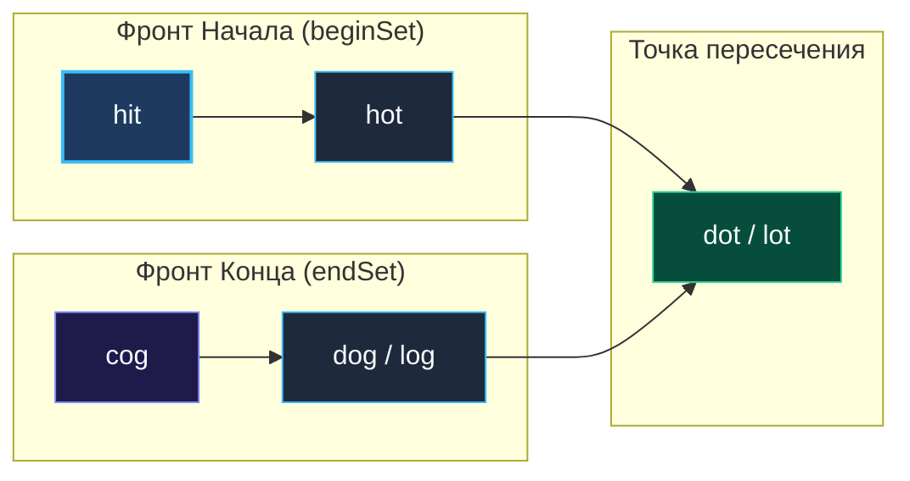

> *«Программирование — это искусство находить ясность среди лабиринта возможностей. Если пространство вариантов разрастается с пугающей скоростью, начните двигаться навстречу цели с обоих концов одновременно».*  
> — Брайан Керниган

**LeetCode 127. Word Ladder.** Даны два слова `beginWord` и `endWord`, а также словарь допустимых слов `wordList`. Все слова имеют одинаковую длину $L$ и состоят только из строчных букв латинского алфавита. За один ход разрешается заменить ровно одну букву так, чтобы получившееся слово присутствовало в `wordList`. Требуется найти **минимальное количество слов** в цепочке превращений от `beginWord` до `endWord`. Если такой путь не существует, вернуть `0`.

Если в задачах на деревья ([[3. Binary Tree Level Order Traversal]], [[4. Minimum Depth of Binary Tree]]) топология графа была явно задана указателями, то в задаче «Лестница слов» перед инженером встаёт **неявный граф состояний** (Implicit State Graph). То, как именно мы будем исследовать этот граф, определяет грань между немедленным падением по таймауту (Time Limit Exceeded) и молниеносным решением за доли миллисекунд.

---

### 1. Архитектура пространства состояний: наивный перебор против генерации соседей

Пусть $N$ — размер словаря ($N \le 5000$), а $L$ — длина слова ($L \le 10$).

- **Наивный подход ($O(N^2 \cdot L)$):**  
  Сравнить каждую пару слов словаря, вычисляя расстояние Хэмминга. Для словаря в $5000$ слов это потребует $5000 \times 5000 \times 10 \approx 250\,000\,000$ операций сравнения байтов ещё до запуска самого поиска. Это гарантированный TLE.
- **Генерация соседей на лету ($O(N \cdot L \cdot 26)$):**  
  Поместим словарь в хеш-таблицу `map[string]struct{}` с проверкой за $O(1)$. Для текущего слова мы последовательно подставляем все $26$ букв английского алфавита в каждую из $L$ позиций ($L \times 26$ вариантов) и проверяем наличие мутации в словаре. Для слова длины $5$ это всего $5 \times 26 = 130$ быстрых поисков по хешу!

---

### 2. Вершина мастерства: Двунаправленный BFS (Bidirectional BFS)

Классический поиск в ширину расширяет волновой фронт исключительно от стартового слова `beginWord`. Если ветвистость графа составляет в среднем $B$, а длина кратчайшего пути равна $D$, то классический BFS будет вынужден просканировать $O(B^D)$ узлов. При $B = 5$ и $D = 8$ это порядка $5^8 \approx 390\,625$ вершин.

**Двунаправленный BFS** запускает два встречных фронта:
1. Прямая волна из `beginWord`.
2. Обратная волна из `endWord`.

```
Прямой BFS:            [Старт] ───────► ◯ ───► ◯ ───► ◯ ───► ◯ ───► [Финиш]
                       Площадь поиска ~ O(B^D)

Двунаправленный BFS:   [Старт] ───► ◯ ───► ⦿ ◄─── ◯ ◄─── [Финиш]
                       Площадь поиска ~ O(2 * B^(D/2))
```

Встреча фронтов происходит посередине. Сложность падает с $O(B^D)$ до $O(2 \cdot B^{D/2})$! Для $B=5, D=8$ это всего $2 \times 5^4 = 1\,250$ проверок — **ускорение в 300 раз!**

Ключевой трюк: на каждом шаге мы всегда **расширяем меньший из двух фронтов**, удерживая размер памяти и число аллокаций на минимально возможном уровне.

---

### 3. Идиоматическая реализация на Go

```go
package main

// ladderLength находит кратчайшую цепочку трансформации слов с помощью Bidirectional BFS.
// Временная сложность: O(N * L * 26) в худшем случае, на практике O(B^(D/2)).
// Пространственная сложность: O(N * L) — хранение словаря и фронтов волны.
func ladderLength(beginWord string, endWord string, wordList []string) int {
	// 1. Помещаем словарь в zero-alloc Set
	dict := make(map[string]struct{}, len(wordList))
	for _, w := range wordList {
		dict[w] = struct{}{}
	}

	// Если целевого слова нет в словаре — трансформации не существует
	if _, exists := dict[endWord]; !exists {
		return 0
	}

	// 2. Инициализируем два встречных фронта
	beginSet := map[string]struct{}{beginWord: {}}
	endSet := map[string]struct{}{endWord: {}}

	// Посещенные слова удаляем прямо из словаря dict, исключая повторные заходы
	delete(dict, beginWord)

	step := 1 // Цепочка начинается с beginWord

	for len(beginSet) > 0 && len(endSet) > 0 {
		// ОПТИМИЗАЦИЯ: всегда шагаем от меньшего фронта к большему
		if len(beginSet) > len(endSet) {
			beginSet, endSet = endSet, beginSet
		}

		nextSet := make(map[string]struct{})

		for word := range beginSet {
			chars := []byte(word)

			// Перебираем каждую позицию слова
			for i := 0; i < len(chars); i++ {
				orig := chars[i]

				// Перебираем 26 вариантов символов
				for c := byte('a'); c <= byte('z'); c++ {
					if c == orig {
						continue
					}
					chars[i] = c
					candidate := string(chars)

					// Фронты встретились! Кратчайший путь найден
					if _, found := endSet[candidate]; found {
						return step + 1
					}

					// Если кандидат есть в словаре — продвигаем фронт
					if _, found := dict[candidate]; found {
						nextSet[candidate] = struct{}{}
						delete(dict, candidate) // Помечаем посещенным (удаляем из словаря)
					}
				}

				chars[i] = orig // Восстанавливаем символ перед следующей позицией
			}
		}

		beginSet = nextSet
		step++
	}

	return 0
}
```

---

### 4. Визуализация столкновения волновых фронтов



---

### 5. Механическая симпатия: Память, Срезы байт и Zero-Size Struct

1. **`map[string]struct{}` против `map[string]bool`:**  
   Пустая структура `struct{}` в Go имеет размер ровно **0 байт** (`unsafe.Sizeof(struct{}{}) == 0`). Значение `bool` занимает 1 байт. Внутренняя хеш-таблица `runtime.hmap` для пустой структуры не выделяет память под значения в бакетах, что экономит десятки килобайт и ускоряет сканирование бакетов кэшем процессора.
2. **In-place мутация `[]byte`:**  
   Мы создаем срез байтов `chars := []byte(word)` один раз на слово. Затем заменяем `chars[i] = c`, формируем строку `candidate := string(chars)` и откатываем `chars[i] = orig`. Это минимизирует аллокации промежуточных срезов.
3. **Удаление из `dict` вместо массива `visited`:**  
   Удаляя слово из словаря функцией `delete(dict, candidate)`, мы совмещаем проверку доступности и проверку посещенности в одной хеш-таблице. Это освобождает память прямо по ходу выполнения программы.

---

### 6. Собеседование: глубокие вопросы

> [!INTERVIEW]
> **Вопрос интервьюера:** «Почему мы меняем местами `beginSet` и `endSet`, если `len(beginSet) > len(endSet)`?»  
> **Ответ кандидата:** «Это фундаментальная оптимизация двунаправленного поиска. Если один фронт содержит 100 слов, а второй — всего 2 слова, то генерация мутаций для 100 слов создаст $100 \times 130 = 13\,000$ кандидатов. А если мы сделаем шаг от меньшего фронта, мы сгенерируем всего $2 \times 130 = 260$ кандидатов! Всегда шагая от меньшего множества к большему, мы минимизируем суммарное число операций».

> [!INTERVIEW]
> **Вопрос интервьюера:** «Как эта задача решается в распределенных поисковых движках (ElasticSearch, Lucene) для поиска похожих слов при опечатках?»  
> **Ответ кандидата:** «В поисковых движках словарь из сотен миллионов слов хранится в виде конечного автомата — **FST (Finite State Transducer)**. Поисковый запрос компилируется в **автомат Левенштейна** (Levenshtein Automaton). Пересечение двух автоматов позволяет за микросекунды найти все слова с расстоянием редактирования $\le 2$ без полного перебора словаря».

---

### Резюме для интервью

| Параметр | Значение |
|---|---|
| **Алгоритм** | Bidirectional BFS (Двунаправленный поиск в ширину) |
| **Сложность по времени** | $O(N \cdot L \cdot 26)$, на практике $O(B^{D/2})$ |
| **Сложность по памяти** | $O(N \cdot L)$ на хеш-таблицы состояний |
| **Ключевой приём** | Динамическое чередование меньшего и большего волновых фронтов |

В следующей задаче — [[6. Rotting Oranges]] — мы рассмотрим ещё один мощный вариант BFS: поиск с множественными источниками (Multi-Source BFS).