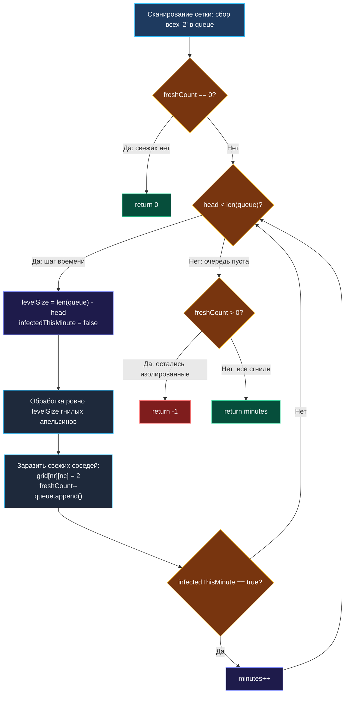

> *«Распределенная система — это система, в которой сбой узла, о самом существовании которого вы даже не догадывались, способен вывести из строя вашу собственную программу».*  
> — Лесли Лэмпорт

**LeetCode 994. Rotting Oranges.** Дана двумерная сетка `grid` размером $M \times N$, в которой:
- `0` обозначает пустую ячейку,
- `1` — свежий апельсин,
- `2` — гнилой апельсин.

Каждую минуту любой гнилой апельсин заражает всех своих 4-связных соседей (вверх, вниз, влево, вправо), превращая их в гнилые. Требуется определить **минимальное количество минут**, необходимое для того, чтобы в сетке не осталось ни одного свежего апельсина. Если хотя бы один свежий апельсин невозможно заразить (он изолирован пустыми ячейками), вернуть `-1`.

Эта задача — канонический представитель класса задач на **мультиисточниковый поиск в ширину (Multi-Source BFS)**. В отличие от стандартного BFS, стартующего из одной фиксированной вершины, здесь процесс диффузии одновременно начинается из множества очагов заражения. Для бэкенд-архитектора это точнейшая математическая модель работы протоколов распространения сплетен (**Gossip Protocols** в HashiCorp Consul, Apache Cassandra и Amazon DynamoDB) и каскадной инвалидации кэшей в распределённых сетях CDN.

---

### 1. Архитектура Multi-Source BFS: Единое время для всех очагов

Главный ментальный барьер — как корректно синхронизировать время, если источников инфекции несколько?

Решение поражает своей элегантностью: **все начальные источники заражения помещаются в единую очередь на нулевом уровне ($t = 0$)**.

```
Минута 0:   Очередь: [ Очаг1, Очаг2 ]          ──► levelSize = 2, заражают соседей
Минута 1:   Очередь: [ Нов1, Нов2, Нов3 ]      ──► levelSize = 3, заражают следующих...
Минута 2:   Очередь: [ Нов4, Нов5 ]            ──► levelSize = 2...
```

Волновой фронт расширяется параллельно из всех гнилых апельсинов с одинаковой скоростью — ровно 1 шаг за 1 минуту. Таким образом, минимальное время заражения каждого свежего апельсина равно его кратчайшему расстоянию до **ближайшего** очага инфекции.

---

### 2. Вопросы интервьюеру перед реализацией

- **Что делать, если в сетке изначально нет ни одного свежего апельсина?**  
  *Ответ:* Вернуть `0`, так как времени на заражение не требуется.
- **Может ли сетка не содержать ни одного гнилого апельсина, но содержать свежие?**  
  *Ответ:* Да. В этом случае свежие апельсины никогда не сгниют — алгоритм должен вернуть `-1`.
- **Разрешена ли модификация массива `grid` (in-place)?**  
  *Ответ:* Да. Замена `1` на `2` прямо в сетке исключает необходимость аллокации дополнительной матрицы или хеш-таблицы `visited`.

---

### 3. Идиоматическая реализация на Go: Zero-Alloc упаковка координат

Для максимальной производительности в Go мы упаковываем двумерные координаты `(r, c)` в одно плоское целое число: `pos = r * n + c`. Это позволяет использовать в качестве очереди непрерывный срез `[]int`, обеспечивая абсолютную кэш-локальность и нулевую нагрузку на Garbage Collector.

```go
package main

// orangesRotting вычисляет время полного заражения сетки с помощью Multi-Source BFS.
// Временная сложность: O(M * N) — каждая ячейка сетки просматривается не более константного числа раз.
// Пространственная сложность: O(M * N) — максимальный размер плоской очереди в худшем случае.
func orangesRotting(grid [][]int) int {
	m, n := len(grid), len(grid[0])
	queue := make([]int, 0, m*n)
	head := 0
	freshCount := 0

	// 1. Предварительное сканирование сетки
	for r := 0; r < m; r++ {
		for c := 0; c < n; c++ {
			switch grid[r][c] {
			case 2:
				// Упаковываем двумерную координату в одно число (r * n + c)
				queue = append(queue, r*n+c)
			case 1:
				freshCount++
			}
		}
	}

	// Если свежих апельсинов изначально нет, время равно 0
	if freshCount == 0 {
		return 0
	}

	minutes := 0
	// Смещение по 4 направлениям (вверх, вниз, влево, вправо)
	dirs := [4][2]int{{-1, 0}, {1, 0}, {0, -1}, {0, 1}}

	// 2. Multi-Source BFS по уровням
	for head < len(queue) {
		levelSize := len(queue) - head
		infectedThisMinute := false

		for i := 0; i < levelSize; i++ {
			pos := queue[head]
			head++

			// Распаковка плоского индекса обратно в координаты (r, c)
			r := pos / n
			c := pos % n

			for _, d := range dirs {
				nr, nc := r+d[0], c+d[1]

				// Проверка границ и наличия свежего апельсина
				if nr >= 0 && nr < m && nc >= 0 && nc < n && grid[nr][nc] == 1 {
					grid[nr][nc] = 2 // Заражаем на месте!
					freshCount--
					infectedThisMinute = true
					queue = append(queue, nr*n+nc)
				}
			}
		}

		// Увеличиваем счетчик минут ТОЛЬКО если на этом шаге был заражен хотя бы один апельсин!
		if infectedThisMinute {
			minutes++
		}
	}

	// Если остались недостижимые свежие апельсины — возвращаем -1
	if freshCount > 0 {
		return -1
	}

	return minutes
}
```

---

### 4. Визуализация волновой диффузии



---

### 5. Механическая симпатия: Память, Кэш-линии и Off-by-One

1. **Плоская координата против структур:**  
   Если создавать очередь структур `type Point struct { r, c int }`, каждый элемент займет 16 байт. Упаковка в плоский `int` занимает 8 байт (на amd64). В одну 64-байтную кэш-линию L1 процессора помещается ровно 8 координат, что в 2 раза увеличивает плотность кэша и снижает количество Cache Miss.
2. **Борьба с Off-by-One ошибкой таймера:**  
   Классическая ошибка — прибавлять `minutes++` на каждом обороте внешнего цикла. На последнем шаге гнилые апельсины извлекаются из очереди, проверяют своих соседей (которые уже либо гнилые, либо пустые) и **никого не заражают**. Без флага `infectedThisMinute` таймер ошибочно накрутит лишнюю минуту.
3. **In-place модификация против `visited`:**  
   Перезапись `grid[nr][nc] = 2` выполняется в уже существующем срезе. Она не требует ни единой аллокации в куче и выполняется процессором за 1 такт через обычную инструкцию записи `MOVQ`.

---

### 6. System Design: Gossip Protocols и Epidemic Replication

Мультиисточниковый BFS — это фундаментальный алгоритм распределённых систем:

- **Cassandra & DynamoDB:** Узлы кластера не имеют центрального мастера. При изменении топологии узел объявляет статус своим $K$ соседям. Каждую секунду каждый зараженный узел передает сплетню дальше. Через $O(\log N)$ раундов весь кластер приходит к консенсусу (Eventual Consistency).
- **Consul (Serf):** Мониторинг жизнеспособности серверов через gossip-пинг. Отказ ноды распространяется по кластеру волновым фронтом точно так же, как гнилой апельсин заражает ящик.

---

### Резюме для интервью

| Параметр | Значение |
|---|---|
| **Алгоритм** | Multi-Source Level-Order BFS |
| **Сложность по времени** | $O(M \cdot N)$ |
| **Сложность по памяти** | $O(M \cdot N)$ на очередь |
| **Ключевой инвариант** | Все очаги помещаются в очередь в момент времени $0$ |
| **Главная ловушка** | Не накручивать лишнюю минуту на последнем пустом шаге |

В следующей задаче — [[7. Open the Lock]] — мы применим волновой поиск к четырехзначному кодовому замку с запрещенными комбинациями.