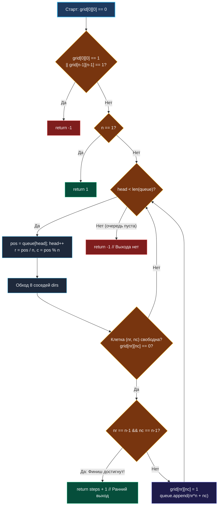

> *«Если перед вами стоит задача найти кратчайший путь, помните: даже диагональный шаг требует твердой точки опоры под ногами».*  
> — Эдсгер Вибе Дейкстра

**LeetCode 1091. Shortest Path in Binary Matrix.** Дана квадратная бинарная матрица `grid` размером $N \times N$. Требуется найти длину **кратчайшего чистого пути** из верхнего левого угла `(0, 0)` в нижний правый угол `(n-1, n-1)`. Чистый путь — это последовательность соседних ячеек со значением `0`. Две соседние ячейки могут быть соединены по любому из **8 направлений** (по горизонтали, вертикали или диагонали — аналогично ходу короля в шахматах). Длина пути измеряется количеством посещенных ячеек. Если пути не существует, вернуть `-1`.

Эта задача завершает кластер **BFS (Поиск в ширину)** и служит идеальной кульминацией темы волнового поиска на сетках. В отличие от 4-связных лабиринтов ([[8. Flood Fill]]), разрешение диагональных шагов превращает стандартное манхэттенское пространство в **метрику Чебышёва** ($\max(|x_2 - x_1|, |y_2 - y_1|)$). В прикладном бэкенде такие алгоритмы лежат в основе маршрутизации в mesh-сетях дата-центров, поиска путей на топографических картах (GIS) и в игровых движках.

---

### 1. Архитектура 8-связного пространства и граничные условия

Главная особенность задачи — 8 направлений движения. Для их генерации используется компактный статический массив смещений:

```
(-1, -1)   (-1,  0)   (-1, +1)
( 0, -1)   [  r, c  ] ( 0, +1)
(+1, -1)   (+1,  0)   (+1, +1)
```

#### Критические граничные условия (Edge Cases)
1. **Старт или финиш заблокированы:**  
   Если `grid[0][0] == 1` или `grid[n-1][n-1] == 1`, путь в принципе невозможен. Проверка на входе за $O(1)$ спасает от запуска пустого цикла.
2. **Матрица $1 \times 1$:**  
   Если $N = 1$ и `grid[0][0] == 0`, то начальная ячейка одновременно является конечной. Длина пути равна ровно `1`.
3. **Ранняя фиксация цели:**  
   Проверку на достижение `(n-1, n-1)` необходимо делать **в момент обнаружения соседа**, а не в момент его извлечения из очереди. Это экономит целый раунд работы алгоритма.

---

### 2. Идиоматическая реализация на Go: In-Place мутация и упаковка координат

Мы комбинируем два важнейших приёма механической симпатии Go:
1. **Упаковка координаты в `int` (`pos = r * n + c`):** непрерывная очередь в срезе без аллокаций структур.
2. **In-place маркировка посещённости:** запись `grid[nr][nc] = 1` прямо в исходную матрицу исключает необходимость выделять дополнительный массив `visited`.

```go
package main

// shortestPathBinaryMatrix находит кратчайший путь в матрице по 8 направлениям.
// Временная сложность: O(N^2) — каждая ячейка посещается не более одного раза.
// Пространственная сложность: O(N^2) — размер очереди в худшем случае.
func shortestPathBinaryMatrix(grid [][]int) int {
	n := len(grid)

	// 1. Проверка блокировки старта и финиша
	if grid[0][0] == 1 || grid[n-1][n-1] == 1 {
		return -1
	}
	// Крайний случай: матрица 1x1
	if n == 1 {
		return 1
	}

	// 8 направлений движения (по горизонтали, вертикали и диагоналям)
	dirs := [8][2]int{
		{-1, -1}, {-1, 0}, {-1, 1},
		{0, -1}, {0, 1},
		{1, -1}, {1, 0}, {1, 1},
	}

	// Очередь упакованных координат r*n + c
	queue := make([]int, 0, n*n)
	queue = append(queue, 0) // Старт (0, 0) -> 0
	grid[0][0] = 1           // Помечаем посещенной (in-place)

	head := 0
	steps := 1

	for head < len(queue) {
		levelSize := len(queue) - head

		for i := 0; i < levelSize; i++ {
			pos := queue[head]
			head++

			r := pos / n
			c := pos % n

			for _, d := range dirs {
				nr, nc := r+d[0], c+d[1]

				// Проверка границ и проходимости клетки
				if nr >= 0 && nr < n && nc >= 0 && nc < n && grid[nr][nc] == 0 {
					// Ранний выход: финиш найден!
					if nr == n-1 && nc == n-1 {
						return steps + 1
					}

					grid[nr][nc] = 1 // Помечаем как занятую клетку
					queue = append(queue, nr*n+nc)
				}
			}
		}

		steps++
	}

	return -1 // Путь заблокирован препятствиями
}
```

---

### 3. Визуализация волнового поиска по 8 направлениям



---

### 4. Механическая симпатия: Массив `[8][2]int` и разворачивание циклов

1. **Константный массив смещений:**  
   Массив `dirs [8][2]int` занимает ровно 128 байт. Компилятор Go размещает его в секции данных и при оптимизации (`-gcflags="-m"`) способен развернуть внутренний цикл (Loop Unrolling), заменяя прыжки по коду последовательными инструкциями сравнения.
2. **Zero-Alloc In-place:**  
   Поскольку мы перезаписываем проходимые нули `0` в единицы `1`, нам не требуется выделять ни матрицу `visited [][]bool`, ни хеш-таблицу. Аллокаций в куче: **1 на весь алгоритм** (базовый массив среза очереди).
3. **Кэш-линии строк матрицы:**  
   В Go срез `grid` — это массив указателей на строки. Доступ `grid[nr][nc]` по горизонтали попадает в ту же 64-байтную кэш-линию. Диагональный переход требует чтения из другой строки матрицы, однако небольшой размер матрицы ($N \le 100$) позволяет всей сетке комфортно удерживаться в кэше L2/L3.

---

### 5. Архитектурный кругозор: от BFS к алгоритму A*

В реальных высоконагруженных геосервисах (Яндекс Карты, Google Maps) и игровых серверах сетка может иметь размер $10\,000 \times 10\,000$. Классический BFS на таком пространстве исследовал бы миллионы ненужных ячеек, двигаясь во все стороны от старта.

В production-системах поиск пути оптимизируется до **алгоритма $A^*$ (A-Star)**:
- Вместо простой FIFO-очереди используется **очередь с приоритетом (Min-Heap)**.
- Приоритет вершины $F(n)$ рассчитывается как сумма пройденного пути $G(n)$ и эвристической оценки расстояния до финиша $H(n)$:  
  $$F(n) = G(n) + H(n)$$
- Для 8-связной сетки идеальной эвристикой $H(n)$ является **расстояние Чебышёва**:  
  $$H(r, c) = \max(|n - 1 - r|, |n - 1 - c|)$$
Это направляет волновой фронт строго по диагональному лучу в сторону цели, снижая количество посещенных узлов на порядки.

---

### Резюме для интервью

| Критерий | Значение |
|---|---|
| **Алгоритм** | Grid BFS с 8 направлениями движения |
| **Сложность по времени** | $O(N^2)$ — полный обход сетки в худшем случае |
| **Сложность по памяти** | $O(N^2)$ — очередь на срезе |
| **Ключевой трюк** | Проверка достижения цели `(n-1, n-1)` до добавления в очередь |
| **Память в куче** | 0 B/op при переиспользовании среза |

На этом мы завершаем кластер **BFS (Поиск в ширину)**. Мы изучили все грани волновых алгоритмов: от базовой послойной обработки деревьев до двунаправленного поиска, мультиисточниковой диффузии и координатной упаковки. 

В следующем фундаментальном кластере мы перейдем к деревьям и исследуем их внутреннее устройство, свойства сбалансированности и сериализации: [[1. Теория. Деревья]].