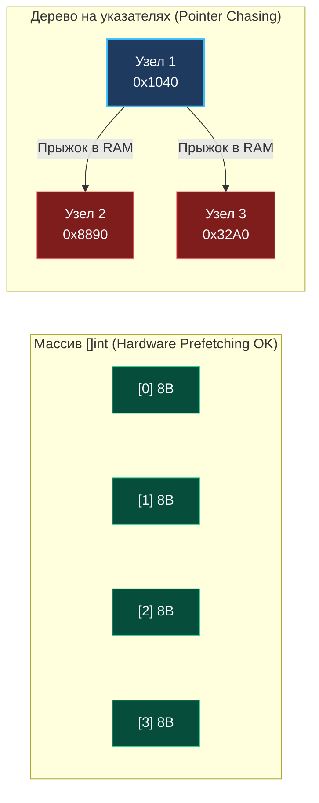
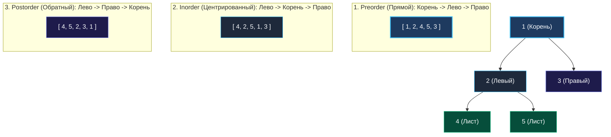

> *«Деревья в информатике растут сверху вниз — в точности как генеалогические древа древних династий, где единственный корень даёт начало бесчисленным ветвям и листьям потомков».*  
> — Дональд Эрвин Кнут

Дерево — одна из самых фундаментальных и выразительных структур данных в Computer Science. Это связный ациклический граф, моделирующий строгие иерархические отношения. В отличие от линейных массивов и связных списков, дерево предоставляет логарифмическую масштабируемость: сбалансированное бинарное дерево из $1\,000\,000$ элементов имеет высоту всего около $20$ уровней!

Для бэкенд-инженера и системного разработчика деревья — это повседневный фундамент всей инфраструктуры:
- **B-Trees и $B^+$Trees:** ядро индексов дисковых СУБД (PostgreSQL, MySQL InnoDB, SQLite).
- **LSM-Trees (Log-Structured Merge-Trees):** архитектурная основа высокоскоростной записи в NoSQL (Apache Cassandra, ScyllaDB, RocksDB, BadgerDB).
- **Radix Trees (Prefix Trees / Trie):** алгоритмическая основа сверхбыстрого HTTP-роутинга в Go (библиотеки `httprouter`, `gin-gonic/gin`, `go-chi/chi`).
- **Синтаксические деревья (AST):** компилятор Go (`go/ast`), парсеры JSON, YAML, Protocol Buffers и валидаторы SQL-запросов.

---

### 1. Анатомия `TreeNode` в памяти Go: 24 байта и кэш-линии

Каноническое представление бинарного дерева в Go строится на структурах с указателями:

```go
type TreeNode struct {
    Val   int       // 8 байт (на amd64 / arm64)
    Left  *TreeNode // 8 байт (указатель)
    Right *TreeNode // 8 байт (указатель)
}
```

#### Раскладка структуры в памяти (Memory Layout)
На 64-битной архитектуре размер `TreeNode` составляет ровно **24 байта**:
```
┌────────────────────────┬────────────────────────┬────────────────────────┐
│        Val (8B)        │     Left *TreeNode     │    Right *TreeNode     │
│        (int64)         │       (8B указатель)   │       (8B указатель)   │
└────────────────────────┴────────────────────────┴────────────────────────┘
 0                      8                        16                       24
```
Поскольку все три поля имеют естественное 8-байтовое выравнивание, компилятор Go не добавляет холостых байтов дополнения (Zero Padding).

#### Проблема «Погони за указателями» (Pointer Chasing)
В непрерывном срезе `[]int` процессор за один такт считывает в кэш-линию L1 блок размером 64 байта (8 последовательных чисел).  
В дереве на указателях каждый узел `&TreeNode{}` выделяется в куче (Heap) независимо. Рантайм Go размещает узлы в разных блоках памяти. Переход по указателю `node.Left` заставляет процессор прыгать по случайным адресам RAM, порождая систематические промахи кэша (**Cache Misses** со штрафом в 100–200 тактов CPU).



---

### 2. Нагрузка на сборщик мусора Go (GC Mark Phase)

В Go используется параллельный трёхцветный сборщик мусора (Tri-color Mark-Sweep GC). На фазе трассировки живых объектов GC обязан просканировать каждое поле, содержащее указатель.

> [!WARNING]
> Если в вашей in-memory структуре данных хранится дерево из $1\,000\,000$ узлов `TreeNode`, сборщик мусора Go при каждом цикле сборки обязан проверить **$2\,000\,000$ указателей** (`Left` и `Right`).  
> Это приводит к затягиванию фазы Mark Assist, росту утилизации CPU фоновыми горутинами GC и деградации p99 Latency всего сервиса.

#### Промышленное решение: Уплощение дерева (Flattened Array / Arena)
В высокопроизводительных движках узлы дерева хранят в монолитном срезе, заменяя 8-байтовые указатели на 4-байтовые индексы:

```go
type FlatNode struct {
    Val      int32
    LeftIdx  int32 // Индекс в срезе nodes[] (-1 если nil)
    RightIdx int32 // Индекс в срезе nodes[] (-1 если nil)
}
// nodes := make([]FlatNode, 0, 1_000_000)
```
Размер узла падает с 24 байт до 12 байт, а миллион узлов превращается в **один непрерывный массив без единого указателя**! Сборщик мусора Go сканирует массив `[]FlatNode` за $0$ микросекунд, так как в типе `FlatNode` нет полей-указателей (`hasPtrs == false`).

---

### 3. Фундаментальные порядки обхода бинарного дерева

Каноническое дерево содержит три базовых порядка обхода в глубину (DFS). Проследим их на едином эталонном дереве:

```
          [ 1 ]
         /     \
       [ 2 ]   [ 3 ]
       /   \
     [ 4 ] [ 5 ]
```



#### Прикладное назначение порядков обхода:
1. **Preorder (Root $\rightarrow$ Left $\rightarrow$ Right):** клонирование деревьев, сериализация топологии, построение префиксных выражений.
2. **Inorder (Left $\rightarrow$ Root $\rightarrow$ Right):** обход бинарного дерева поиска (**BST**) возвращает элементы в **строго возрастающем порядке**.
3. **Postorder (Left $\rightarrow$ Right $\rightarrow$ Root):** вычисление размеров директорий, освобождение ресурсов (деструкторы), вычисление агрегатов снизу вверх ([[6. Binary Tree Maximum Path Sum]]).

---

### 4. Рекурсия и непрерывные стеки Go (Continuous Stacks)

При рекурсивном обходе глубина стека вызовов пропорциональна высоте дерева $H$:
- В сбалансированном дереве $H = \lceil \log_2 N \rceil$. Для $N = 1\,000\,000$ глубина вызовов составит всего $20$ фреймов. Это безупречно ложится на начальный стек горутины размером **2 КБ**.
- В вырожденном дереве-бамбуке $H = N$. Глубина вызовов составит $1\,000\,000$. Рантайм Go будет вынужден многократно выделять новые страницы памяти и копировать стек через процедуру `runtime.morestack`.
- **Компилятор Go принципиально не выполняет Tail Call Optimization (TCO)**, чтобы не искажать стек-трейсы при аварийных паниках (`panic/recover`).

---

### Резюме для интервью

| Характеристика | Дерево на указателях (`*TreeNode`) | Уплощенное дерево (`[]FlatNode`) |
|---|---|---|
| **Размер узла** | 24 байта + оверхед кучи | 12 байт (плотно) |
| **Локальность кэша** | Низкая (Pointer Chasing) | Идеальная (L1 Data Cache Prefetch) |
| **Нагрузка на GC** | Высокая ($2N$ указателей) | Нулевая (0 указателей для сканирования) |
| **Применение** | LeetCode, AST, сложные графы | In-memory базы данных, роутеры, High-Load |

В следующей статье мы подробно изучим детали реализации всех типов обхода — как в лаконичной рекурсивной форме, так и в высокопроизводительной итеративной модели без вызовов функций: [[2. Обходы деревьев]].