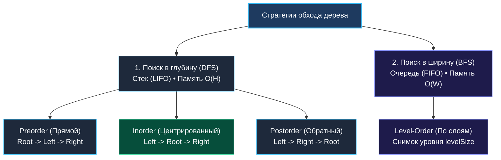

> *«Рекурсия — это великолепный мыслительный инструмент, однако подлинное мастерство инженера проверяется способностью подчинить стек вычислительной машины явным структурам данных».*  
> — Никлаус Вирт

Обход дерева — это методичный процесс посещения каждого узла иерархической структуры ровно один раз. Как мы выяснили в теоретическом введении ([[1. Теория. Деревья]]), узлы дерева разбросаны в куче Go, а переходы по указателям неизбежно порождают промахи кэша процессора.

На инженерных собеседованиях уровня Senior выбор между алгоритмами обхода — это не эстетический вопрос. Это осознанный выбор между **глубиной рекурсивного стека горутины, шириной очереди в куче и нагрузкой на сборщик мусора (GC)**.

---

### 1. Архитектурная карта обходов: DFS против BFS



| Стратегия | Структура памяти | Потребление RAM | Применение |
|---|---|---|---|
| **DFS (Глубина)** | Стек вызовов или срез (LIFO) | $O(H)$ (высота дерева) | Валидация BST, поиск путей, сериализация, агрегаты |
| **BFS (Ширина)** | Очередь на срезе (FIFO) | $O(W)$ (ширина слоя) | Кратчайшие расстояния, послойная группировка |

---

### 2. Поиск в глубину (DFS): Рекурсия против Итерации на срезе

Рекурсивный DFS пишется в 5 строк, но в высоконагруженных системах скрывает риск деградации:
- Компилятор Go **не выполняет TCO (хвостовую оптимизацию)**.
- При вырождении дерева в цепочку глубина стека достигнет $N$. Рантайм вызовет каскадное копирование стека (`runtime.morestack`).

#### Идиоматичный итеративный Inorder DFS (эталон для собеседования)

```go
package main

type TreeNode struct {
	Val   int
	Left  *TreeNode
	Right *TreeNode
}

// inorderTraversalIterative выполняет центрированный обход без рекурсии.
// Временная сложность: O(N).
// Пространственная сложность: O(H) — стек на базе плоского среза.
func inorderTraversalIterative(root *TreeNode) []int {
	result := make([]int, 0, 32)
	// Используем срез Go как LIFO-стек указателей
	stack := make([]*TreeNode, 0, 32)
	curr := root

	for curr != nil || len(stack) > 0 {
		// 1. Спускаемся до упора влево, складируя предков в стек
		for curr != nil {
			stack = append(stack, curr)
			curr = curr.Left
		}

		// 2. Извлекаем вершину стека (Pop)
		curr = stack[len(stack)-1]
		stack[len(stack)-1] = nil // Помогаем GC!
		stack = stack[:len(stack)-1]

		// 3. Обрабатываем значение узла
		result = append(result, curr.Val)

		// 4. Переходим в правое поддерево
		curr = curr.Right
	}

	return result
}
```

---

### 3. Поиск в ширину (BFS): Послойная обработка без утечек памяти

Как мы установили в главе о BFS ([[2. Обход по уровням]]), обход по слоям строится на паттерне **Queue Snapshot**:

```go
// levelOrder выполняет послойный обход с защитой от утечек памяти в GC.
func levelOrder(root *TreeNode) [][]int {
	if root == nil {
		return nil
	}

	queue := []*TreeNode{root}
	head := 0
	result := make([][]int, 0, 16)

	for head < len(queue) {
		levelSize := len(queue) - head
		level := make([]int, 0, levelSize)

		for i := 0; i < levelSize; i++ {
			node := queue[head]
			queue[head] = nil // Защита от удержания объектов в GC
			head++

			level = append(level, node.Val)

			if node.Left != nil {
				queue = append(queue, node.Left)
			}
			if node.Right != nil {
				queue = append(queue, node.Right)
			}
		}

		result = append(result, level)
	}

	return result
}
```

---

### 4. Высший пилотаж: Обход Морриса (Morris Traversal — $O(1)$ памяти)

Если на интервью в топовую компанию (Google, Meta) интервьюер задаёт вопрос:  
*«Можно ли обойти дерево в порядке Inorder за время $O(N)$, используя ровно $O(1)$ дополнительной памяти (без стека рекурсии и без явного среза-стека)?»*

Правильный ответ: **Алгоритм Морриса (Morris Traversal)**.  
Идея заключается в **прошивке дерева** (Threading): пустые правые указатели листьев временно связываются с их преемниками по Inorder-обходу (Inorder Predecessor), создавая обратные временные мосты для подъёма наверх без стека.

```
Временная прошивка (Thread):
           [ 2 ]  ◄───────┐
          /     \         │ (мост из правого листа наверх!)
       [ 1 ]    [ 3 ]     │
         \                │
         [nil] ───────────┘
```

После завершения обхода алгоритм Морриса восстанавливает исходную структуру дерева, удаляя временные ссылки `right = nil`.

---

### 5. Механическая симпатия: Память при DFS против BFS

На собеседовании вас обязательно спросят: *«Что потребляет больше памяти — DFS или BFS?»*

Инженерный ответ:
1. **DFS потребляет $O(H)$ памяти**, где $H$ — высота дерева.  
   - В сбалансированном дереве $H \approx \log_2 N$. При миллионе узлов в стеке будет всего 20 фреймов ($\approx 1$ КБ).  
   - В вырожденном дереве $H = N$. Память $O(N)$.
2. **BFS потребляет $O(W)$ памяти**, где $W$ — максимальная ширина слоя.  
   - В полном бинарном дереве последний слой содержит $\lceil N/2 \rceil$ узлов (50% всех узлов дерева!).  
   - Для дерева из миллиона узлов в очереди BFS одновременно будет находиться $500\,000$ элементов. Это мегабайты кучи.

**Вывод:** Для сбалансированных деревьев DFS экспоненциально экономнее по памяти, чем BFS ($O(\log N)$ против $O(N)$).

---

### Резюме для интервью

- **Preorder:** Корень обрабатывается первым. Идеален для глубокого клонирования и сериализации.
- **Inorder:** Обходит BST строго по возрастанию значений.
- **Postorder:** Корень обрабатывается последним. Идеален для деструкторов, удаления деревьев и подсчета размеров поддеревьев снизу вверх.
- **Зануление ячеек в LIFO/FIFO:** При извлечении из стека или очереди всегда зануляйте указатель (`stack[top] = nil`, `queue[head] = nil`), чтобы предотвратить утечки памяти в Garbage Collector.

В следующей статье мы применим технику постобхода для вычисления глубины дерева: [[3. Maximum Depth of Binary Tree]].