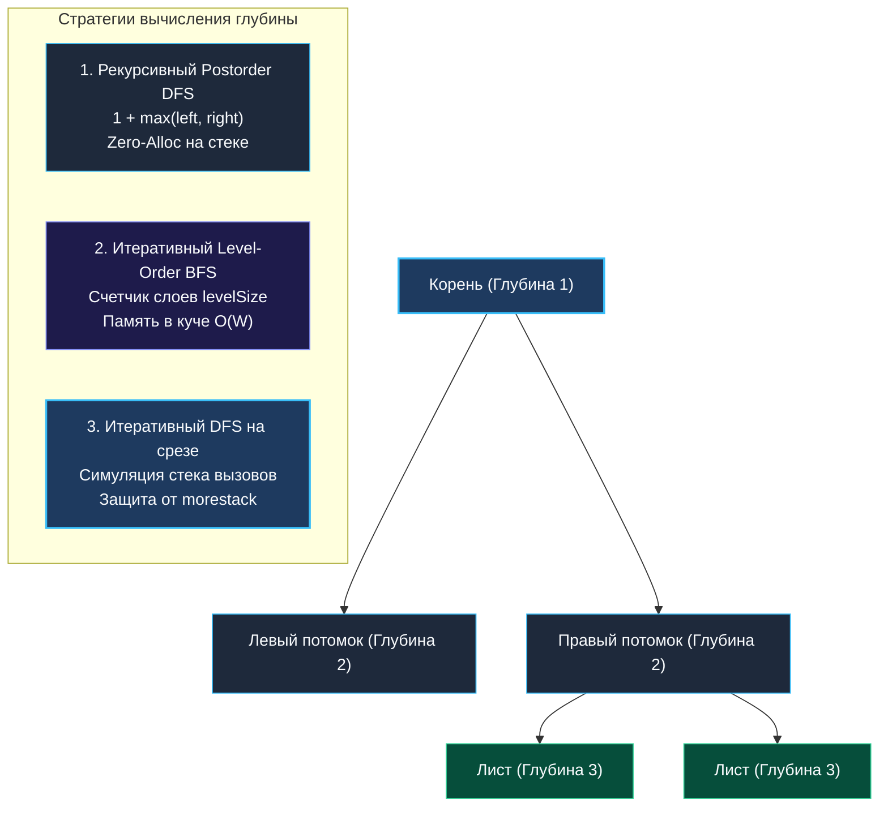

> *«Простые алгоритмы с прозрачной структурой управления всегда предпочтительнее изощрённых трюков. Глубина дерева — это естественная мера того, насколько далеко мы готовы зайти в поисках ясности».*  
> — Брайан Керниган

**LeetCode 104. Maximum Depth of Binary Tree.** Дано бинарное дерево. Требуется найти его **максимальную глубину** — количество узлов вдоль самого длинного пути от корневого узла до самого удалённого листового узла.

Эта задача — каноническая разминка на технических собеседованиях. На первый взгляд она решается тремя строками рекурсии. Однако для опытного инженера это великолепный полигон для демонстрации механической симпатии: как рекурсивный DFS соотносится с 2-килобайтным стеком горутины, когда итеративный BFS начинает пожирать кучу и почему в Go компилятор принципиально не использует TCO (хвостовую оптимизацию).

---

### 1. Архитектурная триада подходов: DFS, BFS и Итерация



---

### 2. Подход 1: Рекурсивный Postorder DFS (Золотой стандарт)

Глубина пустого дерева равна $0$. Для любого существующего узла его глубина определяется как $1$ плюс максимум из глубин его левого и правого поддеревьев. В современном Go (начиная с версии 1.21) мы используем встроенную функцию `max`:

```go
package main

type TreeNode struct {
	Val   int
	Left  *TreeNode
	Right *TreeNode
}

// maxDepth вычисляет максимальную глубину дерева рекурсивным DFS.
// Временная сложность: O(N) — каждый узел посещается ровно один раз.
// Пространственная сложность: O(H) — глубина стека вызовов (H = log N в среднем, H = N в худшем).
func maxDepth(root *TreeNode) int {
	if root == nil {
		return 0
	}
	// Рекурсивный спуск в поддеревья (Postorder: Left, Right, Node)
	return 1 + max(maxDepth(root.Left), maxDepth(root.Right))
}
```

#### Механическая симпатия: Рекурсия и стек горутины
- **Zero Heap Allocations:** Функция `maxDepth` не аллоцирует память в куче (`0 B/op`). Аргументы и адреса возврата живут исключительно в регистрах процессора и стеке горутины.
- **Continuous Stack:** Начальный стек горутины равен 2 КБ. Для сбалансированного дерева из $1\,000\,000$ узлов высота $H \approx 20$. 20 фреймов занимают менее 1 КБ памяти.
- **Вырожденный случай:** Если дерево выродилось в односвязный список длиной $100\,000$ узлов, рантайм Go будет вынужден многократно вызывать `runtime.morestack`, удваивая стек в памяти. Компилятор Go **не выполняет Tail Call Optimization (TCO)**, чтобы сохранить читаемость стек-трейсов при аварийных сбоях.

---

### 3. Подход 2: Итеративный Level-Order BFS (Счетчик слоев)

Если мы опасаемся глубокой рекурсии, задачу можно решить поиском в ширину, подсчитывая количество горизонтальных слоев:

```go
func maxDepthBFS(root *TreeNode) int {
	if root == nil {
		return 0
	}

	queue := []*TreeNode{root}
	head := 0
	depth := 0

	for head < len(queue) {
		levelSize := len(queue) - head
		depth++ // Зафиксировали новый горизонтальный уровень

		for i := 0; i < levelSize; i++ {
			node := queue[head]
			queue[head] = nil // Очищаем ссылку: защита от удержания узлов в GC!
			head++

			if node.Left != nil {
				queue = append(queue, node.Left)
			}
			if node.Right != nil {
				queue = append(queue, node.Right)
			}
		}
	}

	return depth
}
```

> [!WARNING]
> **Трейдофф памяти в BFS:**  
> Очередь BFS хранит все узлы текущего слоя. В полном бинарном дереве последний слой содержит до $N/2$ узлов. Для дерева из миллиона элементов очередь потребует сотни килобайт в куче, создавая нагрузку на Garbage Collector. В то же время рекурсивный DFS потребует всего 20 фреймов на стеке.

---

### 4. Подход 3: Итеративный DFS с явным стеком

Для деревьев экстремальной глубины, где рекурсия рискует превысить стек горутины, стек вызовов эмулируют вручную через срез:

```go
type stackItem struct {
	node  *TreeNode
	depth int
}

func maxDepthIterativeDFS(root *TreeNode) int {
	if root == nil {
		return 0
	}

	stack := []stackItem{{node: root, depth: 1}}
	maxD := 0

	for len(stack) > 0 {
		top := stack[len(stack)-1]
		stack = stack[:len(stack)-1]

		if top.depth > maxD {
			maxD = top.depth
		}

		if top.node.Right != nil {
			stack = append(stack, stackItem{node: top.node.Right, depth: top.depth + 1})
		}
		if top.node.Left != nil {
			stack = append(stack, stackItem{node: top.node.Left, depth: top.depth + 1})
		}
	}

	return maxD
}
```

---

### 5. Сравнение подходов

| Параметр | Рекурсивный DFS | Итеративный BFS | Итеративный DFS |
|---|---|---|---|
| **Сложность по времени** | $O(N)$ | $O(N)$ | $O(N)$ |
| **Память в куче** | **0 B/op** | $O(W)$ (до $N/2$ узлов) | $O(H)$ в срезе |
| **Нагрузка на стек** | $O(H)$ фреймов | $O(1)$ | $O(1)$ |
| **Скорость выполнения** | **Максимальная** (кэш CPU) | Средняя (аллокации очереди) | Высокая |

---

### Резюме для интервью

- **Ключевой инвариант:** глубина узла равна `1 + max(left, right)`.
- **Базовый случай:** `if root == nil { return 0 }`.
- **Senior-инсайт:** рекурсивный DFS работает быстрее всего благодаря отсутствию аллокаций в куче и передаче аргументов через регистры CPU (Go 1.17+ ABIInternal).

В следующей задаче — [[4. Diameter of Binary Tree]] — мы сделаем качественный шаг вперед: научимся находить самый длинный путь между любыми двумя узлами дерева, даже если он не проходит через корень.