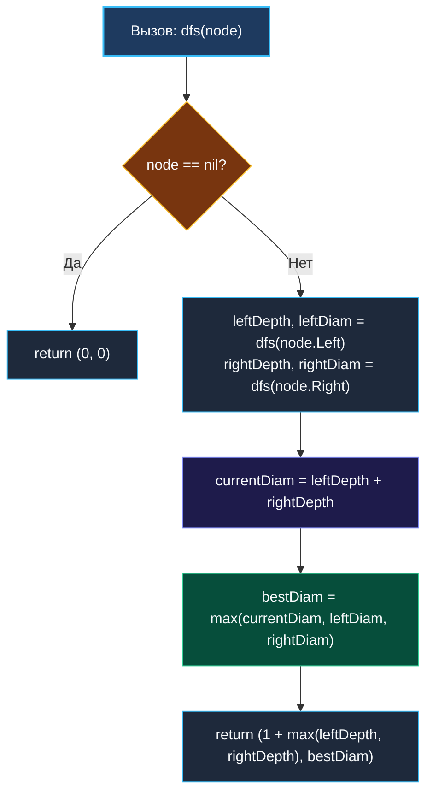

> *«Диаметр графа отражает предельную цену общения между его наиболее удалёнными уголками».*  
> — Дональд Эрвин Кнут

**LeetCode 543. Diameter of Binary Tree.** Дано бинарное дерево. Требуется вычислить длину его **диаметра** — длину самого протяжённого пути между любыми двумя узлами дерева. Этот путь **не обязан проходить через корневой узел**.

*Примечание:* Длина пути между двумя узлами измеряется количеством **рёбер** между ними (а не количеством вершин).

Если в задаче о максимальной глубине ([[3. Maximum Depth of Binary Tree]]) мы искали простейший путь от корня к листу, то задача о диаметре бинарного дерева — это классическая лакмусовая бумажка на собеседованиях уровня Middle+/Senior. Она проверяет способность кандидата разделять локальный максимум пути в поддереве и значение, передаваемое вверх родителю (паттерн, с которым мы также встречались в задаче [[6. Binary Tree Maximum Path Sum]]).

---

### 1. Архитектурная интуиция: мост над бездной

Каждый простой путь в дереве имеет наивысшую точку — узел-апекс (вершину «арки»), выше которой данный путь не поднимается.

Для любого узла `X` длина самого длинного пути, вершиной которого является `X`, равна:
$$\text{localDiameter} = \text{leftDepth} + \text{rightDepth}$$

```
                [ 1 ] (Корень не участвует!)
               /     \
             [ 2 ]   [ 3 ]  ◄── Наивысшая точка пути (Апекс)
            /     \
          [ 4 ]   [ 5 ]
         /           \
       [ 6 ]         [ 7 ]
       /               \
     [ 8 ]             [ 9 ]

 Самый длинный путь: 8 - 6 - 4 - 2 - 5 - 7 - 9
 Длина пути в рёбрах: leftDepth(4) + rightDepth(2) = 6 рёбер
```

#### Инвариант обратного обхода (Postorder DFS)
Чтобы вычислить локальный диаметр в узле `X`, мы обязаны **сначала получить глубины его левого и правого поддеревьев**. Это естественным образом диктует использование **Postorder DFS** (снизу вверх):
1. Спускаемся в детей: получаем `leftDepth` и `rightDepth`.
2. Обновляем глобальный диаметр: `diameter = max(diameter, leftDepth + rightDepth)`.
3. Возвращаем родителю максимальную длину одной ветви: `max(leftDepth, rightDepth) + 1`.

---

### 2. Подход 1: Решение с замыканием (Классический вариант)

```go
package main

type TreeNode struct {
	Val   int
	Left  *TreeNode
	Right *TreeNode
}

// diameterOfBinaryTree находит длину диаметра через замыкание.
// Временная сложность: O(N) — каждый узел посещается ровно один раз.
// Пространственная сложность: O(H) — глубина стека вызовов.
func diameterOfBinaryTree(root *TreeNode) int {
	maxDiameter := 0

	var maxDepth func(node *TreeNode) int
	maxDepth = func(node *TreeNode) int {
		if node == nil {
			return 0
		}

		left := maxDepth(node.Left)
		right := maxDepth(node.Right)

		// Обновляем диаметр: путь через текущий узел как апекс
		if left+right > maxDiameter {
			maxDiameter = left + right
		}

		// Родителю отдаем только одну, самую глубокую ветвь + текущее ребро
		return 1 + max(left, right)
	}

	maxDepth(root)
	return maxDiameter
}
```

---

### 3. Подход 2: Production-Ready (Чистая функция без аллокаций)

Как Senior Go-разработчик, вы можете продемонстрировать глубокое знание компилятора Go. Переменная `maxDiameter` в Подходе 1 захватывается анонимной функцией, что может приводить к Escape Analysis и размещению переменной в куче (`moved to heap: maxDiameter`).

Мы можем написать **чистую функцию (Pure Function)**, возвращающую кортеж из двух значений: `(depth, maxDiameter)`. В Go 1.17+ с регистровым ABIInternal оба возвращаемых числа передаются напрямую через регистры CPU (например, `RAX` и `RBX`), обеспечивая абсолютный `Zero-Alloc` режим работы.

```go
func diameterOfBinaryTreePure(root *TreeNode) int {
	_, diam := dfsPure(root)
	return diam
}

// dfsPure возвращает (глубина поддерева, максимальный диаметр в поддереве)
func dfsPure(node *TreeNode) (int, int) {
	if node == nil {
		return 0, 0
	}

	leftDepth, leftDiam := dfsPure(node.Left)
	rightDepth, rightDiam := dfsPure(node.Right)

	// Текущий диаметр с апексом в данном узле
	currentDiam := leftDepth + rightDepth

	// Максимальный диаметр выбирается среди локального пути и диаметров поддеревьев
	bestDiam := max(currentDiam, max(leftDiam, rightDiam))

	return 1 + max(leftDepth, rightDepth), bestDiam
}
```

---

### 4. Визуализация работы алгоритма



---

### 5. Подводные камни и ловушки (Gotchas)

1. **Рёбра против Вершин:**  
   Внимательно читайте условие! На LeetCode диаметр измеряется **числом рёбер** между узлами. Если путь проходит через 3 узла, его длина равна $2$ рёбрам (`leftDepth + rightDepth`). Если бы требовалось количество узлов, ответом было бы `leftDepth + rightDepth + 1`.
2. **Путь не обязательно проходит через корень:**  
   Дерево может иметь длинный и ветвистый кластер глубоко в одном из поддеревьев. Алгоритм, рассчитывающий диаметр исключительно как `maxDepth(root.Left) + maxDepth(root.Right)`, потерпит крах.
3. **Пустое дерево:**  
   Если `root == nil`, диаметр равен `0`.

---

### Резюме для интервью

| Критерий | Значение | Пояснение |
|---|---|---|
| **Временная сложность** | $O(N)$ | Каждый узел дерева посещается ровно один раз |
| **Пространственная сложность** | $O(H)$ | Глубина стека вызовов ($O(\log N)$ в сбалансированном, $O(N)$ в вырожденном) |
| **Аллокации в куче** | **0 B/op** | Полная работа на регистрах процессора при использовании чистой функции |
| **Ключевой инвариант** | Разделение арки и полупути | Сумма левой и правой ветвей формирует диаметр; родителю отдается максимум |

В следующей задаче мы продолжим исследовать метрики глубины и выясним, как определить идеальную форму дерева: [[5. Balanced Binary Tree]].