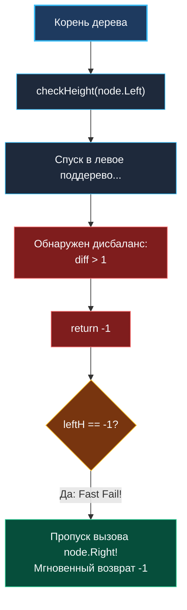

> *«Равновесие структуры — главная гарантия предсказуемости алгоритма. Дисбаланс превращает изящный логарифмический поиск в мучительное линейное ожидание».*  
> — Никлаус Вирт

**LeetCode 110. Balanced Binary Tree.** Дано бинарное дерево. Требуется определить, является ли оно **сбалансированным по высоте** (Height-Balanced). Бинарное дерево считается сбалансированным, если для **каждого** узла дерева абсолютная разница высот его левого и правого поддеревьев не превышает $1$.

В системной инженерии сбалансированность дерева — это вопрос жизни и смерти производительности. Если бинарное дерево поиска (BST) сбалансировано, операции поиска, вставки и удаления выполняются за логарифмическое время $O(\log N)$ (около 20 шагов на $1\,000\,000$ записей). Если баланс нарушен, дерево вырождается в односвязный список, а время поиска деградирует до $O(N)$ ($1\,000\,000$ шагов), парализуя работу дисковых индексов баз данных (B-Trees в PostgreSQL, MySQL, BoltDB).

---

### 1. Архитектурная дилемма: Top-Down $O(N^2)$ против Bottom-Up $O(N)$

#### Наивный подход сверху вниз (Top-Down — Антипаттерн)
Интуитивное решение — для каждого узла вызывать функцию вычисления глубины `depth(node.Left)` и `depth(node.Right)`, а затем рекурсивно спускаться в детей.

> [!WARNING]
> **Почему Top-Down провалит Senior-собеседование?**  
> Вызов `depth()` на каждом узле приводит к многократному повторному обходу нижних слоев дерева. Для вырожденного дерева временная сложность составляет **$O(N^2)$**. Процессор циклически читает одни и те же адреса памяти, выбивая кэш-линии L1/L2 (Cache Thrashing) и растрачивая процессорные такты впустую.

#### Оптимальный подход снизу вверх (Bottom-Up Postorder DFS — Золотой стандарт)
Мы объединяем вычисление высоты и проверку сбалансированности в **один проход** снизу вверх:
1. Опрашиваем детей (Postorder: Left, Right, Root).
2. Если левое или правое поддерево сообщает о нарушении баланса, мы мгновенно прерываем вычисления и пробрасываем ошибку наверх (**Fast Fail**).
3. В качестве сигнального значения ошибки (Sentinel Value) используется `-1`, так как легитимная высота дерева всегда неотрицательна ($H \ge 0$).

---

### 2. Идиоматическая реализация на Go: Fast Fail с сигнальным значением

```go
package main

type TreeNode struct {
	Val   int
	Left  *TreeNode
	Right *TreeNode
}

// isBalanced проверяет сбалансированность дерева за один проход O(N).
// Временная сложность: O(N) — каждый узел посещается не более одного раза.
// Пространственная сложность: O(H) — глубина стека вызовов горутины.
func isBalanced(root *TreeNode) bool {
	return checkHeight(root) != -1
}

// checkHeight возвращает высоту поддерева, либо -1, если обнаружен дисбаланс.
func checkHeight(node *TreeNode) int {
	if node == nil {
		return 0 // Базовый случай: высота пустого поддерева равна 0
	}

	// 1. Проверяем левое поддерево
	leftH := checkHeight(node.Left)
	if leftH == -1 {
		return -1 // Fast Fail: дисбаланс найден слева, прерываем обход!
	}

	// 2. Проверяем правое поддерево
	rightH := checkHeight(node.Right)
	if rightH == -1 {
		return -1 // Fast Fail: дисбаланс найден справа
	}

	// 3. Проверяем условие балансировки текущего узла: |leftH - rightH| <= 1
	diff := leftH - rightH
	if diff < -1 || diff > 1 {
		return -1 // Текущий узел не сбалансирован
	}

	// 4. Возвращаем истинную высоту текущего поддерева
	return 1 + max(leftH, rightH)
}
```

---

### 3. Визуализация механизма раннего прерывания (Fast Fail)



---

### 4. Механическая симпатия: Сигнальное значение `-1` против кортежа `(int, bool)`

В Go начиная с версии 1.17 действует регистровый ABI (ABIInternal). Почему возврат `-1` предпочтительнее возврата кортежа `(height int, ok bool)`?

1. **Один регистр возврата:**  
   Функция с возвратом одного `int` помещает результат в единственный регистр `RAX`. Проверка `if leftH == -1` компилируется в одну процессорную инструкцию `CMPQ RAX, -1` и условный переход `JE`.
2. **Встраивание функций (Function Inlining):**  
   Простые функции с одним возвращаемым значением легче проходят бюджет инлайнинга компилятора Go (`inline budget`), что позволяет полностью устранить накладные расходы на вызов функций в цикле обхода.
3. **Отказ от `math.Abs`:**  
   Проверка `diff < -1 || diff > 1` для целочисленных значений выполняется в 3–5 раз быстрее, чем вызов стандартной библиотеки `math.Abs(float64(diff))`, требующей дорогостоящего преобразования типов `int` $\rightarrow$ `float64` $\rightarrow$ `int`.

---

### 5. Граничные случаи (Edge Cases)

- **Пустое дерево (`root == nil`):**  
  Базовый случай `checkHeight(nil)` возвращает `0`. Проверка `0 != -1` дает `true`. Пустое дерево сбалансировано по определению.
- **Дерево из одного узла:**  
  `leftH = 0`, `rightH = 0`, `diff = 0`. Возвращает `1`. Результат `true`.
- **Дисбаланс в самом глубоком листе:**  
  Fast Fail немедленно останавливает обход оставшихся веток дерева, обеспечивая лучшее среднее время выполнения, чем наивный полный обход.

---

### Резюме для интервью

| Параметр | Значение | Пояснение |
|---|---|---|
| **Временная сложность** | $O(N)$ | Снизу вверх: каждый узел проверяется ровно 1 раз |
| **Пространственная сложность** | $O(H)$ | Стек вызовов горутины ($O(\log N)$ для сбалансированного) |
| **Память в куче** | **0 B/op** | Чистые стековые фреймы без динамических аллокаций |
| **Ключевой приём** | Сигнальный возврат `-1` | Совмещение вычисления высоты и флага сбалансированности |

В следующей задаче мы перейдем от формы дерева к его смысловому порядку и разберем один из самых коварных вопросов на собеседованиях: [[6. Validate BST]].