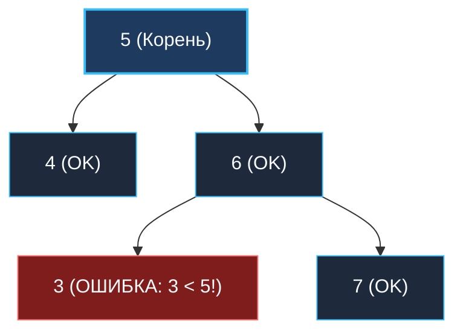

> *«Локальная правильность деталей не гарантирует гармонии всей системы. Проверяя лишь непосредственных соседей, легко упустить фундаментальную архитектурную ошибку».*  
> — Брайан Керниган

**LeetCode 98. Validate Binary Search Tree.** Дано бинарное дерево. Требуется определить, является ли оно корректным **бинарным деревом поиска (BST)**.

По каноническому определению, бинарное дерево является валидным BST тогда и только тогда, когда:
- Левое поддерево узла содержит узлы только со значениями, **строго меньшими** значения самого узла.
- Правое поддерево узла содержит узлы только со значениями, **строго большими** значения самого узла.
- Как левое, так и правое поддеревья сами обязаны являться валидными бинарными деревьями поиска.

Эта задача — легендарный капкан на технических собеседованиях. Более половины кандидатов уровня Middle допускают здесь фатальную ошибку, попадая в так называемую «ловушку локальной проверки».

---

### 1. Ловушка локальной проверки (The Local Validation Trap)

Самая распространённая ошибка — наивно сравнить узел только с его непосредственными левым и правым сыновьями:

```go
// ГРУБАЯ ОШИБКА: Локальная проверка не работает!
func isValidBSTWrong(root *TreeNode) bool {
    if root == nil { return true }
    if root.Left != nil && root.Left.Val >= root.Val { return false }
    if root.Right != nil && root.Right.Val <= root.Val { return false }
    return isValidBSTWrong(root.Left) && isValidBSTWrong(root.Right)
}
```

Почему этот код сломается? Взглянем на классический контрпример:



- В узле `5`: $4 < 5$ и $6 > 5$ — локально верно.
- В узле `6`: $3 < 6$ и $7 > 6$ — локально верно.
- **Но глобально:** узел со значением `3` находится в **правом поддереве корня `5`**! В правом поддереве все элементы обязаны быть больше $5$. Дерево не является BST!

---

### 2. Подход 1: Top-Down DFS с передачей динамических границ

Чтобы гарантировать глобальную корректность, мы должны транслировать диапазон допустимых значений `(min, max)` сверху вниз по дереву:
- Спускаясь в **левое** поддерево, мы ужесточаем верхнюю границу: все потомки обязаны быть $< \text{current.Val}$.
- Спускаясь в **правое** поддерево, мы ужесточаем нижнюю границу: все потомки обязаны быть $> \text{current.Val}$.

> [!TIP]
> **Архитектурный трюк с указателями в Go:**  
> Как задать бесконечные границы на старте? Использование `math.MinInt` и `math.MaxInt` чревато ошибками, если в узлах дерева лежат значения `math.MinInt` или `math.MaxInt`.  
> В Go самым надёжным и элегантным решением является передача **указателей на узлы** `minNode, maxNode *TreeNode`. Значение `nil` естественно моделирует бесконечность, избавляя код от костылей со специальными числами.

```go
package main

type TreeNode struct {
	Val   int
	Left  *TreeNode
	Right *TreeNode
}

// isValidBST проверяет валидность дерева поиска за один нисходящий проход.
// Временная сложность: O(N) — каждый узел проверяется ровно один раз.
// Пространственная сложность: O(H) — глубина стека вызовов.
func isValidBST(root *TreeNode) bool {
	return validate(root, nil, nil)
}

func validate(node, minNode, maxNode *TreeNode) bool {
	if node == nil {
		return true
	}

	// 1. Проверка нижней границы: узел обязан быть строго больше minNode
	if minNode != nil && node.Val <= minNode.Val {
		return false
	}

	// 2. Проверка верхней границы: узел обязан быть строго меньше maxNode
	if maxNode != nil && node.Val >= maxNode.Val {
		return false
	}

	// 3. При шаге влево текущий узел становится верхней границей.
	// При шаге вправо текущий узел становится нижней границей.
	return validate(node.Left, minNode, node) &&
		validate(node.Right, node, maxNode)
}
```

---

### 3. Подход 2: Inorder DFS (Свойство строгого возрастания)

Фундаментальное математическое свойство бинарного дерева поиска:
> **Симметричный центрированный обход (Inorder Traversal: Left $\rightarrow$ Root $\rightarrow$ Right) бинарного дерева поиска всегда возвращает элементы в строго возрастающем порядке.**

Если в процессе обхода текущий элемент оказывается меньше или равен предыдущему (`curr.Val <= prev.Val`), инвариант BST нарушен!

```go
func isValidBSTInorder(root *TreeNode) bool {
	var prev *TreeNode
	stack := make([]*TreeNode, 0, 32)
	curr := root

	for curr != nil || len(stack) > 0 {
		for curr != nil {
			stack = append(stack, curr)
			curr = curr.Left
		}

		// Извлекаем вершину стека
		curr = stack[len(stack)-1]
		stack[len(stack)-1] = nil // Помогаем GC
		stack = stack[:len(stack)-1]

		// Нарушение строгого монотонного возрастания
		if prev != nil && curr.Val <= prev.Val {
			return false
		}
		prev = curr

		curr = curr.Right
	}

	return true
}
```

---

### 4. Механическая симпатия: Указатели на стеке и Zero-Alloc

1. **Escape Analysis указателей границ:**  
   В функции `validate(node, minNode, maxNode)` передаются указатели на уже существующие узлы дерева. Функция не создает новых объектов в куче (`0 B/op`). Указатели передаются через регистры CPU (`RDX, RSI, RDI`).
2. **Fast-Fail прерывание:**  
   Оператор `&&` в выражении `validate(node.Left, ...) && validate(node.Right, ...)` обеспечивает короткое замыкание (Short-Circuit Evaluation): при обнаружении первого же дефекта в левом поддереве обход правого поддерева даже не начнется.

---

### 5. Граничные случаи (Edge Cases)

- **Дерево содержит минимальные/максимальные целые числа (`math.MinInt`, `math.MaxInt`):**  
  Решение на указателях `*TreeNode` абсолютно неуязвимо к граничным значениям типов, в отличие от решений с числовыми границами.
- **Дубликаты узлов:**  
  В классическом BST дубликаты строго запрещены ($Left < Root < Right$). Проверки `<=` и `>=` корректно отсекают узлы с равными значениями.
- **Один узел:**  
  `validate(root, nil, nil)` возвращает `true`.

---

### Резюме для интервью

- **Локальная проверка — провал:** Дерево нельзя валидировать сравнением только прямых детей.
- **Два эталонных решения:**
  1. *Top-Down с границами-указателями* — кратчайший и самый быстрый код.
  2. *Inorder Traversal* — идеальное знание теории порядков обхода.

В следующей задаче мы применим магию центрированного Inorder-обхода для поиска $K$-го наименьшего элемента: [[7. Kth Smallest Element in BST]].