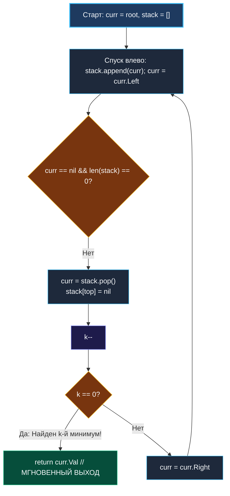
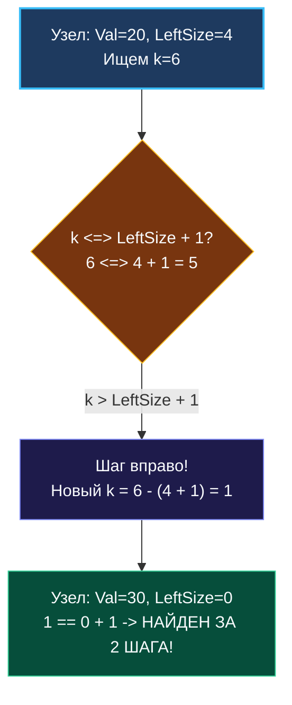

> *«В правильной структуре данных поиск нужного элемента происходит не благодаря слепому перебору, а благодаря свойствам самого пространства».*  
> — Чарльз Эркюль Хоар

**LeetCode 230. Kth Smallest Element in a BST.** Дано бинарное дерево поиска (BST) и целое число $k$ ($1$-индексация, то есть $k = 1$ соответствует минимальному элементу). Требуется найти $k$-й по величине наименьший элемент в дереве.

В предыдущей задаче ([[6. Validate BST]]) мы сформулировали фундаментальный закон бинарных деревьев поиска: **центрированный обход (Inorder Traversal: Лево $\rightarrow$ Корень $\rightarrow$ Право) обходит элементы в строго возрастающем порядке**. Задача о поиске $k$-го минимума — идеальная иллюстрация того, как знание инвариантов структур данных позволяет трансформировать тяжеловесный перебор в молниеносный алгоритм с ранним выходом (**Early Exit**).

---

### 1. Архитектурный контраст: Наивный сбор массива против раннего выхода

- **Наивный подход ($O(N)$ времени и памяти):**  
  Выполнить полный рекурсивный Inorder-обход, сложить все $N$ чисел в срез `[]int` и вернуть `result[k-1]`.  
  *Провал в High-Load:* Если в дереве $10\,000\,000$ узлов, а клиент запросил $k = 3$, наивный алгоритм обойдёт все 10 миллионов вершин, выделит мегабайты памяти в куче и спровоцирует задержки сборщика мусора Go.
- **Оптимальный подход ($O(H + k)$ времени, $O(H)$ памяти):**  
  Использовать **итеративный Inorder-обход** на срезе-стеке. Мы спускаемся до наименьшего элемента (самый левый лист за $O(H)$ шагов), а затем извлекаем ровно $k$ элементов, декрементируя счетчик. В момент, когда $k = 0$, мы немедленно завершаем работу и возвращаем ответ.

```
       [ 5 ]
      /     \
    [ 3 ]   [ 6 ]         Inorder поток: 1 -> 2 -> 3 -> 4 -> 5 -> 6
   /     \
 [ 2 ]   [ 4 ]            При k = 3:
 /                          1. Извлекли 1 (k=2)
[ 1 ]                       2. Извлекли 2 (k=1)
                            3. Извлекли 3 (k=0) -> МГНОВЕННЫЙ ВЫХОД!
```

---

### 2. Идиоматическая реализация на Go: Итеративный Early Exit

```go
package main

type TreeNode struct {
	Val   int
	Left  *TreeNode
	Right *TreeNode
}

// kthSmallest находит k-й наименьший элемент в BST с помощью итеративного Inorder-обхода.
// Временная сложность: O(H + k) — спуск в левый лист + k шагов обхода.
// Пространственная сложность: O(H) — размер среза-стека равен высоте дерева.
func kthSmallest(root *TreeNode, k int) int {
	// Предаллоцируем срез стека под среднюю высоту дерева
	stack := make([]*TreeNode, 0, 32)
	curr := root

	for curr != nil || len(stack) > 0 {
		// 1. Спускаемся максимально влево к наименьшему текущему элементу
		for curr != nil {
			stack = append(stack, curr)
			curr = curr.Left
		}

		// 2. Извлекаем минимальный узел из стека (Pop)
		curr = stack[len(stack)-1]
		stack[len(stack)-1] = nil // Очищаем ссылку для сборщика мусора
		stack = stack[:len(stack)-1]

		// 3. Учитываем посещенный узел
		k--
		if k == 0 {
			return curr.Val // Ранний выход: k-й минимум найден!
		}

		// 4. Переходим в правое поддерево
		curr = curr.Right
	}

	return -1 // Недостижимо при корректном k <= N
}
```

---

### 3. Визуализация итеративного извлечения элементов



---

### 4. Senior Follow-Up: Дерево порядковой статистики (Order Statistic Tree)

На системных собеседованиях в BigTech часто звучит усложнение:  
*«Что если дерево постоянно модифицируется (миллионы вставок и удалений), а поиск $k$-го элемента вызывается непрерывно? Как ускорить поиск до строгого $O(H)$ без зависимости от $k$?»*

#### Архитектурное решение: Расширение структуры узла (Augmented BST)
Мы дополняем структуру узла полем `LeftSize` — количеством узлов в его левом поддереве:

```go
type OrderNode struct {
    Val      int
    LeftSize int // Количество узлов в левом поддереве
    Left     *OrderNode
    Right    *OrderNode
}
```

#### Логарифмический поиск $O(H)$ вместо $O(H + k)$:
Стоя в корне `node`:
1. Если $k == \text{node.LeftSize} + 1$: **текущий узел и есть ответ!** Найдено за $1$ шаг.
2. Если $k \le \text{node.LeftSize}$: искомый узел гарантированно находится в левом поддереве. Спускаемся влево, $k$ не меняется.
3. Если $k > \text{node.LeftSize} + 1$: узел находится в правом поддереве. Спускаемся вправо, уменьшая $k$ на $(\text{node.LeftSize} + 1)$.



Этот принцип лежит в основе реализации постраничной навигации в реляционных СУБД: классический SQL-запрос `OFFSET k LIMIT 1` на обычном B-Tree вынужден физически просканировать $k$ записей, тогда как B-Tree с поддержкой порядковой статистики прыгает к нужной записи за $O(\log N)$ дисковых чтений.

---

### Резюме для интервью

| Метод | Сложность по времени | Память | Особенности |
|---|---|---|---|
| **Полный обход в массив** | $O(N)$ | $O(N)$ | Антипаттерн, неприемлемо при $k \ll N$ |
| **Итеративный Inorder (наш выбор)** | $O(H + k)$ | $O(H)$ | Идеальный баланс простоты и раннего выхода |
| **Order Statistic Tree** | $O(H)$ | $O(N)$ | Системный ответ на Follow-up: требует $O(H)$ на вставку |

В следующей задаче уровня Hard мы совершим переход от оперативной памяти к дискам и сетевым сокетам, научившись упаковывать дерево в байтовые потоки: [[8. Serialize and Deserialize Binary Tree]].