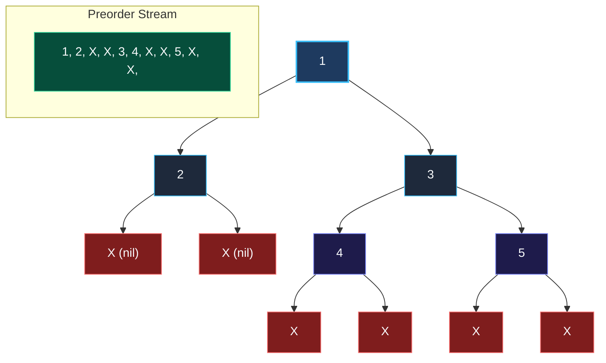

> *«Данные должны передаваться просто. Избавьтесь от лишних украшений — и сеть ответит вам взаимностью».*  
> — Роб Пайк

**LeetCode 297. Serialize and Deserialize Binary Tree.** Требуется спроектировать и реализовать алгоритм сериализации бинарного дерева в строку и обратной десериализации этой строки в эквивалентное бинарное дерево. Ограничений на формат кодирования не накладывается — главное, чтобы дерево гарантированно восстанавливалось в исходном виде.

В оперативной памяти узлы дерева связаны **виртуальными указателями** (например, `0xc0000a2040`). Однако указатели локальны для адресного пространства конкретного процесса. Их невозможно записать в файл на диск, отправить в топик Apache Kafka или передать через сетевой сокет в gRPC-вызове.

Для сетевой передачи сложный иерархический граф объектов с указателями обязан быть преобразован в плоскую последовательность байтов. Эта задача уровня Hard проверяет зрелость системного мышления инженера: умение проектировать компактные протоколы сериализации, исключать паразитные аллокации строк и мыслить категориями сетевой пропускной способности.

---

### 1. Архитектурный выбор: почему стандартный JSON не подходит для High-Load?

Первая мысль кандидата — использовать стандартный пакет `encoding/json`:

```json
{
  "Val": 1,
  "Left": { "Val": 2, "Left": null, "Right": null },
  "Right": { "Val": 3, "Left": null, "Right": null }
}
```

> [!WARNING]
> **Скрытая цена текстовых протоколов:**  
> Для дерева всего из трёх узлов JSON генерирует более 130 байт данных, из которых 90% — это служебные ключи (`"Val"`, `"Left"`, скобки, кавычки и пробелы).  
> При передаче дерева из $1\,000\,000$ узлов между микросервисами размер JSON превысит 100 МБ! Парсинг текстовых ключей перегрузит CPU и забьет сетевой канал.  
> 
> Наш канонический протокол сериализации на базе **Preorder DFS с маркерами отсутствия (`X`)** сожмёт то же самое дерево до компактной строки:  
> `1,2,X,X,3,X,X,` (всего 16 байт вместо 130 — экономия в 8 раз!).

---

### 2. Алгоритм кодирования: Preorder DFS с маркерами `X`

Мы используем прямой центрированный обход (**Preorder DFS: Корень $\rightarrow$ Лево $\rightarrow$ Право**):
1. Если узел пуст (`nil`), записываем терминальный символ `X,`.
2. Если узел существует, записываем числовое значение узла и разделитель-запятую: `node.Val,`.
3. Рекурсивно сериализуем левое поддерево, затем правое поддерево.

Фиксация маркеров `X` для пустых потомков однозначно устраняет топологическую двусмысленность: такое представление восстанавливает единственное возможное бинарное дерево без необходимости сохранять второй порядок обхода (Inorder).



---

### 3. Идиоматическая реализация на Go

```go
package main

import (
	"strconv"
	"strings"
)

type TreeNode struct {
	Val   int
	Left  *TreeNode
	Right *TreeNode
}

type Codec struct{}

func Constructor() Codec {
	return Codec{}
}

// serialize преобразует дерево в компактную строку Preorder с помощью strings.Builder.
// Временная сложность: O(N) — каждый узел посещается один раз.
// Пространственная сложность: O(N) — размер результирующей строки.
func (this *Codec) serialize(root *TreeNode) string {
	var sb strings.Builder

	var buildString func(node *TreeNode)
	buildString = func(node *TreeNode) {
		if node == nil {
			sb.WriteString("X,")
			return
		}

		// Записываем значение узла и разделитель
		sb.WriteString(strconv.Itoa(node.Val))
		sb.WriteByte(',')

		buildString(node.Left)
		buildString(node.Right)
	}

	buildString(root)
	return sb.String()
}

// deserialize восстанавливает бинарное дерево из строки токенов.
// Временная сложность: O(N) — каждый токен обрабатывается за O(1).
// Пространственная сложность: O(N) — хранение слайса токенов и узлов в куче.
func (this *Codec) deserialize(data string) *TreeNode {
	if len(data) == 0 {
		return nil
	}

	tokens := strings.Split(data, ",")
	idx := 0

	var buildTree func() *TreeNode
	buildTree = func() *TreeNode {
		if idx >= len(tokens) {
			return nil
		}

		token := tokens[idx]
		idx++

		// Базовый случай: пустой узел
		if token == "X" || token == "" {
			return nil
		}

		val, _ := strconv.Atoi(token)
		node := &TreeNode{Val: val}

		// Порядок восстановления строго соответствует Preorder (Left -> Right)
		node.Left = buildTree()
		node.Right = buildTree()

		return node
	}

	return buildTree()
}
```

---

### 4. Механическая симпатия: Эффективная работа со строками и памятью

1. **`strings.Builder` против конкатенации `+`:**  
   Строки в Go неизменяемы. Операция `str += "X,"` при каждом шаге цикла выделяет новый блок памяти и копирует туда старую строку, порождая квадратичную сложность аллокаций $O(N^2)$.  
   Внутри `strings.Builder` находится динамический срез байтов `[]byte`. Метод `sb.String()` использует безопасный указатель, возвращая готовую строку со сложностью **Zero-Copy** (без дублирующего копирования буфера в куче).
2. **Промышленный инсайт: Zero-Allocation сканер вместо `strings.Split`:**  
   Вызов `strings.Split(data, ",")` для дерева из $1\,000\,000$ узлов создаёт массив из миллиона структур `string` (каждая по 16 байт = 16 МБ памяти в куче), нагружая сборщик мусора.  
   В производственных сериализаторах строку читают потоковым итератором по байтовому срезу через функцию `strings.IndexByte(data[offset:], ',')`, расходуя ровно **0 байт дополнительной памяти** на промежуточные токены.

---

### 5. Граничные случаи (Edge Cases)

- **Пустое дерево (`root == nil`):**  
  Сериализатор возвращает `"X,"`. Десериализатор считывает токен `"X"` и возвращает `nil`.
- **Отрицательные числа:**  
  Функция `strconv.Itoa` корректно кодирует отрицательные целые числа (например, `-42`), а `strconv.Atoi` безошибочно парсит знак минус.
- **Одностороннее вырожденное дерево:**  
  Маркеры `X` фиксируют форму дерева, предотвращая превращение левой цепочки в правую.

---

### Резюме для интервью

| Характеристика | Значение |
|---|---|
| **Формат кодирования** | Preorder DFS с терминальными маркерами `X` |
| **Сложность по времени** | $O(N)$ на сериализацию и $O(N)$ на десериализацию |
| **Сложность по памяти** | $O(N)$ на строковый буфер и токены |
| **Ключевой приём в Go** | `strings.Builder` для быстрого построения строки без аллокаций |

На этом мы завершаем кластер **Деревья**. Мы освоили все ключевые аспекты работы с иерархическими структурами данных: от локальности памяти и сборки мусора до послойного обхода, поиска диаметра, валидации BST и сетевой сериализации.

В следующем масштабном разделе мы покидаем рамки деревьев и погружаемся в мир произвольных сетей, циклов и взаимных зависимостей — кластер **Графы**: [[1. Теория. Графы]].