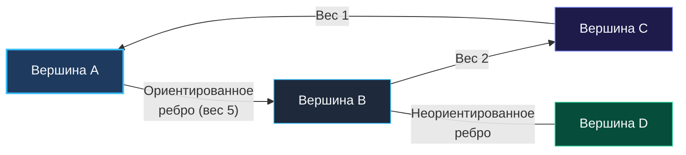

> *«В теории графов нет никакой мистики: есть лишь вершины, соединяющие их рёбра и искусство не блуждать по кругу».*  
> — Эдсгер Вибе Дейкстра

Граф — наиболее общая и выразительная модель данных в Computer Science. Если списки и массивы моделируют последовательности, а деревья — строгие иерархии «сверху вниз», то **графы моделируют произвольные взаимосвязи между объектами реального мира**.

В архитектуре современных высоконагруженных систем графы окружают инженера повсюду:
- **Распределённая трассировка (Distributed Tracing):** граф вызовов микросервисов в OpenTelemetry / Jaeger с передачей `TraceID` и `SpanID`.
- **Сетевая маршрутизация:** построение кратчайших путей в протоколах OSPF, BGP и mesh-сетях дата-центров.
- **Менеджеры зависимостей:** построение направленного графа зависимостей пакетов в `go mod` и графа задач в системах сборки (Makefile, Bazel).
- **Обнаружение Deadlock'ов:** поиск циклов ожидания ресурсов в транзакционных СУБД (PostgreSQL, MySQL InnoDB).
- **Сборка мусора в Go (GC):** трёхцветный алгоритм пометки живых объектов (Tri-color Mark & Sweep) — это не что иное, как обход направленного графа ссылок в куче, начиная от корней (Root Set).

> [!NOTE]
> **Дерево как частный случай графа:**  
> Любое бинарное дерево — это связный ориентированный ациклический граф (**DAG — Directed Acyclic Graph**), обладающий строгим ограничением: количество рёбер ровно на единицу меньше количества вершин ($E = V - 1$), а полустепень захода каждого узла (кроме корня) равна ровно $1$. Добавление хотя бы одного дополнительного ребра или цикла немедленно превращает дерево в произвольный граф.

---

### 1. Математическая анатомия графа

Формально граф $G$ определяется парой множеств: $G = (V, E)$, где:
- $V$ (**Vertices / Вершины**) — множество узлов системы (пользователи, серверы, задачи).
- $E$ (**Edges / Рёбра**) — множество пар вершин, описывающих взаимосвязи.



#### Классификация графов
1. **По направленности рёбер:**
   - **Неориентированные (Undirected):** рёбра двунаправлены ($A - B \iff B - A$). Пример: сетевой кабель или взаимная дружба в соцсети.
   - **Ориентированные (Directed / Digraph):** рёбра имеют строгое направление ($A \rightarrow B$). Пример: зависимости пакетов, подписки в Twitter, HTTP-вызовы.
2. **По наличию весов:**
   - **Невзвешенные (Unweighted):** стоимость каждого перехода равна $1$. Кратчайший путь находится классическим волновым BFS ([[1. Теория. BFS]]).
   - **Взвешенные (Weighted):** каждому ребру сопоставлен вес $w(u, v)$ (задержка сети в мс, стоимость перелёта). Кратчайший путь требует алгоритма Дейкстры или Беллмана-Форда.
3. **По наличию циклов:**
   - **Ациклические (DAG):** не содержат путей, возвращающихся в исходную точку. Критически важны для топологической сортировки.
   - **Циклические:** содержат замкнутые маршруты, требующие строгого контроля посещённости (`visited`).

---

### 2. Представление графа в памяти Go: Память и Кэш-линии

Аппаратная архитектура процессора оперирует непрерывными массивами оперативной памяти. Существует три классических формата хранения графов в RAM:

#### 1. Матрица смежности (Adjacency Matrix)
Квадратная таблица размером $V \times V$, где ячейка `matrix[u][v]` хранит вес ребра от вершины $u$ к вершине $v$ (или $0/1$):

```go
matrix := [][]int{
    {0, 1, 0, 0}, // Ребро 0 -> 1
    {1, 0, 1, 1}, // Ребра 1 -> 0, 1 -> 2, 1 -> 3
    {0, 1, 0, 0},
    {0, 1, 0, 0},
}
```

- **Проверка наличия ребра $(u, v)$:** мгновенно за $O(1)$.
- **Потребление памяти:** строго $O(V^2)$.
- **Инженерный вердикт:** применима только для плотных графов (**Dense Graphs**), где $E \approx V^2$. Для графа из $100\,000$ пользователей матрица займет $100\,000 \times 100\,000 \times 8 \text{ байт} \approx 80 \text{ ГБ}$ памяти, из которых $99.9\%$ будут пустыми нулями. Гарантированный OOM-сбой.

#### 2. Список смежности (Adjacency List — Золотой стандарт)
Для каждой вершины хранится срез её непосредственных соседей. Применяется в 95% задач:

```go
// Вариант А: Разреженные идентификаторы (UUID, строки)
graphMap := make(map[string][]string)

// Вариант Б: Плотные целочисленные идентификаторы 0..V-1 (High-Performance)
graph := make([][]int, numVertices)
graph[0] = []int{1, 2}
graph[1] = []int{0, 3}
```

- **Потребление памяти:** оптимальное $O(V + E)$.
- **Итерация по соседям:** $O(\text{deg}(u))$ — мы сканируем только реальные рёбра.

---

### 3. Mechanical Sympathy: Срез срезов `[][]int` против `map[int][]int`

На собеседовании уровня Senior кандидата обязательно спросят:  
*«Почему представление `[][]int` работает на порядок быстрее, чем `map[int][]int`, если их алгоритмическая сложность формально одинакова — $O(V + E)$?»*

Ответ раскрывает глубинное понимание рантайма Go и микроархитектуры процессора:

1. **Накладные расходы хеширования:**  
   Срез `[][]int` — это монолитный блок 24-байтовых дескрипторов `SliceHeader`. Обращение `graph[u]` компилируется в одну инструкцию сложения `base + u * 24` за **1 такт CPU**.  
   Доступ к `map[u]` требует вычисления хеша ключа, наложения битовой маски бакета, проверки `top-hash`, перехода по цепочкам переполнения и разыменования указателей — это **сотни инструкций** процессора.
2. **Кэш-локальность L1/L2:**  
   Ячейки среза лежат в памяти последовательно. Предвыборщик процессора (Hardware Prefetcher) подтягивает соседние записи в 64-байтную кэш-линию L1d с нулевой задержкой.  
   Хеш-таблица `runtime.hmap` разбрасывает бакеты по куче псевдослучайно, порождая постоянные промахи кэша (**Cache Misses** с простоем в 150–200 тактов на каждое обращение).

> [!TIP]
> **Производственный паттерн (ID Interning):**  
> Если входной граф содержит строковые ключи (например, имена хостов или UUID), перед началом обхода преобразуйте строки в последовательные индексы $0 \dots N-1$ с помощью словаря-индексатора `map[string]int`, а сам алгоритм запускайте над плоским срезом `[][]int`. Это ускоряет выполнение обходов в 5–10 раз.

---

### 4. Список рёбер (Edge List)

Массив плоских структур, представляющих каждое ребро:

```go
type Edge struct {
    From   int
    To     int
    Weight int
}
edges := []Edge{{From: 0, To: 1, Weight: 10}}
```

- **Потребление памяти:** минимальное $O(E)$.
- **Применение:** алгоритм Крускала (поиск минимального остовного дерева MST с сортировкой рёбер), алгоритм Беллмана-Форда (поиск кратчайших путей с отрицательными рёбрами).

---

### 5. Ловушка зацикливания: почему графам необходим `visited`

В бинарном дереве рекурсия гарантированно завершалась в листьях (`node == nil`). В графах наличие циклов ($A \rightarrow B \rightarrow C \rightarrow A$) превращает наивный обход в бесконечную рекурсию и панику по переполнению стека (`stack overflow`).

Для разрыва циклов в алгоритм обязательно вводится структура учёта посещённых вершин:
- В неориентированных графах: булев массив `visited := make([]bool, V)`.
- В ориентированных графах: **метод трёх цветов (White-Gray-Black)**, подробно рассматриваемый в следующей главе.

---

### Резюме для интервью

| Представление | Память | Проверка ребра $(u, v)$ | Перебор соседей вершины $u$ | Где применяется |
|---|---|---|---|---|
| **Матрица смежности** | $O(V^2)$ | $O(1)$ | $O(V)$ | Плотные графы ($E \approx V^2$), алгоритм Флойда-Уоршелла |
| **Список смежности (`[][]int`)** | $O(V + E)$ | $O(\text{deg}(u))$ | $O(\text{deg}(u))$ | 95% задач на DFS/BFS, Дейкстру, топосорт |
| **Список рёбер** | $O(E)$ | $O(E)$ | $O(E)$ | Алгоритмы Крускала, Беллмана-Форда |

В следующей статье мы разберем две важнейшие фундаментальные операции над графами — выделение компонент связности и детектирование циклов: [[2. Компоненты и циклы]].