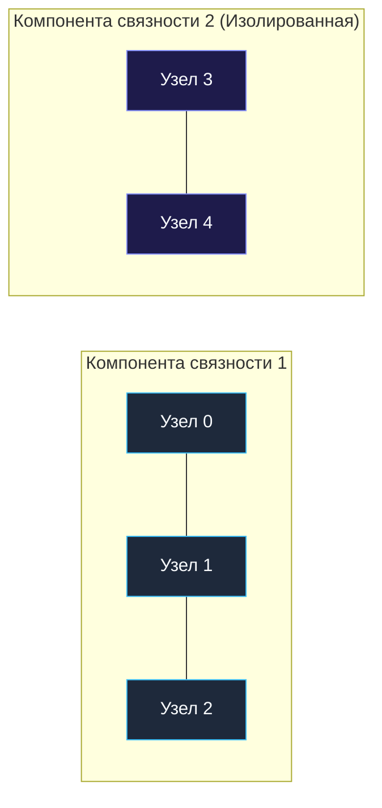
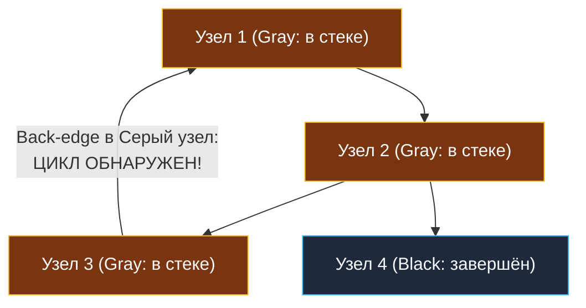

> *«Глубинный обход графа открывает нам его скрытую анатомию: мосты, точки сочленения и невидимые циклы, грозящие бесконечным тупиком».*  
> — Роберт Тарджан

В предыдущей главе ([[1. Теория. Графы]]) мы изучили способы эффективного представления графов в оперативной памяти Go. Теперь перейдем к двум фундаментальным топологическим характеристикам любой сетевой структуры: **Связности (Connectivity)** и **Ацикличности (Acyclicity)**.

В инженерной практике эти концепции решают критически важные прикладные задачи:
- **Компоненты связности:** выявление сетевых расколов в распределённых кластерах (**Network Partition / Split-Brain** в etcd, Consul, Raft) и кластеризация пользователей в графах рекомендаций.
- **Обнаружение циклов:** предотвращение взаимных блокировок транзакций в СУБД (**Deadlock Detection**), циклических ссылок при внедрении зависимостей (**Circular Dependency** в DI-контейнерах) и зацикливания пакетов в протоколах маршрутизации.

---

### 1. Компоненты связности в неориентированных графах

**Компонента связности** в неориентированном графе — это максимальное подмножество вершин, в котором между любыми двумя вершинами существует хотя бы один путь. Если граф разорван на изолированные кластеры, количество компонент связности больше $1$.



#### Алгоритм выделения компонент: Волновой Flood Fill
1. Инициализируем массив `visited := make([]bool, n)`.
2. Запускаем внешний цикл от $0$ до $n-1$.
3. Если вершина $i$ еще не посещена — мы нашли новую компоненту! Увеличиваем счетчик и запускаем DFS/BFS для пометки всех достижимых вершин.

```go
package main

// countComponents подсчитывает число компонент связности в неориентированном графе.
// Временная сложность: O(V + E) — каждое ребро и вершина просматриваются константное число раз.
// Пространственная сложность: O(V + E) — список смежности и булев массив visited.
func countComponents(n int, edges [][]int) int {
	// 1. Построение списка смежности на непрерывных срезах
	graph := make([][]int, n)
	for _, e := range edges {
		u, v := e[0], e[1]
		graph[u] = append(graph[u], v)
		graph[v] = append(graph[v], u)
	}

	visited := make([]bool, n)
	components := 0

	var dfs func(node int)
	dfs = func(node int) {
		visited[node] = true
		for _, neighbor := range graph[node] {
			if !visited[neighbor] {
				dfs(neighbor)
			}
		}
	}

	// 2. Внешний цикл поиска изолированных кластеров
	for i := 0; i < n; i++ {
		if !visited[i] {
			components++ // Обнаружен новый кластер
			dfs(i)       // Полная заливка кластера
		}
	}

	return components
}
```

---

### 2. Поиск циклов в ориентированных графах: Метод трёх цветов

В неориентированном графе для обнаружения цикла достаточно простого правила: если мы пришли в уже посещённую вершину (и это не наш непосредственный родитель), то в графе есть цикл.

В **ориентированных графах (Directed Graphs)** это правило перестаёт работать!  
Схождение двух независимых путей в один узел (например, $A \rightarrow C$ и $B \rightarrow C$) **не образует цикла**:

```
      A ──► C ◄── B    (Ромб: это НЕ цикл!)
```

Цикл возникает исключительно тогда, когда ребро ведёт к предку, который **прямо сейчас находится в текущем стеке вызовов (Call Stack)**. Такое ребро называется **обратным (Back-edge)**.

#### Трёхцветная маркировка (White-Gray-Black)
Каждой вершине присваивается одно из трёх состояний:
- ⚪ **White (0 — Белый):** вершина ещё не исследовалась.
- 🟡 **Gray (1 — Серый):** вершина посещена, и в данный момент обходятся её потомки (вершина находится в стеке вызовов текущей цепочки).
- ⚫ **Black (2 — Чёрный):** вершина и все её потомки полностью исследованы, обход подграфа завершён.



> [!CRITICAL]
> **Инвариант детектирования цикла:**  
> Если в процессе обхода мы встречаем соседа, окрашенного в **серый цвет (`Gray == 1`)**, в ориентированном графе гарантированно обнаружен **цикл**!

---

### 3. Идиоматическая реализация детектора циклов на Go

```go
package main

// hasCycle проверяет наличие циклов в ориентированном графе методом трех цветов.
// Временная сложность: O(V + E) — каждый узел красится в серый и черный строго 1 раз.
// Пространственная сложность: O(V) — стек рекурсии и массив цветов.
func hasCycle(n int, graph [][]int) bool {
	const (
		white uint8 = 0 // Не посещен
		gray  uint8 = 1 // В процессе обхода (в стеке)
		black uint8 = 2 // Полностью завершен
	)

	colors := make([]uint8, n)

	var dfs func(node int) bool
	dfs = func(node int) bool {
		colors[node] = gray // Помещаем в текущую цепочку

		for _, neighbor := range graph[node] {
			// Обнаружено обратное ребро к серому предку -> ЦИКЛ!
			if colors[neighbor] == gray {
				return true
			}
			// Белый сосед -> рекурсивный спуск
			if colors[neighbor] == white {
				if dfs(neighbor) {
					return true // Fast Fail проброс наверх
				}
			}
			// Черных соседей просто игнорируем (они уже проверены и безопасны)
		}

		colors[node] = black // Завершаем обработку подграфа
		return false
	}

	// Запускаем обход для каждой еще не посещенной вершины (граф может быть несвязным)
	for i := 0; i < n; i++ {
		if colors[i] == white {
			if dfs(i) {
				return true
			}
		}
	}

	return false
}
```

> [!WARNING]
> **Фатальная ошибка новичков (Сброс в White вместо Black):**  
> Многие разработчики путают поиск циклов с бэктрекингом и после обхода детей сбрасывают цвет обратно в `white (0)`: `colors[node] = 0`.  
> Это приводит к катастрофическому взрыву сложности с $O(V + E)$ до **экспоненциальной $O(2^V)$**, так как один и тот же подграф будет многократно переобследоваться из других путей. Чёрный цвет (`black = 2`) — это гарантия того, что узел полностью валиден и к нему не нужно возвращаться.

---

### 4. Механическая симпатия: Связь с Go Garbage Collector

Знаете ли вы, что рантайм Go использует алгоритм трёх цветов прямо во время работы вашего сервиса?

Память процесса Go — это направленный граф объектов в куче:
- **Белые объекты (White):** кандидаты на удаление (память будет освобождена).
- **Серые объекты (Gray):** объекты, найденные сборщиком мусора, чьи внутренние указатели ещё не отсканированы (находятся в очереди сканирования `gcWork`).
- **Чёрные объекты (Black):** живые объекты, все ссылки из которых полностью проверены.

Понимание топологии графов позволяет инженеру осознавать, как структуры данных в коде влияют на паузы GC и задержки аллокаций.

---

### Резюме для интервью

| Задача | Тип графа | Механизм проверки | Сложность |
|---|---|---|---|
| **Компоненты связности** | Неориентированный | Двухцветный массив `visited` (`bool`) | $O(V + E)$ |
| **Поиск циклов** | Ориентированный | Трёхцветная маркировка (White-Gray-Black) | $O(V + E)$ |
| **Ключевой маркер цикла** | Ориентированный | Встреча соседа со статусом `Gray` (в стеке) | $O(1)$ на проверку |

В следующей задаче мы применим поиск циклов к разрешению зависимостей в учебных планах и сборках проектов: [[3. Course Schedule]].