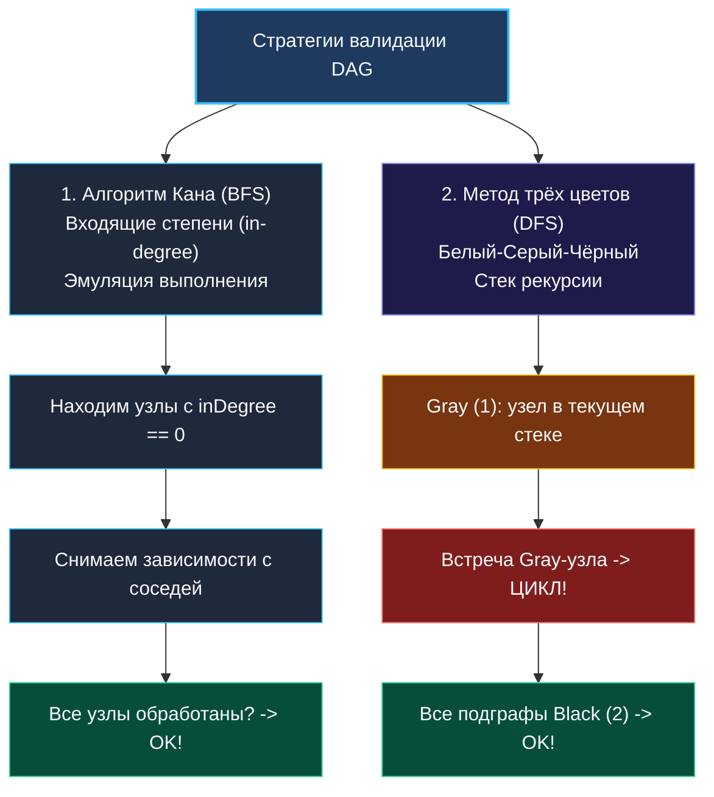

> *«Прежде чем возводить башню, убедитесь, что её фундамент не опирается на собственную крышу».*  
> — Брайан Керниган

**LeetCode 207. Course Schedule.** Вам требуется пройти `numCourses` курсов, пронумерованных от $0$ до $\text{numCourses} - 1$. Задан список предварительных требований `prerequisites`, где пара $[a, b]$ означает, что для прохождения курса $a$ необходимо **предварительно завершить курс $b$** (ребро $b \rightarrow a$). Требуется определить: возможно ли завершить все курсы?

Для студента это академическая задача о расписании. Для бэкенд-инженера — это классическая задача **разрешения графа зависимостей (Dependency Resolution)**:
- **Пакетные менеджеры (`go mod`, `cargo`, `npm`):** определение возможности компиляции проекта без циклических импортов (`import cycle not allowed`).
- **Внедрение зависимостей (DI-контейнеры в Go, например `uber-go/fx`):** валидация графа инициализации микросервиса перед запуском. Если `UserService` требует `Database`, `Database` требует `Config`, а `Config` требует `UserService`, приложение падает при старте с циклической блокировкой.
- **Оркестрация конвейеров (Airflow, Argo Workflows, CI/CD):** исполнение задач, организованных в направленный ациклический граф (**DAG**).

Если в графе зависимостей существует хотя бы один цикл, система входит в состояние взаимной блокировки (**Deadlock**). Таким образом, задача Course Schedule эквивалентна строгой проверке: **является ли заданный ориентированный граф ациклическим (DAG)?**

---

### 1. Архитектурная дилемма: BFS (Алгоритм Кана) против DFS (Три цвета)

Для поиска циклов в ориентированном графе существует два канонических метода с одинаковой асимптотикой $O(V + E)$:



---

### 2. Подход 1: Алгоритм Кана (Kahn's Algorithm — BFS через входящие степени)

Алгоритм Кана моделирует реальный процесс обучения.  
Ключевая метрика — **входящая степень (In-Degree)**: количество незакрытых предварительных зависимостей для каждого курса.

1. Подсчитываем `inDegree[course]` для каждого курса.
2. Курсы с `inDegree == 0` не имеют предварительных требований. Они готовы к немедленному прохождению — помещаем их в очередь FIFO.
3. Извлекаем курс из очереди, засчитываем его прохождение (`visitedCount++`) и уменьшаем `inDegree` всех его зависимых соседей на $1$.
4. Если у соседа `inDegree` обнуляется, он разблокирован — добавляем его в очередь.
5. **Финал:** если `visitedCount == numCourses`, граф ацикличен. Если `visitedCount < numCourses`, оставшиеся узлы заперты во взаимном цикле!

```go
package main

// canFinish проверяет возможность закрытия всех курсов алгоритмом Кана (BFS).
// Временная сложность: O(V + E) — каждое ребро и вершина обрабатываются ровно один раз.
// Пространственная сложность: O(V + E) — список смежности и массив inDegree.
func canFinish(numCourses int, prerequisites [][]int) bool {
	graph := make([][]int, numCourses)
	inDegree := make([]int, numCourses)

	// 1. Построение графа: ребро pre -> course (pre разблокирует course)
	for _, p := range prerequisites {
		course, pre := p[0], p[1]
		graph[pre] = append(graph[pre], course)
		inDegree[course]++
	}

	// 2. Инициализируем очередь курсами без предварительных требований
	queue := make([]int, 0, numCourses)
	for i := 0; i < numCourses; i++ {
		if inDegree[i] == 0 {
			queue = append(queue, i)
		}
	}

	visitedCount := 0
	head := 0

	// 3. Волновой обход BFS
	for head < len(queue) {
		curr := queue[head]
		head++
		visitedCount++

		for _, next := range graph[curr] {
			inDegree[next]--
			if inDegree[next] == 0 {
				queue = append(queue, next)
			}
		}
	}

	// Если посещены все вершины — циклов нет
	return visitedCount == numCourses
}
```

---

### 3. Подход 2: Метод трёх цветов (DFS)

Если требуется только факт наличия цикла, рекурсивный DFS часто находит его быстрее за счёт раннего обрыва (**Fast Fail**), не сканируя независимые узлы нулевого слоя:

```go
func canFinishDFS(numCourses int, prerequisites [][]int) bool {
	graph := make([][]int, numCourses)
	for _, p := range prerequisites {
		course, pre := p[0], p[1]
		graph[pre] = append(graph[pre], course)
	}

	// 0: White (не посещен), 1: Gray (в стеке вызовов), 2: Black (полностью безопасен)
	state := make([]uint8, numCourses)

	var dfs func(u int) bool
	dfs = func(u int) bool {
		if state[u] == 1 {
			return false // Обнаружено обратное ребро в стек -> ЦИКЛ!
		}
		if state[u] == 2 {
			return true // Уже проверенный безопасный подграф
		}

		state[u] = 1 // Помечаем серым

		for _, v := range graph[u] {
			if !dfs(v) {
				return false
			}
		}

		state[u] = 2 // Окрашиваем в черный
		return true
	}

	for i := 0; i < numCourses; i++ {
		if state[i] == 0 {
			if !dfs(i) {
				return false
			}
		}
	}

	return true
}
```

---

### 4. Механическая симпатия: Очередь чисел `[]int` и Garbage Collector

Обратите внимание на структуру очереди в алгоритме Кана: срез `queue` хранит примитивные значения `int`, а не указатели `*Node`.

В рантайме Go сборщик мусора сканирует только те блоки памяти в куче, которые содержат биты указателей (`hasPtrs`). Срез `[]int` полностью прозрачен для фазы Mark сборщика мусора. Сдвиг головы очереди `head++` не создает утечек памяти, так как оставшиеся позади целые числа не удерживают ссылки на другие объекты.

---

### Резюме для интервью

- **Ключевой инвариант:** Задача эквивалентна обнаружению циклов в ориентированном графе (проверка на DAG).
- **Kahn vs DFS:**  
  - *Алгоритм Кана (BFS):* строит порядок выполнения от корней к листьям, естественен для оркестрации.
  - *Метод трёх цветов (DFS):* идеален для мгновенного детектирования Deadlock'ов благодаря Fast Fail.

В следующей задаче мы расширим алгоритм Кана, научившись восстанавливать точный порядок выполнения всех этапов: [[4. Course Schedule II]].