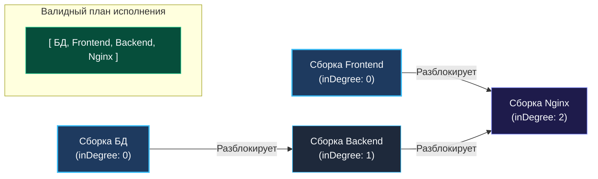

> *«Топологическая сортировка — это искусство находить естественный порядок вещей среди видимого хаоса взаимных обязательств».*  
> — Дональд Эрвин Кнут

**LeetCode 210. Course Schedule II.** Вам дано общее количество курсов `numCourses` (пронумерованных от $0$ до $\text{numCourses} - 1$) и массив предварительных требований `prerequisites`, где пара $[a, b]$ означает, что курс $b$ должен быть завершен **до** курса $a$ ($b \rightarrow a$). Требуется вернуть **последовательность прохождения курсов**, позволяющую закончить все курсы. Если существует несколько правильных порядков, разрешается вернуть любой из них. Если закончить все курсы невозможно из-за взаимных блокировок, вернуть пустой массив `[]`.

Если в задаче Course Schedule I ([[3. Course Schedule]]) требовалось лишь подтвердить факт разрешимости зависимостей, то в реальных системах планировщикам (Linux systemd, Kubernetes Kubelet, CI/CD runners, Go compiler) требуется **точный, детерминированный план пошагового выполнения**.

Такой порядок в теории графов называется **Топологической сортировкой (Topological Sort)**.

---

### 1. Архитектура топологической сортировки

Топологическая сортировка применима **исключительно к направленным ациклическим графам (DAG)**. Это линейное упорядочивание вершин, при котором для каждого направленного ребра $u \rightarrow v$ вершина $u$ расположена в итоговом массиве **строго раньше** вершины $v$.



> [!NOTE]
> В графе выше «Сборка БД» и «Сборка Frontend» не зависят друг от друга. Поэтому порядок `[Frontend, БД, Backend, Nginx]` также является на $100\%$ корректным. Топологический порядок **не уникален**.

---

### 2. Подход 1: Алгоритм Кана (BFS) — Промышленный эталон

Алгоритм Кана формирует топологический порядок естественным образом: узлы попадают в результирующий срез ровно в тот момент, когда все их предварительные зависимости закрыты (`inDegree == 0`).

```go
package main

// findOrder находит топологический порядок курсов алгоритмом Кана (BFS).
// Временная сложность: O(V + E) — каждый узел и ребро просматриваются ровно 1 раз.
// Пространственная сложность: O(V + E) — список смежности и срез результата.
func findOrder(numCourses int, prerequisites [][]int) []int {
	graph := make([][]int, numCourses)
	inDegree := make([]int, numCourses)

	// 1. Построение графа: ребро pre -> course
	for _, p := range prerequisites {
		course, pre := p[0], p[1]
		graph[pre] = append(graph[pre], course)
		inDegree[course]++
	}

	// 2. Инициализируем очередь курсами без зависимостей
	queue := make([]int, 0, numCourses)
	for i := 0; i < numCourses; i++ {
		if inDegree[i] == 0 {
			queue = append(queue, i)
		}
	}

	// Предаллоцируем итоговый срез сразу на полную емкость
	order := make([]int, 0, numCourses)
	head := 0

	// 3. Волновой обход
	for head < len(queue) {
		curr := queue[head]
		head++

		// Курс готов к исполнению — добавляем в итоговый план
		order = append(order, curr)

		for _, next := range graph[curr] {
			inDegree[next]--
			if inDegree[next] == 0 {
				queue = append(queue, next)
			}
		}
	}

	// 4. Проверка на цикл: если в план вошли не все курсы — обнаружен Deadlock!
	if len(order) != numCourses {
		return []int{} // По условию задачи возвращаем пустой срез
	}

	return order
}
```

---

### 3. Подход 2: Метод трёх цветов (DFS) и заполнение с конца

При использовании рекурсивного DFS возникает важный нюанс: вершина завершает работу (окрашивается в чёрный цвет) **после того, как исследованы все её потомки**. Это означает, что первым завершится узел-сток (у которого нет зависимых задач).  
Следовательно, DFS возвращает топологический порядок **в обратном направлении**.

Чтобы не тратить время на разворот массива, мы заполняем срез `order` **с конца**:

```go
func findOrderDFS(numCourses int, prerequisites [][]int) []int {
	graph := make([][]int, numCourses)
	for _, p := range prerequisites {
		course, pre := p[0], p[1]
		graph[pre] = append(graph[pre], course)
	}

	state := make([]uint8, numCourses) // 0: White, 1: Gray, 2: Black
	order := make([]int, numCourses)
	insertIdx := numCourses - 1 // Заполнение среза с правого конца

	var dfs func(u int) bool
	dfs = func(u int) bool {
		if state[u] == 1 {
			return false // Цикл!
		}
		if state[u] == 2 {
			return true
		}

		state[u] = 1

		for _, v := range graph[u] {
			if !dfs(v) {
				return false
			}
		}

		state[u] = 2
		// Узел обработан — записываем на текущую свободную позицию с конца
		order[insertIdx] = u
		insertIdx--

		return true
	}

	for i := 0; i < numCourses; i++ {
		if state[i] == 0 {
			if !dfs(i) {
				return []int{}
			}
		}
	}

	return order
}
```

---

### 4. Mechanical Sympathy: Естественный параллелизм алгоритма Кана

На системных собеседованиях часто задают вопрос:  
*«Какой из двух алгоритмов (Kahn BFS или DFS) лучше подходит для реального планировщика сборки (Job Scheduler)?»*

**Ответ Senior-инженера:**  
Алгоритм Кана (**BFS**) категорически превосходит DFS по двум причинам:
1. **Защита от Stack Overflow:** он плоский и не расходует стек вызовов горутины при длинных цепочках зависимостей ($N > 10^5$).
2. **Естественный параллелизм:** все задачи, одновременно находящиеся в очереди `queue` на каждом шаге, имеют `inDegree == 0`. Они **полностью независимы друг от друга** и могут быть параллельно отправлены в пул рабочих горутин (`Worker Pool`) для одновременного исполнения на разных ядрах CPU!

---

### Резюме для интервью

| Характеристика | Алгоритм Кана (BFS) | DFS (Обратный обход) |
|---|---|---|
| **Порядок формирования** | Прямой (от источников к стокам) | Обратный (заполнение с конца) |
| **Память в куче** | Предаллокация `make([]int, 0, N)` | Заполнение массива `make([]int, N)` с конца |
| **Параллелизм** | Легко распараллеливается на горутины | Строго последовательный |
| **Обнаружение цикла** | `len(order) != numCourses` | Встреча `state[v] == Gray` |

В следующей задаче мы вернемся к двумерным сеткам и рассмотрим классическую задачу на подсчет связных компонент: [[5. Number of Islands]].