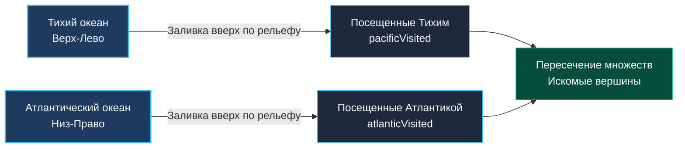

> *«Вода течет вниз, но инженерная мысль способна повернуть реки вспять, начав с океана».*  
> — Дональд Эрвин Кнут

## Смена перспективы: Реверсивный обход графа

В задаче [[5. Number of Islands]] мы искали замкнутые области, запуская алгоритм заливки из конкретной точки. Но в системной инженерии и маршрутизации часто встречается паттерн **Множественных источников (Multi-source)**. 

Задача **Pacific Atlantic Water Flow** (LeetCode №417) — классический пример такого паттерна.

**Условие:** Дана матрица высот `m x n`. Остров омывается Тихим океаном (сверху и слева) и Атлантическим океаном (снизу и справа). Вода может течь **вниз или на том же уровне** (то есть в соседние ячейки с высотой $\le$).  
Нужно найти координаты всех ячеек, дождевая вода из которых может достичь **обоих** океанов.

---

## Наивный подход: Прямая симуляция

Первое, что приходит в голову — симуляция законов физики.  
Пройдемся двойным циклом по всем ячейкам `(r, c)`. Для каждой ячейки запустим DFS. Если DFS найдет путь до левой/верхней границы и до правой/нижней — добавим клетку в ответ.

**Почему это провал на интервью?**  
Представьте, что у вас остров, который идет под уклон в виде ступенек. Для ячейки на вершине DFS обойдет весь остров. Для ячейки чуть ниже — почти весь остров.  
Мы будем многократно вычислять одни и те же пути. Временная сложность такого алгоритма составит $O((M \times N)^2)$. Для матрицы $1000 \times 1000$ (миллион ячеек) это $10^{12}$ операций. Вы гарантированно получите Time Limit Exceeded (TLE).

---

## Архитектурное решение: Инверсия потока (Reverse Flow)

Чтобы снизить сложность до линейной $O(M \times N)$, нам нужно **сменить точку обзора**.  
Вместо того чтобы пускать воду с каждой горы вниз, давайте **затопим остров от океанов вверх**.

Мы знаем, что вода течет вниз (высота $X \ge Y$). Значит, если мы идем *от океана*, мы можем двигаться только **вверх или по плоскости** (высота $X \le Y$).

Алгоритм:
1. Запускаем обход (DFS или BFS) от всех ячеек, граничащих с Тихим океаном. Отмечаем все достижимые клетки как `pacificVisited`.
2. Запускаем обход от всех ячеек, граничащих с Атлантическим океаном. Отмечаем все достижимые клетки как `atlanticVisited`.
3. Проходим по матрице один раз. Если ячейка есть и в `pacificVisited`, и в `atlanticVisited` — это наш ответ.



---

## Идиоматичная реализация (Middle Level)

В этой реализации мы используем два среза `visited`. Это надежный, легко читаемый код, демонстрирующий базовое владение алгоритмом.

```go
package main

// pacificAtlanticMiddle решает задачу через два двумерных массива посещений.
func pacificAtlanticMiddle(heights [][]int) [][]int {
	if len(heights) == 0 {
		return nil
	}

	rows, cols := len(heights), len(heights[0])
	pacific := make([][]bool, rows)
	atlantic := make([][]bool, rows)
	for i := 0; i < rows; i++ {
		pacific[i] = make([]bool, cols)
		atlantic[i] = make([]bool, cols)
	}

	var dfs func(r, c int, visited [][]bool, prevHeight int)
	dfs = func(r, c int, visited [][]bool, prevHeight int) {
		// Проверка выхода за границы
		if r < 0 || c < 0 || r >= rows || c >= cols {
			return
		}
		// Вода не может течь "вверх" от океана, если высота меньше предыдущей
		if heights[r][c] < prevHeight {
			return
		}
		// Защита от зацикливания
		if visited[r][c] {
			return
		}

		visited[r][c] = true

		// Идем в 4 стороны
		currH := heights[r][c]
		dfs(r+1, c, visited, currH)
		dfs(r-1, c, visited, currH)
		dfs(r, c+1, visited, currH)
		dfs(r, c-1, visited, currH)
	}

	// Запускаем DFS от береговых линий
	for r := 0; r < rows; r++ {
		dfs(r, 0, pacific, heights[r][0])           // Левый берег
		dfs(r, cols-1, atlantic, heights[r][cols-1]) // Правый берег
	}
	for c := 0; c < cols; c++ {
		dfs(0, c, pacific, heights[0][c])           // Верхний берег
		dfs(rows-1, c, atlantic, heights[rows-1][c]) // Нижний берег
	}

	// Ищем пересечение
	var res [][]int
	for r := 0; r < rows; r++ {
		for c := 0; c < cols; c++ {
			if pacific[r][c] && atlantic[r][c] {
				res = append(res, []int{r, c})
			}
		}
	}

	return res
}
```

---

## Mechanical Sympathy: Оптимизация для Senior/Lead (Bitmasks & Flat Arrays)

Как Principal Engineer, вы должны видеть архитектурные резервы:
1. **Перерасход памяти:** Два среза `[][]bool`. В 64-битной архитектуре слайс `[][]bool` — это массив заголовков `SliceHeader` (по 24 байта каждый), указывающих на разрозненные куски памяти. Для матрицы $1000 \times 1000$ это создаст $2000$ лишних аллокаций в куче и фрагментирует L1-кэш.
2. **Лишние проверки:** Мы дважды обходим граф и дважды выделяем состояние.

**Решение:**  
Мы можем упаковать всё состояние матрицы в **один одномерный срез (Flat Array)** типа `[]byte`, а принадлежность к океанам закодировать **битовыми масками (Bitmasks)**:
- `0b00` (0) — не посещено
- `0b01` (1) — достижимо из Тихого океана (Pacific)
- `0b10` (2) — достижимо из Атлантического океана (Atlantic)
- `0b11` (3) — достижимо из обоих (искомый результат)

> [!NOTE]
> **Под капотом: Математика плоских массивов**  
> Любую 2D-матрицу можно развернуть в одномерный срез непрерывной памяти.  
> Координата `(r, c)` превращается в индекс: `idx = r * cols + c`.  
> Это позволяет выделить память всего одной инструкцией аллокатора, а процессор подгружает смежные ячейки в L1-кэш целыми линиями (Cache Lines по 64 байта), минимизируя Cache Misses.

### Production-Ready реализация (Bitmasks)

```go
package main

// pacificAtlantic находит ячейки с двойным стоком через битовые маски и одномерный массив.
// Временная сложность: O(M * N) — каждая вершина посещается не более 2 раз.
// Пространственная сложность: O(M * N) для плоского среза states и стека рекурсии.
func pacificAtlantic(heights [][]int) [][]int {
	if len(heights) == 0 {
		return nil
	}

	rows, cols := len(heights), len(heights[0])

	// Единый плоский массив состояний: 1 - Pacific, 2 - Atlantic, 3 - Both
	states := make([]byte, rows*cols)

	var dfs func(r, c int, stateMask byte, prevHeight int)
	dfs = func(r, c int, stateMask byte, prevHeight int) {
		if r < 0 || c < 0 || r >= rows || c >= cols {
			return
		}

		idx := r*cols + c // Вычисление 1D-индекса

		// Условие реверсивного подъема
		if heights[r][c] < prevHeight {
			return
		}

		// Побитовое И: если данный океан уже посещал ячейку, прерываем обход
		if states[idx]&stateMask == stateMask {
			return
		}

		// Побитовое ИЛИ: маркируем достижимость текущим океаном
		states[idx] |= stateMask

		currH := heights[r][c]
		dfs(r+1, c, stateMask, currH)
		dfs(r-1, c, stateMask, currH)
		dfs(r, c+1, stateMask, currH)
		dfs(r, c-1, stateMask, currH)
	}

	// Pacific (Маска = 1)
	for c := 0; c < cols; c++ {
		dfs(0, c, 1, heights[0][c])
	}
	for r := 0; r < rows; r++ {
		dfs(r, 0, 1, heights[r][0])
	}

	// Atlantic (Маска = 2)
	for c := 0; c < cols; c++ {
		dfs(rows-1, c, 2, heights[rows-1][c])
	}
	for r := 0; r < rows; r++ {
		dfs(r, cols-1, 2, heights[r][cols-1])
	}

	// Собираем результат: ищем ячейки с обоими битами (состояние 3)
	var res [][]int
	for r := 0; r < rows; r++ {
		for c := 0; c < cols; c++ {
			if states[r*cols+c] == 3 {
				res = append(res, []int{r, c})
			}
		}
	}

	return res
}
```

> [!TIP]
> **Совет для собеседования**  
> Решение с битовыми масками и одномерным срезом демонстрирует глубокое понимание `Mechanical Sympathy`: знание стоимости аллокаций в куче, понимание того, как устроены слайсы в Go, и умение эффективно упаковывать флаги в процессорные регистры.

### Оценка сложности
- **Время:** $O(M \times N)$. В худшем случае (совершенно плоский остров) каждый узел будет посещен максимум $2$ раза (один раз Тихим океаном, один раз Атлантическим). Благодаря отсечению `states[idx]&stateMask == stateMask` повторные проходы пресекаются за $O(1)$.
- **Память:** $O(M \times N)$. В оптимизированной версии используется один срез `[]byte` размером $M \times N$ байт, что в $16$ раз компактнее `[][]bool` (без учета заголовков слайсов).

---

## Резюме

1. **Многоточечный старт (Multi-source):** Если у задачи несколько источников (береговая линия, границы матрицы, очаги возгорания), выгодно запускать обход последовательно от границ, накапливая общее состояние.
2. **Инверсия логики:** Если прямой обход дает $O(N^2)$, подумайте, можно ли начать с конца. Этот паттерн часто встречается в задачах на маршруты.
3. **Плоская матрица (Flat Grid):** Отраслевой стандарт работы с сетками в Go, радикально снижающий нагрузку на GC и повышающий Spatial Locality кэша.

Мы разобрали поиск путей и компонент. Но графы таят в себе еще одну угрозу. Иногда добавление всего одного ребра превращает строгую иерархию в хаотичный цикл. Как быстро обнаруживать такие «лишние» связи в динамически меняющихся сетях? Эту проблему мы решим в следующей статье: [[7. Redundant Connection]].