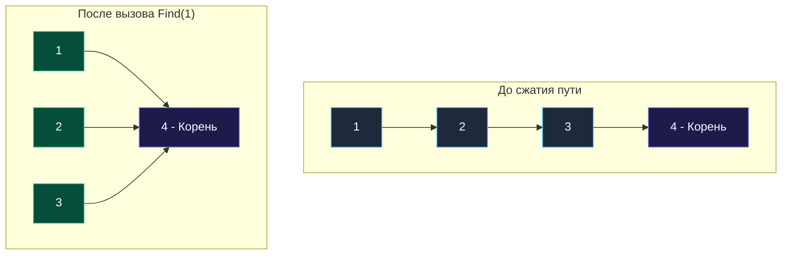

> *«В сложных сетях одна лишняя связь способна разрушить идеальную гармонию всей системы».*  
> — Роберт Тарджан

## Цена лишней связи: От иерархии к хаосу

Представьте, что вы проектируете локальную сеть дата-центра. Все коммутаторы (свитчи) соединены в древовидную топологию. Дерево (Tree) обладает фундаментальным свойством: между любыми двумя узлами существует строго **один уникальный путь**. 

Но что произойдет, если сетевой инженер случайно воткнет кабель, соединив два коммутатора, которые уже были связаны через другие узлы?  
Иерархия мгновенно превратится в **граф с циклом**. В компьютерных сетях на канальном уровне это вызывает **Broadcast Storm (Шторм широковещательных пакетов)** — коммутаторы начинают бесконечно ретранслировать один и тот же пакет по кругу, пока CPU коммутаторов не утилизируются на $100\%$ и сеть не упадет. 

Для предотвращения этой катастрофы сетевые инженеры используют протокол STP (Spanning Tree Protocol), который программно блокирует избыточные линки.  
Задача **Redundant Connection** (LeetCode №684) предлагает нам создать алгоритм обнаружения этого самого «лишнего» кабеля.

**Условие:** Дан неориентированный граф из $N$ узлов (пронумерованных от $1$ до $N$) и $N$ ребер. Изначально это было связное дерево из $N$ узлов и $N-1$ ребер, к которому добавили ровно одно новое ребро. Найдите ребро, добавление которого привело к образованию цикла. Если таких ребер несколько (в порядке их появления во входных данных), верните то, которое встречается в массиве последним.

---

## Почему не классический DFS или BFS?

Первая мысль на собеседовании — использовать обход в глубину.  
Мы можем добавлять ребра в пустой граф по одному и перед добавлением каждого ребра $[u, v]$ запускать DFS, чтобы проверить: *«А существует ли уже путь между $u$ и $v$?»*.  
Если путь уже существует — значит, добавление ребра замкнет цикл. Это и есть искомый ответ.

> [!WARNING]
> **Ловушка / Gotcha: Временная сложность DFS**  
> В графе $N$ ребер. Перед добавлением каждого ребра мы запускаем DFS, который в худшем случае обходит все уже добавленные $O(N)$ ребер. Итоговая сложность: $O(N^2)$.  
> Для $N = 1000$ это миллион операций (проходит тесты). Но для $N = 10^5$ (типичный размер таблиц маршрутизации или графа в БД) это $10^{10}$ операций — алгоритм неизбежно упадет по таймауту (TLE). Нам необходима структура данных, способная проверять связность двух узлов за околоконстантное $O(1)$ время.

---

## Знакомьтесь: Union-Find (Disjoint Set Union, DSU)

**Disjoint Set Union (DSU)** или **Система непересекающихся множеств** — это специализированная, компактная и эффективная структура данных. Она создана для двух ключевых операций:
1. **Find(x):** определить идентификатор множества (корневого представителя), к которому принадлежит элемент `x`.
2. **Union(x, y):** объединить два множества, содержащие элементы `x` и `y`.

Вместо построения громоздких списков смежности (`[][]int`), DSU хранит всё состояние в плоском срезе `parent`.

Изначально каждый узел изолирован и является родителем самому себе: `parent[i] = i`.  
Когда мы связываем два узла, мы делаем корень одного дерева родителем корня другого.

### Mechanical Sympathy: Почему DSU так быстр?

DSU базируется на плоских массивах целых чисел, а не на указателях (в отличие от `*TreeNode`).  
В Go срез `parent := make([]int, N+1)` выделяется единым непрерывным блоком памяти в куче. Процессор загружает этот срез в кэш-линии (Cache Lines L1/L2 по 64 байта). Операция перехода к родителю `parent[x]` — это не переход по произвольному адресу оперативной памяти (Pointer Chasing), а мгновенное вычисление смещения в регистрах CPU: `base_address + x * 8`.

---

## Две магии DSU: Оптимизации до O(α(N))

Наивная реализация DSU может выродиться в длинную цепочку (связный список с высотой $O(N)$). Чтобы операции `Find` и `Union` работали за околоконстантное время, применяют две обязательные эвристики:

### 1. Сжатие путей (Path Compression) при Find
Когда мы ищем корень множества для элемента `x`, мы проходим через цепочку его предков. Почему бы сразу не перевесить всех пройденных предков напрямую к корню? При следующем вызове `Find` для любого из этих узлов ответ будет получен ровно за один шаг!



### 2. Объединение по размеру / рангу (Union by Size / Rank)
Когда мы объединяем два множества, мы должны решить, кто станет новым корнем. Если подвесить большее дерево к меньшему, суммарная глубина вырастет. Если подвесить меньшее к большему — глубина дерева почти не изменится. Для этого используется массив `size`, хранящий количество узлов в каждом поддереве.

---

## Идиоматичная реализация на Go

```go
package main

// DSU представляет систему непересекающихся множеств.
type DSU struct {
	parent []int
	size   []int
}

// NewDSU создает новую структуру DSU.
// Используем размер n+1, так как узлы пронумерованы от 1 до n (1-based indexing).
func NewDSU(n int) *DSU {
	dsu := &DSU{
		parent: make([]int, n+1),
		size:   make([]int, n+1),
	}
	for i := 0; i <= n; i++ {
		dsu.parent[i] = i // Изначально каждый узел — собственный корень
		dsu.size[i] = 1   // Размер начального множества равен 1
	}
	return dsu
}

// Find находит корень множества с оптимизацией Path Compression.
func (d *DSU) Find(x int) int {
	if d.parent[x] != x {
		// Сплющиваем дерево, перепривязывая узел напрямую к корню
		d.parent[x] = d.Find(d.parent[x])
	}
	return d.parent[x]
}

// Union объединяет множества двух элементов.
// Возвращает false, если узлы уже находились в одном множестве (найден цикл).
func (d *DSU) Union(x, y int) bool {
	rootX := d.Find(x)
	rootY := d.Find(y)

	// Если корни совпадают, добавление ребра (x, y) образует цикл!
	if rootX == rootY {
		return false
	}

	// Оптимизация Union by Size: подвешиваем меньшее поддерево к большему
	if d.size[rootX] < d.size[rootY] {
		d.parent[rootX] = rootY
		d.size[rootY] += d.size[rootX]
	} else {
		d.parent[rootY] = rootX
		d.size[rootX] += d.size[rootY]
	}

	return true
}

// findRedundantConnection находит ребро, замыкающее цикл в графе.
func findRedundantConnection(edges [][]int) []int {
	n := len(edges)
	dsu := NewDSU(n)

	for _, edge := range edges {
		u, v := edge[0], edge[1]
		// Пытаемся объединить компоненты
		if !dsu.Union(u, v) {
			// Если узлы уже были связаны, текущее ребро является избыточным
			return edge
		}
	}

	return nil
}
```

> [!TIP]
> **Собеседование: Индексация 0-based vs 1-based**  
> В условии сказано, что узлы нумеруются от $1$ до $N$.  
> Многие кандидаты выделяют срез размером $N$ и везде производят вычитание `edge[0] - 1` и `edge[1] - 1`. Это повышает когнитивную нагрузку и провоцирует ошибки Off-by-one. В Go аллокация одного дополнительного `int` (8 байт) в срезе `make([]int, n+1)` пренебрежимо мала. Выделяйте `N+1` и оперируйте оригинальными идентификаторами узлов напрямую.

### Оценка сложности (Амортизационный анализ)

При одновременном применении Path Compression и Union by Size амортизированная стоимость каждой операции `Find` и `Union` составляет $O(\alpha(N))$.

> [!NOTE]
> **Под капотом: Обратная функция Аккермана**  
> $\alpha(N)$ — обратная функция Аккермана. Она растет настолько медленно, что для любого практически мыслимого значения $N \le 10^{80}$ (число элементарных частиц в наблюдаемой Вселенной) значение $\alpha(N) \le 4$.  
> Следовательно, на практике $O(\alpha(N))$ неотличима от константного времени $O(1)$.  
> - **Временная сложность:** $O(N \cdot \alpha(N)) \approx O(N)$.  
> - **Пространственная сложность:** $O(N)$ для хранения срезов `parent` и `size`.

---

## Резюме

1. **Динамическая связность:** Когда граф строится постепенно (ребра добавляются потоково в рантайме), алгоритм DFS уступает DSU ($O(N^2)$ против $O(N)$).
2. **DSU (Union-Find):** Золотой стандарт для кластеризации, поиска компонент связности и выявления циклов в **неориентированных** графах.
3. **Оптимизации:** Сжатие путей (Path Compression) и объединение по рангу/размеру обязательны — именно они гарантируют $O(1)$ амортизированного времени.

DSU решает задачи топологии, где вес ребра не имеет значения. Но в сетях цена маршрута — задержка (Latency) — критически важна. Как найти не просто путь, а наискорейший путь, когда у каждого канала связи своя задержка? Об этом мы поговорим в разборе фундаментального алгоритма Дейкстры: [[8. Network Delay Time]].