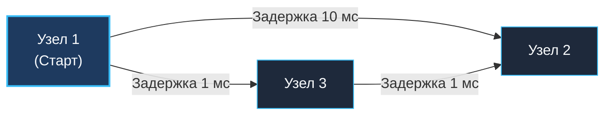

> *«Кратчайший путь редко бывает самым очевидным, особенно когда у каждого шага есть своя цена».*  
> — Эдсгер Дейкстра

## Анатомия задержек: Взвешенные графы и маршрутизация

В предыдущих статьях мы рассматривали невзвешенные графы, где все связи были равнозначны. Для поиска кратчайшего пути использовался BFS (как в матрицах [[5. Number of Islands]]), поскольку каждое ребро стоило ровно $1$ шаг.

Но в реальном системном программировании графы почти всегда **взвешенные (Weighted Graphs)**:
- В сетевых протоколах (OSPF, IS-IS) каждое соединение имеет метрику задержки (RTT, ping) или пропускную способность.
- В микросервисной архитектуре RPC-вызов `Service A -> Service B` может занимать $5\text{ мс}$, а `Service A -> Service C` — $60\text{ мс}$.
- В геоинформационных системах дороги различаются длиной, качеством покрытия и скоростным режимом.

Задача **Network Delay Time** (LeetCode №743) моделирует распространение сигнала по компьютерной сети.

**Условие:** Дана сеть из $N$ узлов (пронумерованных от $1$ до $N$). Задан список направленных взвешенных ребер `times[i] = [u, v, w]`, где $u$ — источник, $v$ — приемник, $w$ — время прохождения сигнала. Мы посылаем сигнал из узла $k$. Требуется определить: через какое минимальное время **все** узлы сети получат сигнал? Если хотя бы один узел окажется недостижим, вернуть `-1`.

Эта задача — канонический полигон для реализации одного из фундаментальных алгоритмов Computer Science: **Алгоритма Дейкстры (Dijkstra's Algorithm)**.

---

## Почему BFS здесь бессилен?

Классический поиск в ширину (BFS) обходит граф строго слоями (по количеству пройденных ребер).



Если мы запустим наивный BFS из Узла 1, он в первую очередь посетит Узел 2 (за 1 шаг с задержкой $10\text{ мс}$) и Узел 3 (за 1 шаг с задержкой $1\text{ мс}$). Алгоритм ошибочно посчитает, что кратчайший путь до Узла 2 равен $10\text{ мс}$.  
Однако сигнал, прошедший через Узел 3, прибудет в Узел 2 за $1 + 1 = 2\text{ мс}$!

> [!IMPORTANT]
> **Принцип взвешенных путей:**  
> Во взвешенных графах число переходов (Hop Count) не коррелирует с физическим временем пути. Нам необходим механизм, исследующий узлы в порядке возрастания **суммарного накопленного времени**, а не топологической глубины.

---

## Алгоритм Дейкстры и Min-Heap (Очередь с приоритетом)

Алгоритм Дейкстры опирается на «жадный» выбор наименее удаленного узла:
1. Инициализируем массив минимальных расстояний `dist` размера $N+1$. Для всех узлов устанавливаем расстояние $\infty$ (`math.MaxInt`), а для стартовой вершины $k$ — равным $0$.
2. Создаем **очередь с приоритетом (Min-Heap)**, сохраняющую инвариант минимального времени на вершине кучи. Помещаем туда стартовый узел: `Item{node: k, weight: 0}`.
3. Извлекаем вершину с минимальным накопленным временем. Если извлеченное время строго больше `dist[node]`, значит, этот узел уже был достигнут более быстрым маршрутом — пропускаем его.
4. Проходим по всем исходящим ребрам текущего узла. Вычисляем `newDist = currDist + weight`.
5. Если `newDist < dist[neighbor]`, мы обнаружили более быстрый путь (**Релаксация ребра / Relaxation**). Обновляем `dist[neighbor] = newDist` и добавляем пару `(neighbor, newDist)` в кучу.

---

## Идиоматичная реализация на Go (container/heap)

В стандартной библиотеке Go нет обобщенного типа `PriorityQueue`. Кандидату требуется реализовать интерфейс `heap.Interface` из пакета `container/heap`.

```go
package main

import (
	"container/heap"
	"math"
)

// Item описывает элемент в очереди с приоритетом.
type Item struct {
	node   int
	weight int
}

// MinHeap реализует heap.Interface для элементов Item.
type MinHeap []Item

func (h MinHeap) Len() int           { return len(h) }
func (h MinHeap) Less(i, j int) bool { return h[i].weight < h[j].weight }
func (h MinHeap) Swap(i, j int)      { h[i], h[j] = h[j], h[i] }

func (h *MinHeap) Push(x any) {
	*h = append(*h, x.(Item))
}

func (h *MinHeap) Pop() any {
	old := *h
	n := len(old)
	item := old[n-1]
	*h = old[0 : n-1]
	return item
}

// Edge описывает направленное ребро графа.
type Edge struct {
	to     int
	weight int
}

// networkDelayTime вычисляет время доставки сигнала всем узлам сети алгоритмом Дейкстры.
// Временная сложность: O(E * log V), где E — число ребер, V — число узлов.
// Пространственная сложность: O(V + E) для хранения графа и кучи.
func networkDelayTime(times [][]int, n int, k int) int {
	// 1. Строим список смежности (узлы 1-indexed, аллоцируем n+1)
	graph := make([][]Edge, n+1)
	for _, t := range times {
		u, v, w := t[0], t[1], t[2]
		graph[u] = append(graph[u], Edge{to: v, weight: w})
	}

	// 2. Инициализируем массив минимальных задержек
	dist := make([]int, n+1)
	for i := 1; i <= n; i++ {
		dist[i] = math.MaxInt
	}
	dist[k] = 0

	// 3. Инициализируем кучу
	pq := &MinHeap{}
	heap.Init(pq)
	heap.Push(pq, Item{node: k, weight: 0})

	// 4. Основной цикл Дейкстры
	for pq.Len() > 0 {
		curr := heap.Pop(pq).(Item)
		u := curr.node
		currDist := curr.weight

		// Оптимизация: отсекаем устаревшие дубликаты
		if currDist > dist[u] {
			continue
		}

		// Релаксация смежных ребер
		for _, edge := range graph[u] {
			v := edge.to
			newDist := currDist + edge.weight

			if newDist < dist[v] {
				dist[v] = newDist
				heap.Push(pq, Item{node: v, weight: newDist})
			}
		}
	}

	// 5. Поиск времени прибытия последнего пакета
	maxTime := 0
	for i := 1; i <= n; i++ {
		if dist[i] == math.MaxInt {
			return -1 // Узел остался изолированным
		}
		if dist[i] > maxTime {
			maxTime = dist[i]
		}
	}

	return maxTime
}
```

> [!NOTE]
> **Под капотом: Mechanical Sympathy и упаковка interface{}**  
> Пакет `container/heap` оперирует пустым интерфейсом `any` (`interface{}`). При вызове `heap.Push(pq, Item{...})` компилятор вынужден упаковывать структуру в интерфейсный заголовок (Boxing).  
> Хотя современный компилятор Go (Escape Analysis) часто способен доказать локальность вызова, в нагруженных графах с миллионами ребер непрерывный боксинг может вызывать аллокации в куче и нагружать GC. В продакшен-коде Go 1.22+ для критических участков часто создают типизированные дженерик-кучи `type GenericHeap[T any]`, устраняющие аллокации полностью.

---

## Оценка сложности

- **Время:** $O(E \log V)$. Каждое ребро обрабатывается и может добавить вершину в очередь с приоритетом. Операции вставки и извлечения из двоичной кучи занимают $O(\log V)$.
- **Память:** $O(V + E)$ для списка смежности и $O(V)$ для среза `dist` и Min-Heap.

> [!WARNING]
> **Ловушка / Gotcha: Отрицательные веса**  
> Алгоритм Дейкстры **математически не применим**, если в графе присутствуют ребра с отрицательным весом.  
> Дейкстра исходит из жадной предпосылки: добавление ребра неотрицательного веса не может уменьшить общую длину пути. Поэтому вершина, извлеченная из кучи, считается окончательно исследованной. Если в графе допустимы отрицательные веса (или циклы отрицательного веса), требуется применять **Алгоритм Беллмана-Форда** ($O(V \times E)$).

---

## Корнер-кейсы

1. **Несвязный граф:** Если хотя бы один узел остался со значением `dist[i] == math.MaxInt`, сеть распалась на изолированные сегменты — возвращаем `-1`.
2. **Нулевые веса ($0\text{ мс}$):** Алгоритм Дейкстры корректно обрабатывает ребра с нулевым весом.
3. **Параллельные ребра:** Если между двумя серверами проложено несколько линков разного качества, алгоритм выберет наилучший за счет условия `newDist < dist[v]`.
4. **Ленивое удаление (Lazy Deletion):** Проверка `if currDist > dist[u] { continue }` позволяет не удалять старые значения из середины кучи при нахождении лучшего пути, гарантируя эффективную работу за $O(1)$.

Мы научились находить абсолютный кратчайший путь. Но в бизнесе кратчайший путь не всегда приемлем: например, самый дешевый авиабилет может требовать 5 пересадок. Как модифицировать алгоритм при лимите на количество шагов? Разберем это в задаче: [[9. Cheapest Flights Within K Stops]].