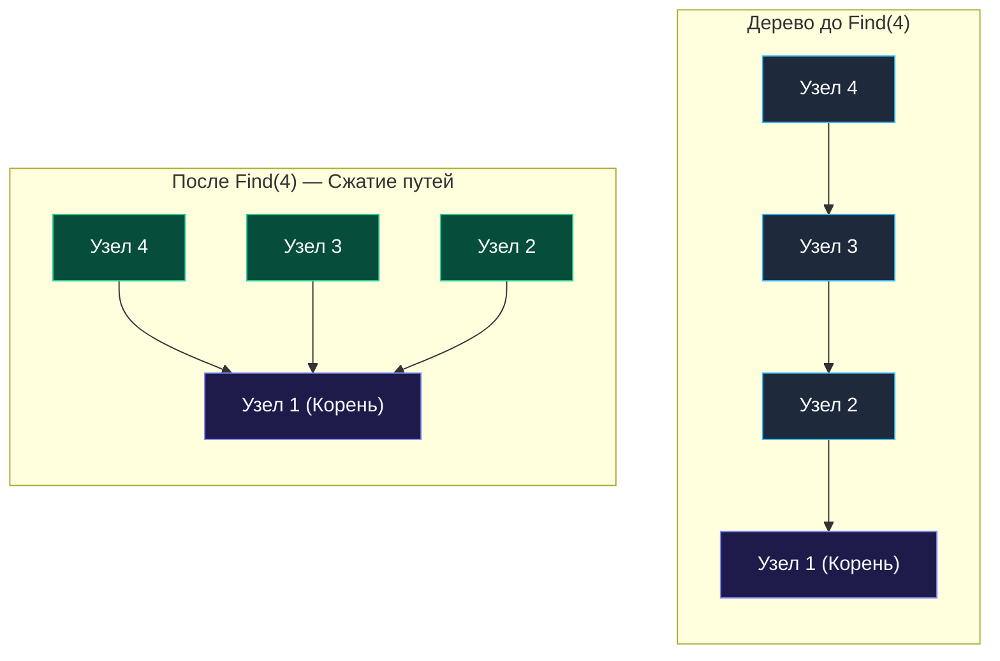

> *«Простота структуры данных часто важнее сложности алгоритмов, которые над ней работают».*  
> — Роберт Тарджан

## Система непересекающихся множеств (Disjoint Set Union, DSU)

В разделе про графы, разбирая задачу [[7. Redundant Connection]], мы познакомились с компактной структурой данных — **Union-Find** (также известной как **Disjoint Set Union, DSU** или Система непересекающихся множеств). 

DFS и BFS отлично справляются с анализом статических графов, где вся топология известна заранее. Но в реальных распределенных системах сети **динамические**:
- Новые узлы подключаются к кластеру в рантайме.
- Каналы связи между дата-центрами динамически поднимаются и деградируют.
- В P2P-сетях и распределенных реестрах пиры обмениваются данными и образуют новые группы в реальном времени.

Если после каждого добавления ребра отвечать на вопрос: *«Связаны ли теперь узел $A$ и узел $B$?»*, повторный запуск DFS даст сложность $O(V + E)$ на каждый запрос. Для миллиона узлов система мгновенно окажется перегружена.

Union-Find создана именно для решения проблемы **динамической связности (Dynamic Connectivity)**. Она обрабатывает запросы объединения и проверки связности практически за константное время $O(\alpha(N)) \approx O(1)$.

---

## Архитектура DSU: Массивы вместо указателей

Классическое дерево общего назначения строится на указателях:

```go
// Антипаттерн для высоконагруженного DSU
type Node struct {
	Val    int
	Parent *Node
}
```

Union-Find отбрасывает тяжелый указательный подход в пользу **Data-Oriented Design**: всё состояние размещается в компактных плоских массивах.

```go
type DSU struct {
	parent []int // Хранит индекс родителя для каждого узла
	size   []int // Хранит размер компоненты (используется только для корней)
}

func NewDSU(n int) *DSU {
	dsu := &DSU{
		parent: make([]int, n),
		size:   make([]int, n),
	}
	for i := 0; i < n; i++ {
		dsu.parent[i] = i // Изначально каждый узел — корень собственного дерева
		dsu.size[i] = 1   // Размер начального дерева равен 1
	}
	return dsu
}
```

> [!NOTE]
> **Под капотом: Mechanical Sympathy и Garbage Collector**  
> Почему плоские срезы `[]int` превосходят деревья на указателях `*Node`?
> 1. **Zero Fragmentation:** `make([]int, n)` выделяет память в куче **ровно один раз** непрерывным блоком. Создание $N$ структур `Node` потребует $N$ аллокаций, разбросанных по разным адресам.
> 2. **Локальность кэша (Spatial Locality):** При обращении к `parent[i]` процессор загружает целую кэш-линию L1 ($64$ байта), попутно забирая еще 7 соседних элементов. Поиск по массиву работает со скоростью пропускной способности RAM. Указатели же вызывают постоянные Cache Misses (Pointer Chasing).
> 3. **Разгрузка GC:** Слайс примитивов `[]int` не содержит указателей. Сборщик мусора Go в фазе Mark просто пропускает такие объекты, не тратя драгоценные такты CPU на обход графа ссылок.

---

## Две магии DSU: Find и Union

В основе структуры лежат две базовые операции. Без оптимизаций дерево может выродиться в цепочку глубиной $O(N)$, но с двумя классическими эвристиками время сводится к $O(1)$.

### 1. Операция Find и сжатие путей (Path Compression)

Операция `Find(x)` ищет **Корень (Представителя)** множества, к которому принадлежит узел $x$. Корень характеризуется инвариантом: `parent[x] == x`.

**Оптимизация:** при подъеме к корню мы проходим цепочку промежуточных предков. На обратном ходе рекурсии мы **переподвешиваем все пройденные вершины напрямую к корню**. Дерево моментально сплющивается, и любые последующие вызовы `Find` отрабатывают за один шаг.

```go
func (d *DSU) Find(x int) int {
	if d.parent[x] != x {
		// Сплющивание дерева: переподвешиваем родителя напрямую к корню
		d.parent[x] = d.Find(d.parent[x])
	}
	return d.parent[x]
}
```



### 2. Операция Union и объединение по размеру (Union by Size)

Операция `Union(x, y)` объединяет множества элементов $x$ и $y$.  
Мы находим корень `rootX` и корень `rootY`. Чтобы объединить множества, делаем один корень родителем другого: `parent[rootX] = rootY`.

**Оптимизация:** если подвесить большее дерево к меньшему, глубина результирующего дерева возрастет. Мы всегда **подвешиваем меньшее поддерево к корню большего**. Для этого мы храним массив `size`.

```go
// Union возвращает true при успешном слиянии и false, если узлы уже были в одном множестве.
func (d *DSU) Union(x, y int) bool {
	rootX := d.Find(x)
	rootY := d.Find(y)

	if rootX == rootY {
		return false // Узлы уже принадлежат одному компоненту (найден цикл)
	}

	// Подвешиваем меньшее поддерево к большему
	if d.size[rootX] < d.size[rootY] {
		d.parent[rootX] = rootY
		d.size[rootY] += d.size[rootX]
	} else {
		d.parent[rootY] = rootX
		d.size[rootX] += d.size[rootY]
	}

	return true
}
```

> [!TIP]
> **Совет для собеседования: Union by Size против Union by Rank**  
> Существует альтернатива `Union by Size` — `Union by Rank` (по рангу/глубине дерева).  
> На практике `Size` предпочтительнее: во многих задачах требуется вернуть размер компоненты связности (например, «сколько серверов в крупнейшем сегменте?»). Массив `size` сразу содержит готовый ответ `d.size[d.Find(x)]` за $O(1)$ без дополнительных обходов.

---

## Асимптотическая сложность и обратная функция Аккермана

При совместном использовании Path Compression и Union by Size амортизированное время выполнения любой операции `Find` или `Union` составляет строго $O(\alpha(N))$.

$\alpha(N)$ — **Обратная функция Аккермана (Inverse Ackermann Function)**.  
Она растет настолько медленно, что для любых практически возможных в физической Вселенной значений $N \le 10^{80}$ значение $\alpha(N) \le 4$.  
Для современного процессора $4$ операции — это константа, поэтому асимптотику DSU на практике считают эквивалентной $O(1)$.

- **Инициализация DSU:** $O(N)$ для выделения срезов `parent` и `size`.
- **Операции Find / Union:** $O(\alpha(N)) \approx O(1)$.
- **Пространственная сложность:** $O(N)$ для двух плоских срезов.

---

## Резюме: Когда применять Union-Find?

Структура данных DSU идеально подходит для следующих сценариев:
1. **Динамическое добавление ребер:** Связи появляются последовательно в потоке событий.
2. **Проверка связности:** Быстрый ответ на вопрос: «Принадлежат ли узлы $A$ и $B$ одному кластеру?».
3. **Кластеризация:** Разбиение объектов на изолированные непересекающиеся группы.
4. **Обнаружение циклов в неориентированном графе:** Как только `Union(u, v)` возвращает `false`, зафиксирован цикл.
5. **Алгоритм Крускала (Kruskal's Algorithm):** Построение минимального остовного дерева (MST).

> [!WARNING]
> **Ловушка / Gotcha: Границы применимости DSU**  
> 1. DSU **не поддерживает удаление ребер** с сохранением суб-логарифмической сложности.
> 2. DSU **не находит маршрутов** и кратчайших путей: структура знает лишь факт связности.
> 3. DSU применим **исключительно для неориентированных графов**. В ориентированных графах для поиска циклов используются алгоритм Кана (BFS) или трехцветный DFS.

Теперь перейдем к практическим паттернам применения DSU: [[2. Применения]].