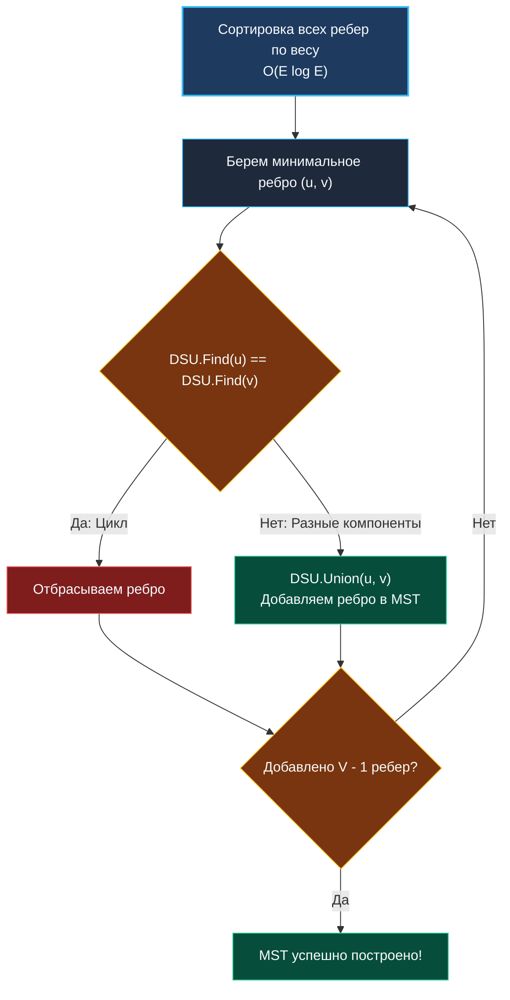

> *«Жадный выбор в правильном порядке превращает сложнейшую топологическую задачу в простую цепочку локальных решений».*  
> — Джозеф Крускал

## Инструмент для динамического мира: Где DSU незаменим

В статье [[1. Теория. Union Find]] мы разобрали математический аппарат Системы непересекающихся множеств (DSU) и выяснили, что благодаря плоским массивам в непрерывной памяти (Data-Oriented Design) операции `Find` и `Union` выполняются за амортизированное время $O(\alpha(N)) \approx O(1)$.

Зачем учить специализированную структуру, если мы уже освоили обходы графов DFS и BFS?

Ответ кроется в слове **«Динамика»**. DFS и BFS — инструменты анализа *статических* графов, делающие снимок системы в фиксированный момент времени. DSU — инструмент для систем, топология которых *эволюционирует в реальном времени*.

Ниже представлены четыре ключевых архитектурных паттерна, в которых DSU является безальтернативным решением.

---

## Паттерн 1: Динамическая связность (Dynamic Connectivity)

Представьте систему распределенного мониторинга кластера баз данных или P2P-сети. Изначально в наличии $N$ изолированных серверов. По мере обнаружения пиров каждые несколько миллисекунд регистрируется новое соединение (ребро).  
Требуется непрерывно отвечать на запрос: *«Сколько изолированных сегментов сети (Network Partitions / Split-Brain) существует в данный момент?»*.

При использовании DFS: добавление каждого нового ребра требует повторного обхода графа ($O(V + E)$). Под потоком сетевых событий процессор неизбежно захлебнется.

**Решение через DSU:**  
Расширяем DSU счетчиком компонент `components`. Изначально счетчик равен $N$. При каждом успешном вызове `Union` (когда сливаются два ранее разобщенных множества) уменьшаем счетчик на $1$.

```go
type DSU struct {
	parent     []int
	size       []int
	components int // Текущее число изолированных кластеров
}

func NewDSU(n int) *DSU {
	dsu := &DSU{
		parent:     make([]int, n),
		size:       make([]int, n),
		components: n, // На старте каждый узел изолирован
	}
	for i := 0; i < n; i++ {
		dsu.parent[i] = i
		dsu.size[i] = 1
	}
	return dsu
}

func (d *DSU) Find(x int) int {
	if d.parent[x] != x {
		d.parent[x] = d.Find(d.parent[x])
	}
	return d.parent[x]
}

func (d *DSU) Union(x, y int) bool {
	rootX := d.Find(x)
	rootY := d.Find(y)

	if rootX == rootY {
		return false
	}

	if d.size[rootX] < d.size[rootY] {
		d.parent[rootX] = rootY
		d.size[rootY] += d.size[rootX]
	} else {
		d.parent[rootY] = rootX
		d.size[rootX] += d.size[rootY]
	}

	// Два множества объединились — количество компонент уменьшилось
	d.components--
	return true
}
```

> [!TIP]
> **Совет для собеседования**  
> Инкапсуляция поля `components` внутри структуры DSU — визитная карточка опытного инженера. Это снижает сложность запроса числа компонент с $O(V + E)$ до $O(1)$.

---

## Паттерн 2: Минимальное остовное дерево (Алгоритм Крускала)

**Сценарий:** требуется объединить $N$ дата-центров магистральными оптоволоконными линиями. Стоимость прокладки кабеля между узлами различается (взвешенный граф). Нужно соединить все площадки с минимальными совокупными затратами, исключив кольцевые избыточные соединения.

Это классическая задача поиска **минимального остовного дерева (Minimum Spanning Tree, MST)**. **Алгоритм Крускала** решает её жадным методом с помощью DSU:

1. Сортируем все доступные ребра по возрастанию стоимости ($O(E \log E)$).
2. Последовательно берем самое дешевое ребро и вызываем `Union(u, v)`.
3. Если `Union` возвращает `true` (узлы находились в разных компонентах), ребро включается в остовное дерево.
4. Если `Union` возвращает `false` (узлы уже соединены обходным маршрутом), ребро отбрасывается, предотвращая появление цикла.
5. Процесс останавливается при добавлении $V - 1$ ребер.



---

## Паттерн 3: Эквивалентность и дедупликация (Identity Resolution)

В высоконагруженных бэкенд-системах регулярно возникает задача склейки профилей пользователей:
- Заказ 1 оформлен на Email $A$ и телефон $X$.
- Заказ 2 оформлен на Email $B$ и телефон $X$.
- Заказ 3 оформлен на Email $B$ и телефон $Y$.

Из совпадения телефонов следует, что Заказ 1 и Заказ 2 сделаны одним клиентом. Из совпадения Email следует, что Заказ 2 и Заказ 3 также принадлежат ему. Следовательно, все три профиля образуют единый **класс эквивалентности**.

DSU идеально подходит для объединения таких транзитивных сущностей. Мы сопоставляем строковые идентификаторы (Email, телефон) целочисленным индексам через хэш-таблицу, а затем выполняем серию вызовов `Union(id1, id2)`.  
Этот паттерн всесторонне разобран в задаче [[5. Accounts Merge]].

---

## Паттерн 4: Обнаружение циклов в неориентированных графах

Если в неориентированном графе операция `Union(u, v)` возвращает `false` (то есть `Find(u) == Find(v)`), ребро $(u, v)$ гарантированно образует **цикл**.

> [!WARNING]
> **Ограничение по направленности ребер:**  
> DSU детектирует циклы **строго в неориентированных графах**.  
> В ориентированных графах связи $A \rightarrow B$ и $A \rightarrow C \rightarrow B$ не образуют цикл, однако наивный DSU посчитает их принадлежащими одному множеству. Для ориентированных графов применяются алгоритм Кана (BFS) или поиск обратных ребер через DFS (см. [[3. Course Schedule]]).

---

## Резюме: Чек-лист выбора Union-Find

**Выбирайте DSU, если:**
1. Требуется непрерывная кластеризация данных, поступающих в реальном времени.
2. Необходимо поддерживать количество компонент связности за $O(1)$.
3. Строится минимальное остовное дерево алгоритмом Крускала.
4. Выполняется дедупликация сущностей (Identity Resolution).
5. Ищутся циклы в неориентированном графе.

**Не используйте DSU, если:**
1. Граф ориентированный.
2. Требуется найти физический маршрут или кратчайшее расстояние (для этого нужны BFS или алгоритм Дейкстры).
3. Требуется эффективное удаление ребер.

Перейдем к практическому кодингу базовой задачи кластеризации: [[3. Number of Connected Components]].