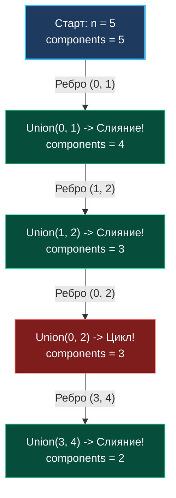

> *«Разделяй задачи до тех пор, пока каждая часть не станет тривиальной, а затем соединяй их кратчайшим путем».*  
> — Роберт Тарджан

## «Hello World» для Union-Find

Задача **Number of Connected Components in an Undirected Graph** (LeetCode №323) — это азбука для структуры данных DSU (Disjoint Set Union). Поняв её механику, вы решите $80\%$ задач на кластеризацию графов.

**Условие:** Задано $n$ узлов, пронумерованных от $0$ до $n - 1$, и массив неориентированных ребер `edges`. Напишите функцию, возвращающую количество изолированных компонент связности в этом графе.

Эта задача — прямой математический эквивалент того, как оркестратор распределенных систем (например, Kubernetes Kubelet, Consul или Raft-кластер) определяет, на сколько изолированных сегментов (Split-Brain) распалась сеть после аварии (Network Partition).

---

## Почему DSU превосходит DFS/BFS?

Мы уже решали задачу подсчета компонент связности через DFS в статье [[2. Компоненты и циклы]], строя список смежности (`[][]int`) и обходя вершины рекурсивно.

Почему для продакшен-кода DSU предпочтительнее? Ответ кроется в **Mechanical Sympathy** и стоимости инициализации:

1. **Список смежности (Adjacency List):** для DFS необходимо сначала выделить срез слайсов `make([][]int, n)`, а затем для каждого ребра $(u, v)$ вызывать `append` в списки смежности обеих вершин. Это порождает $O(E)$ мелких аллокаций в куче и фрагментирует память.
2. **DSU (Плоские массивы):** Union-Find не строит граф явно. Алгоритм выделяет ровно два непрерывных среза `parent` и `size` размера $N$. Затем он линейно проходит по входному срезу ребер, манипулируя индексами. Никаких микроаллокаций, перевыделений слайсов и обхода разрозненных указателей.

> [!NOTE]
> **Под капотом: L1 Cache и Hardware Prefetcher**  
> При вызове `Union(u, v)` процессор обращается к последовательным адресам памяти `parent`. Hardware Prefetcher CPU заблаговременно подтягивает кэш-линии L1/L2.  
> Сжатие путей гарантирует, что высота деревьев редко превышает 1–2 уровня. Предсказатель переходов (Branch Predictor) мгновенно подстраивается под этот паттерн, сводя пенальти конвейера к минимуму.

---

## Идея решения

Вместо того чтобы сначала построить граф, а потом запустить обход, мы ведем подсчет компонент **в потоковом режиме**:
1. На старте ребер нет. Каждый из $n$ узлов образует изолированную компоненту: `components = n`.
2. Извлекаем очередное ребро $(u, v)$ и вызываем `Union(u, v)`.
3. Если вершины $u$ и $v$ находились в разных поддеревьях, `Union` соединяет их и возвращает `true`. Две компоненты слились в одну: декрементируем `components--`.
4. Если вершины уже имели общий корень, `Union` возвращает `false`: ребро замыкает цикл внутри уже существующей компоненты, счетчик не меняется.



---

## Идиоматичный Go-код (Канонический шаблон DSU)

Этот код представляет собой фундаментальный шаблон реализации DSU на Go:

```go
package main

// DSU структура с поддержкой отслеживания количества компонент.
type DSU struct {
	parent     []int
	size       []int
	components int
}

// NewDSU аллоцирует непрерывные срезы состояния.
func NewDSU(n int) *DSU {
	dsu := &DSU{
		parent:     make([]int, n),
		size:       make([]int, n),
		components: n,
	}
	for i := 0; i < n; i++ {
		dsu.parent[i] = i
		dsu.size[i] = 1
	}
	return dsu
}

// Find находит корень с оптимизацией сжатия путей (Path Compression).
func (d *DSU) Find(x int) int {
	if d.parent[x] != x {
		d.parent[x] = d.Find(d.parent[x])
	}
	return d.parent[x]
}

// Union объединяет поддеревья по размеру (Union by Size).
func (d *DSU) Union(x, y int) bool {
	rootX := d.Find(x)
	rootY := d.Find(y)

	if rootX == rootY {
		return false
	}

	if d.size[rootX] < d.size[rootY] {
		d.parent[rootX] = rootY
		d.size[rootY] += d.size[rootX]
	} else {
		d.parent[rootY] = rootX
		d.size[rootX] += d.size[rootY]
	}

	d.components--
	return true
}

// countComponents возвращает число компонент связности в графе.
// Временная сложность: O(V + E * α(V)) ≈ O(V + E).
// Пространственная сложность: O(V) для двух срезов parent и size.
func countComponents(n int, edges [][]int) int {
	dsu := NewDSU(n)

	for _, edge := range edges {
		u, v := edge[0], edge[1]
		dsu.Union(u, v)
	}

	return dsu.components
}
```

> [!WARNING]
> **Ловушка / Gotcha: 0-based против 1-based индексации**  
> В данной задаче узлы нумеруются от $0$ до $n - 1$ (0-indexed), поэтому размер срезов равен $n$.  
> Если в условии узлы нумеруются от $1$ до $n$ (1-indexed), аллоцируйте `make([]int, n+1)`. Это исключит необходимость вручную вычитать $1$ из каждого индекса и защитит от ошибок выхода за пределы слайса.

---

## Резюме

1. **Потоковая кластеризация:** DSU поддерживает актуальное количество компонент связности на лету за $O(1)$ без необходимости повторного обхода графа.
2. **Zero Pointer Chasing:** Отказ от указателей в пользу плоских массивов исключает промахи кэша CPU.
3. **Линейная память:** Потребление оперативной памяти жестко ограничено числом вершин $O(V)$ и не зависит от числа ребер $E$.

Далее мы применим этот же канонический шаблон для выявления избыточных циклов: [[4. Redundant Connection]].