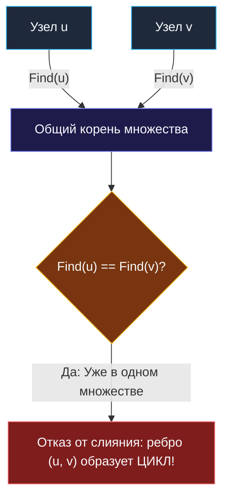

> *«В правильной архитектуре каждый элемент имеет ровно один путь к истине; второй путь — это уже конфликт».*  
> — Брайан Керниган

## Возвращение к истокам: DSU в чистом виде

В разделе графов мы подробно разбирали проблему Broadcast Storm и циклов в топологиях дата-центров ([[7. Redundant Connection]]). Там мы установили, что классические алгоритмы обхода (DFS, BFS) при потоковом добавлении ребер неэффективны ($O(N^2)$), и доказали необходимость Union-Find.

Опираясь на оптимизированный шаблон DSU из статьи [[3. Number of Connected Components]], мы можем решить задачу **Redundant Connection** (LeetCode №684) буквально в десяток строк выразительной бизнес-логики.

---

## Идея решения: Поиск ребра, замыкающего цикл

**Напомним условие:** дано связное дерево из $N$ вершин, в которое по ошибке добавили одно лишнее ребро, породившее ровно один цикл. Ребра подаются последовательно, и требуется вернуть то ребро, которое замкнуло кольцо.

Логика на основе DSU:
1. Изначально все $N$ вершин изолированы: `parent[i] = i`.
2. Извлекаем ребро $(u, v)$ и вызываем `Union(u, v)`.
3. Если вершины $u$ и $v$ находились в **разных** компонентах, `Union` соединяет их и возвращает `true`. Это нормальный процесс построения дерева.
4. Если вершины $u$ и $v$ **уже имели общий корень** (`Find(u) == Find(v)`), значит между ними уже проложен альтернативный путь. Добавление ребра $(u, v)$ замыкает цикл — это и есть избыточная связь.



---

## Идиоматичная реализация на Go

> [!WARNING]
> **Ловушка / Gotcha: 1-based индексация**  
> Обратите внимание: в условии этой задачи вершины нумеруются от $1$ до $N$.  
> Никогда не используйте искусственные сдвиги индексов `u - 1` и `v - 1` по всему коду: это провоцирует трудноуловимые ошибки Off-by-one. Просто выделите срез размера $N + 1$ (`make([]int, n+1)`). Память в 8 байт на неиспользуемый нулевой элемент бесплатна, а читаемость кода сохраняется на высоте.

```go
package main

// DSU структура для 1-indexed вершин
type DSU struct {
	parent []int
	size   []int
}

func NewDSU(n int) *DSU {
	dsu := &DSU{
		parent: make([]int, n+1),
		size:   make([]int, n+1),
	}
	for i := 1; i <= n; i++ {
		dsu.parent[i] = i
		dsu.size[i] = 1
	}
	return dsu
}

func (d *DSU) Find(x int) int {
	if d.parent[x] != x {
		d.parent[x] = d.Find(d.parent[x]) // Сжатие путей
	}
	return d.parent[x]
}

func (d *DSU) Union(x, y int) bool {
	rootX := d.Find(x)
	rootY := d.Find(y)

	if rootX == rootY {
		return false // Цикл обнаружен!
	}

	if d.size[rootX] < d.size[rootY] {
		d.parent[rootX] = rootY
		d.size[rootY] += d.size[rootX]
	} else {
		d.parent[rootY] = rootX
		d.size[rootX] += d.size[rootY]
	}

	return true
}

// findRedundantConnection находит ребро, замыкающее цикл в графе.
// Временная сложность: O(N * α(N)) ≈ O(N).
// Пространственная сложность: O(N) для структуры DSU.
func findRedundantConnection(edges [][]int) []int {
	n := len(edges)
	dsu := NewDSU(n)

	for _, edge := range edges {
		u, v := edge[0], edge[1]
		if !dsu.Union(u, v) {
			return edge
		}
	}

	return nil
}
```

---

## Под капотом: Mechanical Sympathy и Escape Analysis

1. **Минимум аллокаций:** Память выделяется ровно один раз в конструкторе `NewDSU`. Никаких очередей (BFS) или рекурсивных фреймов стека (DFS).
2. **Линейный проход:** Входной срез `edges` считывается строго последовательно, обеспечивая стопроцентное попадание в L1 Data Cache.
3. **Околоконстантное время:** Благодаря комбинации сжатия путей и объединения по размеру каждое ребро обрабатывается за $O(\alpha(N))$.

> [!TIP]
> **Совет для собеседования**  
> Требование задачи: *«Если таких ребер несколько, верните то, которое встречается в массиве последним»*.  
> Потоковая обработка ребер в порядке входного массива естественным образом гарантирует, что первым найденным циклом окажется именно то ребро, которое физически замкнуло кольцо последним.

---

## Резюме

Потоковое нахождение циклов в неориентированных графах с помощью DSU — эталонный паттерн: лаконичный, надежный и максимально дружелюбный к оборудованию.

Но что делать, если вершины — не целые числа от $1$ до $N$, а строковые идентификаторы (Email-адреса, телефоны)? Как адаптировать DSU для склейки профилей пользователей? Разберем это в задаче: [[5. Accounts Merge]].