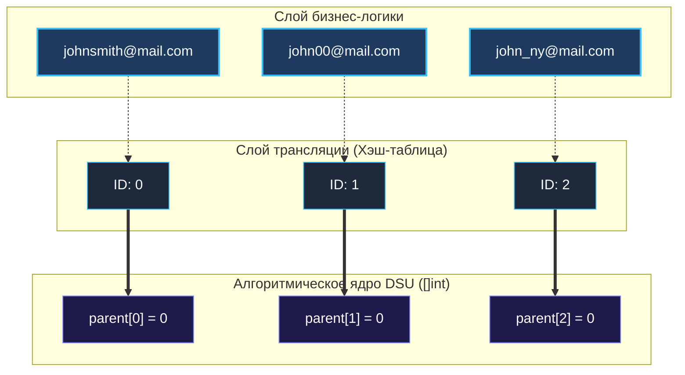

> *«Отделяйте алгоритмические примитивы от прикладных данных — и ваш код обретет скорость и ясность».*  
> — Брайан Керниган

## Склейка профилей (Identity Resolution) в реальном мире

В предыдущих статьях ([[1. Теория. Union Find]] и [[3. Number of Connected Components]]) мы применяли DSU к числовым индексам от $0$ до $N - 1$. Процессор идеально обрабатывает такие массивы благодаря прямой адресной арифметике.

Но в продакшен-бэкенде (CRM, антифрод-системы, биллинг) сущности представлены строками: Email-адресами, телефонными номерами, UUID устройств.  
Пользователь может зарегистрироваться с ноутбука по Email, а через месяц войти со смартфона по номеру телефона. При совершении заказа клиент указывает и Email, и телефон. Система обязана мгновенно распознать, что это **одна и та же личность**, и объединить профили. Этот процесс называется **Identity Resolution**.

Задача **Accounts Merge** (LeetCode №721) моделирует именно этот промышленный сценарий.

**Условие:** Задан список аккаунтов `accounts`, где `accounts[i][0]` — имя пользователя (Name), а последующие элементы `accounts[i][1:]` — принадлежащие ему Email-адреса.  
Два аккаунта относятся к одному человеку, если у них есть **хотя бы один общий Email**. При этом одинаковые имена без пересечения адресов могут принадлежать разным людям (тезкам).  
Требуется вернуть склеенные профили: имя пользователя и отсортированный по алфавиту список уникальных адресов.

---

## Архитектурный выбор: Мапы в DSU против трансляции данных

Каждый уникальный Email — вершина графа. Email-адреса, входящие в одну учетную запись, соединены ребрами. Нам нужно найти компоненты связности.

Типичный антипаттерн — попытка переписать DSU напрямую под строки:

```go
// АНТИПАТТЕРН: DSU на основе map[string]string
type BadStringDSU struct {
	parent map[string]string
	size   map[string]int
}
```

Почему это провал на архитектурном собеседовании?  
Каждый шаг `Find` в `map[string]string` превращается в вычисление хэша строки, поиск бакета в куче, разыменование указателей и побайтовое сравнение `memcmp`. Теоретическая асимптотика $O(\alpha(N))$ деградирует из-за огромных накладных расходов.

### Решение Senior-инженера: Data-Oriented Design

Мы строго разделяем архитектурные слои:
1. **Слой трансляции:** один раз присваиваем каждому уникальному Email целочисленный ID (от $0$ до $K - 1$).
2. **Алгоритмическое ядро:** запускаем эталонный DSU на плоских срезах `[]int`.
3. **Слой агрегации:** группируем исходные адреса по идентификаторам их корневых представителей.



---

## Идиоматичная реализация на Go

```go
package main

import "sort"

// 1. Стандартный DSU на плоских массивах целых чисел
type DSU struct {
	parent []int
	size   []int
}

func NewDSU(n int) *DSU {
	dsu := &DSU{
		parent: make([]int, n),
		size:   make([]int, n),
	}
	for i := 0; i < n; i++ {
		dsu.parent[i] = i
		dsu.size[i] = 1
	}
	return dsu
}

func (d *DSU) Find(x int) int {
	if d.parent[x] != x {
		d.parent[x] = d.Find(d.parent[x])
	}
	return d.parent[x]
}

func (d *DSU) Union(x, y int) {
	rootX := d.Find(x)
	rootY := d.Find(y)
	if rootX == rootY {
		return
	}
	if d.size[rootX] < d.size[rootY] {
		d.parent[rootX] = rootY
		d.size[rootY] += d.size[rootX]
	} else {
		d.parent[rootY] = rootX
		d.size[rootX] += d.size[rootY]
	}
}

// 2. Основная бизнес-логика слияния аккаунтов
func accountsMerge(accounts [][]string) [][]string {
	emailToID := make(map[string]int)
	emailToName := make(map[string]string)
	idCounter := 0

	// Шаг 1: Присваиваем каждому уникальному email целочисленный ID
	for _, acc := range accounts {
		name := acc[0]
		for i := 1; i < len(acc); i++ {
			email := acc[i]
			if _, exists := emailToID[email]; !exists {
				emailToID[email] = idCounter
				emailToName[email] = name
				idCounter++
			}
		}
	}

	// Шаг 2: Инициализируем DSU и объединяем email-адреса внутри одного профиля
	dsu := NewDSU(idCounter)
	for _, acc := range accounts {
		firstEmailID := emailToID[acc[1]]
		for i := 2; i < len(acc); i++ {
			dsu.Union(firstEmailID, emailToID[acc[i]])
		}
	}

	// Шаг 3: Группируем адреса по корневому представителю компоненты
	rootToEmails := make(map[int][]string)
	for email, id := range emailToID {
		rootID := dsu.Find(id)
		rootToEmails[rootID] = append(rootToEmails[rootID], email)
	}

	// Шаг 4: Формируем итоговый результат с преаллокацией памяти
	res := make([][]string, 0, len(rootToEmails))
	for _, emails := range rootToEmails {
		sort.Strings(emails)

		name := emailToName[emails[0]]
		merged := make([]string, 0, len(emails)+1)
		merged = append(merged, name)
		merged = append(merged, emails...)

		res = append(res, merged)
	}

	return res
}
```

> [!TIP]
> **Mechanical Sympathy: Преаллокация срезов**  
> Обратите внимание на предварительное задание емкости:  
> `res := make([][]string, 0, len(rootToEmails))`  
> `merged := make([]string, 0, len(emails)+1)`  
> Задание `capacity` исключает вызовы `runtime.growslice`, повторные аллокации в куче и копирование элементов при каждом `append`.

---

## Под капотом: Строки, GC и сложность

1. **Заголовки строк (StringHeader):** Строка в Go — 16-байтная структура из указателя на байты и длины. При перемещении строк в `rootToEmails` копируются лишь эти 16 байт: исходные массивы символов не дублируются в памяти.
2. **Асимптотическая сложность:**
   - **Время:** $O(N \cdot K \cdot \log(N \cdot K))$, где $N$ — число аккаунтов, $K$ — максимальное число email в профиле. Основное время тратится на лексикографическую сортировку `sort.Strings`, тогда как операции DSU работают практически за $O(1)$.
   - **Память:** $O(N \cdot K)$ для таблиц трансляции и DSU.

---

## Резюме

Паттерн трансляции строк в плоские скалярные индексы — ключевой прием высокопроизводительного программирования на Go: бизнес-сущности остаются на границе приложения, а алгоритмическое ядро оперирует компактными непрерывными массивами.

В следующей задаче мы разберем математические критерии проверки дерева на валидность: [[6. Graph Valid Tree]].