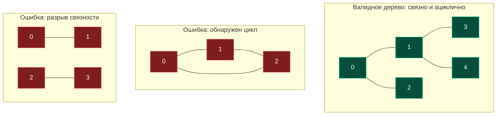

> *«Всякое дерево держится на строгом балансе: убери одно ребро — распадется связь, добавь одно — родится цикл».*  
> — Леонард Эйлер

## Фундаментальные законы сетей: Что делает граф деревом?

В задаче [[4. Redundant Connection]] нам гарантировали, что исходный граф был связным деревом до добавления кабеля.

Что делать, если на вход поступает произвольный массив из $N$ вершин и случайный набор ребер? Как математически строго и алгоритмически быстро определить: является ли данный граф **Валидным деревом (Valid Tree)**?

Задача **Graph Valid Tree** (LeetCode №261) проверяет знание фундаментальных дискретных свойств структур данных, используемых в архитектуре систем (топологии серверов, деревья разбора AST в компиляторах, DOM-деревья).

С точки зрения теории графов, **Дерево — это связный неориентированный ациклический граф**:
1. **Ацикличность:** в графе нет ни одного цикла.
2. **Связность:** граф состоит ровно из одной компоненты связности.



---

## Математический Fast Fail: Закон N - 1 ребер

Типичная ошибка новичка — сразу бросаться писать DFS/BFS или строить DSU без предварительного анализа размерностей.

Фундаментальная теорема теории графов гласит: **любое дерево из $N$ вершин содержит ровно $N - 1$ ребер**.
- Если число ребер $> N - 1$, по принципу Дирихле в графе **гарантированно присутствует хотя бы один цикл**.
- Если число ребер $< N - 1$, граф **гарантированно распадается на несвязные компоненты**.

> [!TIP]
> **Паттерн Fast Fail на собеседовании**  
> Начните реализацию с проверки: `if len(edges) != n - 1 { return false }`.  
> Это условие выполняется за $O(1)$ времени. Если на вход подан граф с миллионом вершин и двумя миллионами ребер, ваш код вернет верный ответ за долю наносекунды, не потратив ни одного байта оперативной памяти.

Однако одного правила $E = N - 1$ недостаточно: граф может содержать цикл в одной части и быть изолированным в другой. Нам требуется детектор циклов.

---

## Архитектура решения через DSU

Для проверки ацикличности DSU превосходит DFS по показателям Mechanical Sympathy:
- Не требует построения списков смежности `[][]int`.
- Память выделяется в два непрерывных среза `parent` и `size`.
- Процессор читает ребра последовательно, обеспечивая максимальную утилизацию кэша L1.

```go
package main

type DSU struct {
	parent []int
	size   []int
}

func NewDSU(n int) *DSU {
	dsu := &DSU{
		parent: make([]int, n),
		size:   make([]int, n),
	}
	for i := 0; i < n; i++ {
		dsu.parent[i] = i
		dsu.size[i] = 1
	}
	return dsu
}

func (d *DSU) Find(x int) int {
	if d.parent[x] != x {
		d.parent[x] = d.Find(d.parent[x])
	}
	return d.parent[x]
}

func (d *DSU) Union(x, y int) bool {
	rootX := d.Find(x)
	rootY := d.Find(y)

	if rootX == rootY {
		return false // Цикл найден
	}

	if d.size[rootX] < d.size[rootY] {
		d.parent[rootX] = rootY
		d.size[rootY] += d.size[rootX]
	} else {
		d.parent[rootY] = rootX
		d.size[rootX] += d.size[rootY]
	}

	return true
}

// validTree определяет, является ли граф корректным связным деревом.
// Временная сложность: O(N * α(N)) ≈ O(N).
// Пространственная сложность: O(N) для DSU.
func validTree(n int, edges [][]int) bool {
	// 1. Быстрая математическая проверка инварианта дерева
	if len(edges) != n-1 {
		return false
	}

	// 2. Инициализация DSU
	dsu := NewDSU(n)

	// 3. Проверка на отсутствие циклов
	for _, edge := range edges {
		u, v := edge[0], edge[1]
		if !dsu.Union(u, v) {
			return false // Обнаружен цикл
		}
	}

	// Теорема: если в графе из N вершин ровно N - 1 ребер и нет циклов,
	// он ГАРАНТИРОВАННО является одним связным деревом.
	return true
}
```

> [!NOTE]
> **Под капотом: Математическое доказательство связности**  
> Почему в коде выше нет проверки `components == 1`?  
> Если в графе из $N$ вершин ровно $N - 1$ ребер и ни одно из них не замкнуло цикл, то каждое из $N - 1$ ребер гарантированно соединило две ранее разобщенные компоненты. Итоговое число компонент связности: $N - (N - 1) = 1$. Проверка числа компонент избыточна и экономит такты процессора.

---

## Резюме

1. **Инвариант дерева:** Ровно $N - 1$ ребер для $N$ вершин — обязательное условие для быстрого отсечения некорректных графов за $O(1)$.
2. **Ацикличность и связность:** При $E = N - 1$ отсутствие циклов автоматически гарантирует связность всей системы.
3. **Эффективность DSU:** Проверка занимает линейное время $O(N)$ и исключает накладные расходы на рекурсивный стек вызовов.

Завершим блок систем непересекающихся множеств разбором задачи с матричным представлением графа: [[7. Number of Provinces]].