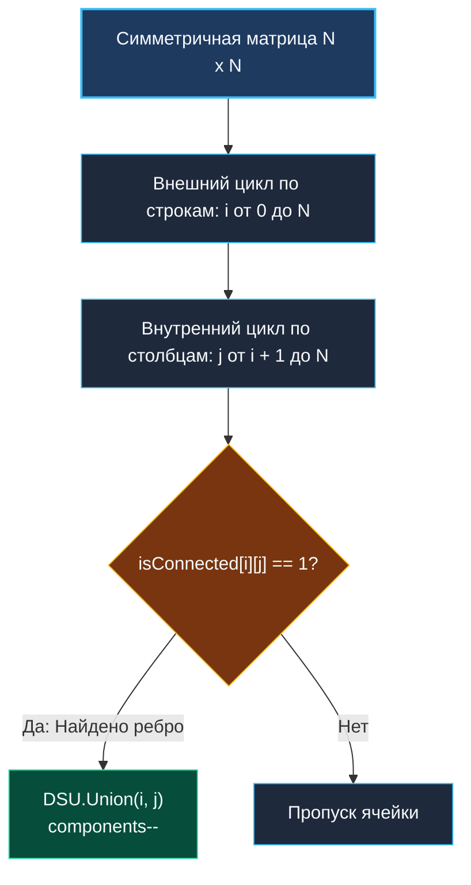

> *«Представление данных определяет пределы алгоритма: измените матрицу на список — и время изменится вместе с ними».*  
> — Брайан Керниган

## Скрытые графы: Матрица смежности и кластеризация

В предыдущих задачах ([[3. Number of Connected Components]] и [[6. Graph Valid Tree]]) топология графа передавалась в виде **Списка ребер (Edge List)**.

В корпоративных хранилищах и аналитических системах графы нередко представлены в виде матриц. Задача **Number of Provinces** (LeetCode №547) — классический пример такой постановки.

**Условие:** Дано $N$ городов. Города соединены дорогами напрямую или транзитивно (через промежуточные города). **Провинция** — это замкнутая компонента связности взаимосвязанных городов.  
Вам передана матрица смежности `isConnected` размером $N \times N$, где `isConnected[i][j] = 1`, если между городами $i$ и $j$ существует прямой путь, и `0` в противном случае.  
Требуется вернуть общее число провинций.

С алгоритмической точки зрения задачи «Number of Provinces» и «Number of Connected Components» эквивалентны: обе ищут число компонент связности. Ключевое отличие — во входной структуре данных (матрица смежности вместо списка ребер).

---

## Архитектурное сравнение: Edge List против Adjacency Matrix

| Параметр | Список ребер (`edges [][]int`) | Матрица смежности (`isConnected [][]int`) |
|---|---|---|
| **Разреженные графы ($E \ll V^2$)** | $O(E)$ времени (очень быстро) | $O(V^2)$ времени (избыточно) |
| **Плотные графы ($E \approx V^2$)** | $O(V^2)$ времени | $O(V^2)$ времени |
| **Проверка наличия ребра $(u, v)$** | $O(E)$ или $O(1)$ с хэш-таблицей | $O(1)$ по прямой индексации `matrix[u][v]` |

В матрице смежности мы **обязаны** прочитать ячейки, даже если граф не содержит ни одного ребра. Время алгоритма неустранимо ограничено снизу как $\Omega(N^2)$.

> [!WARNING]
> **Ловушка / Gotcha: Дублирование работы и диагональ**  
> В неориентированном графе матрица смежности симметрична: `isConnected[i][j] == isConnected[j][i]`. Кроме того, главная диагональ всегда тривиальна: `isConnected[i][i] == 1` (город связан сам с собой).  
> Двойной цикл от $0$ до $N$ выполнит вдвое больше работы и попытается объединять узлы сами с собой.  
> **Оптимизация:** итерируйтесь только по **верхнему треугольнику** матрицы (`j > i`). Это сокращает число итераций ровно в два раза: с $N^2$ до $\frac{N(N - 1)}{2}$.



---

## Идиоматичная реализация на Go

```go
package main

// DSU структура со счетчиком компонент
type DSU struct {
	parent     []int
	size       []int
	components int
}

func NewDSU(n int) *DSU {
	dsu := &DSU{
		parent:     make([]int, n),
		size:       make([]int, n),
		components: n, // Изначально каждый город — отдельная провинция
	}
	for i := 0; i < n; i++ {
		dsu.parent[i] = i
		dsu.size[i] = 1
	}
	return dsu
}

func (d *DSU) Find(x int) int {
	if d.parent[x] != x {
		d.parent[x] = d.Find(d.parent[x]) // Сжатие путей
	}
	return d.parent[x]
}

func (d *DSU) Union(x, y int) bool {
	rootX := d.Find(x)
	rootY := d.Find(y)

	if rootX == rootY {
		return false
	}

	if d.size[rootX] < d.size[rootY] {
		d.parent[rootX] = rootY
		d.size[rootY] += d.size[rootX]
	} else {
		d.parent[rootY] = rootX
		d.size[rootX] += d.size[rootY]
	}

	d.components--
	return true
}

// findCircleNum находит число провинций в матрице смежности.
// Временная сложность: O(N^2) для обхода верхнего треугольника матрицы.
// Пространственная сложность: O(N) для структуры DSU.
func findCircleNum(isConnected [][]int) int {
	n := len(isConnected)
	if n == 0 {
		return 0
	}

	dsu := NewDSU(n)

	// Итерируемся строго по верхнему треугольнику матрицы
	for i := 0; i < n; i++ {
		for j := i + 1; j < n; j++ {
			if isConnected[i][j] == 1 {
				dsu.Union(i, j)
			}
		}
	}

	return dsu.components
}
```

> [!NOTE]
> **Mechanical Sympathy: Порядок обхода строк (Row-major order)**  
> Внешний цикл по $i$ и внутренний по $j$ гарантируют последовательный доступ к ячейкам `isConnected[i]`. Это обеспечивает максимальный hit rate в L1 Data Cache. Обход по столбцам (сначала $j$, затем $i$) привел бы к постоянным скачкам по памяти и деградации производительности.

---

## Резюме раздела Union-Find

1. **Модель связности:** DSU — наиболее компактный инструмент для решения задач динамической связности и кластеризации в неориентированных графах.
2. **Амортизация:** Path Compression и Union by Size дают практическое время $O(1)$ на запрос.
3. **Data-Oriented подход:** Разделение бизнес-сущностей и скалярных индексов DSU позволяет писать быстрый и расширяемый код.

Мы завершили разбор теории графов и систем непересекающихся множеств.  
Переходим к следующему мощному инструменту алгоритмического инженера — пирамидам и приоритетным очередям: [[1. Теория. Кучи]].