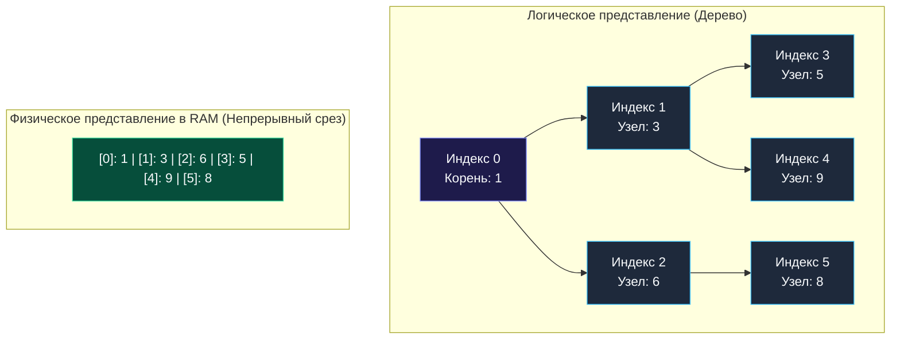

> *«Приоритетная очередь — это инструмент, позволяющий навести строгий локальный порядок в хаосе глобального потока событий».*  
> — Дональд Эрвин Кнут

## Две «Кучи» в Computer Science: Терминологический водораздел

Прежде чем приступать к алгоритмам, необходимо строго разграничить два понятия, которые в русском языке звучат одинаково:

1. **Куча в памяти (Heap Memory):** Область оперативной памяти, куда компилятор Go (в результате Escape Analysis) размещает переменные, чье время жизни выходит за рамки стекового фрейма функции. Уборкой этой памяти занимается Garbage Collector (GC).
2. **Структура данных «Куча» (Heap Data Structure / Priority Queue):** Специализированное двоичное дерево, о котором пойдет речь в данном разделе.

В контексте алгоритмических секций и LeetCode термин «Куча» **всегда** обозначает структуру данных — в частности, **Двоичную кучу (Binary Heap)**, служащую базисом для реализации **Очередей с приоритетом (Priority Queues)**.

---

## Что такое двоичная куча?

Двоичная куча — это бинарное дерево, удовлетворяющее двум строгим инвариантам:

1. **Свойство формы (Complete Binary Tree):** Дерево заполняется строго по уровням сверху вниз и слева направо. Не может существовать правого потомка при отсутствии левого.
2. **Свойство кучи (Heap Property):**
   - **Min-Heap (Минимальная куча):** Значение любого родительского узла меньше либо равно значениям его потомков. Корень дерева всегда хранит **абсолютный минимум**.
   - **Max-Heap (Максимальная куча):** Значение любого родительского узла больше либо равно значениям его потомков. Корень дерева всегда хранит **абсолютный максимум**.

В отличие от сбалансированных деревьев поиска (BST, AVL, Red-Black), куча не поддерживает полный порядок слева направо. Куча гарантирует только вертикальный инвариант (родитель $\le$ потомок). Между узлами одного уровня (братьями) порядок не определен.

---

## Mechanical Sympathy: Идеальная локальность кэша

В классических деревьях каждый узел представлен отдельной структурой с указателями (`Left *Node`, `Right *Node`), разбросанными по куче и вызывающими постоянные Cache Misses (Pointer Chasing).

Благодаря жесткому «Свойству формы» двоичной куче **указатели не требуются вовсе**. Двоичная куча компактно размещается в непрерывном срезе Go (`[]int`):

Для любого узла с индексом $i$:
- **Левый потомок:** $2i + 1$
- **Правый потомок:** $2i + 2$
- **Родитель:** $\lfloor(i - 1) / 2\rfloor$



Современный CPU демонстрирует пиковую производительность на таких структурах:
- **Аппаратный Prefetcher** подгружает соседние элементы кучи в L1 Data Cache линиями по $64$ байта.
- **Битовая арифметика:** Индекс левого потомка $2i + 1$ вычисляется за $1$ такт процессора с помощью сдвига влево: `(i << 1) | 1`.
- **Исторический факт:** Таймеры в рантайме Go (`runtime/time.go`) исторически строились именно на 4-арной куче на базе плоского среза для минимизации задержек шедулера.

---

## Базовые операции и их асимптотика

1. **Вставка (Push) — $O(\log N)$:**  
   Элемент добавляется в конец среза (`append`). Затем вызывается операция **Sift Up (Всплытие)**: элемент сравнивается с родителем и поднимается вверх по дереву до восстановления инварианта.
2. **Извлечение корня (Pop) — $O(\log N)$:**  
   Корень `arr[0]` меняется местами с последним элементом среза `arr[len-1]`. Срез усекается на единицу за $O(1)$. Новый корень погружается вниз с помощью операции **Sift Down (Просеивание)**, меняясь местами с наименьшим из своих потомков.
3. **Чтение экстремума (Peek) — $O(1)$:**  
   Прямой доступ к корню `arr[0]`.

> [!TIP]
> **Собеседование: Построение кучи за $O(N)$ (Floyd's Heapify)**  
> На вопрос: *«За сколько можно превратить неотсортированный срез из $N$ элементов в кучу?»* новички часто отвечают $O(N \log N)$, подразумевая $N$ вставок.  
> Это ошибка. **Алгоритм Флойда (`heap.Init`)** строит кучу за линейное время **$O(N)$**. Он выполняет Sift Down в обратном порядке от середины массива к корню: $\sum_{h=0}^{\lfloor\log N\rfloor} \frac{N}{2^{h+1}} \cdot O(h) = O(N)$.

---

## Идиоматичная реализация Min-Heap на Go (`container/heap`)

В стандартной библиотеке Go нет готового дженерик-типа `PriorityQueue`. Go предоставляет пакет `container/heap`, содержащий алгоритмы просеивания, но требующий реализации интерфейса `heap.Interface` (включающего `sort.Interface`):

```go
package main

import (
	"container/heap"
	"fmt"
)

// IntHeap реализует heap.Interface для среза целых чисел (Min-Heap).
type IntHeap []int

// Методы sort.Interface
func (h IntHeap) Len() int           { return len(h) }
func (h IntHeap) Less(i, j int) bool { return h[i] < h[j] } // Для Max-Heap: h[i] > h[j]
func (h IntHeap) Swap(i, j int)      { h[i], h[j] = h[j], h[i] }

// Методы heap.Interface (требуют указательного ресивера для изменения длины среза)
func (h *IntHeap) Push(x any) {
	*h = append(*h, x.(int))
}

func (h *IntHeap) Pop() any {
	old := *h
	n := len(old)
	x := old[n-1]
	*h = old[0 : n-1]
	return x
}

func ExampleHeap() {
	h := &IntHeap{9, 3, 6, 1, 5, 8}
	heap.Init(h) // Линейное построение кучи на месте O(N)

	heap.Push(h, 2) // Добавление за O(log N)

	minVal := heap.Pop(h).(int) // Извлечение минимума (1) за O(log N)
	fmt.Println("Минимум:", minVal)
}
```

> [!WARNING]
> **Ловушка / Gotcha: Боксинг интерфейсов и Escape Analysis**  
> Контракт `heap.Interface` использует `any` (`interface{}`). При передаче примитивных типов (`int`) компилятор может упаковывать значение в интерфейсный бокс. В высоконагруженных циклах (HFT, стриминг логов) это может порождать аллокации в куче. В продакшене для критических путей нередко пишут легковесные кастомные дженерик-кучи `type Heap[T cmp.Ordered] []T`, полностью избавленные от аллокаций.

---

## Резюме

1. **Локальный порядок:** Куча поддерживает частичную упорядоченность, гарантируя мгновенный доступ к экстремуму за $O(1)$.
2. **Zero Pointer Overhead:** Расположение в плоском срезе обеспечивает максимальную скорость работы с кэшем L1.
3. **Линейный Heapify:** Построение кучи из существующего массива занимает $O(N)$, а не $O(N \log N)$.

В следующей статье мы разберем главный паттерн практического применения куч в прикладных системах: [[2. Задачи Top K]].