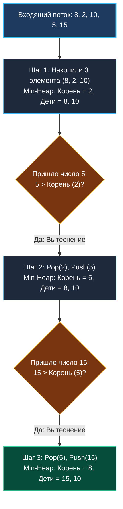

> *«Не сортируйте всё море данных, если вам нужно лишь зачерпнуть горсть лучших жемчужин».*  
> — Брайан Керниган

## Паттерн Top K: Выделение ключевых сущностей

В высоконагруженных бэкенд-системах редко требуется упорядочивать весь массив данных. Бизнес-логика почти всегда оперирует топ-выборками:
- $10$ наиболее популярных поисковых запросов за последний час (Trending Topics).
- $5$ ближайших к клиенту курьеров в гео-сервисе (K Closest).
- $100$ наиболее подозрительных IP-адресов в антифрод-шлюзе (Top K Frequent).

Когда в условии задачи или бизнес-требованиях фигурируют формулировки: *«наибольшие»*, *«наименьшие»*, *«наиболее частые»* в сочетании с конкретным лимитом **$K$**, первым выбором инженера должен стать **паттерн «Куча размера K»**.

---

## Наивный подход: Полная сортировка

Интуитивное решение новичка — загрузить все элементы в срез, отсортировать его и взять первые $K$ значений:

```go
func getTopKNaive(nums []int, k int) []int {
	slices.SortFunc(nums, func(a, b int) int {
		return b - a // Сортировка по убыванию
	})
	return nums[:k]
}
```

> [!WARNING]
> **Ловушка / Gotcha: Проблема бесконечных потоков и памяти**  
> Полная сортировка требует $O(N \log N)$ времени и предполагает, что весь массив находится в оперативной памяти.  
> Если `nums` — это суточный лог транзакций объемом в $200\text{ ГБ}$, загрузить его в RAM для `slices.Sort` невозможно. Попытка применить внешнюю дисковую сортировку (External Sort) приведет к деградации дисковой подсистемы I/O. Нам необходим алгоритм, работающий в **потоковом режиме (Streaming)** с константной памятью $O(K)$.

---

## Архитектура решения: Инвертированный выбор кучи

Ключевой математический парадокс паттерна Top K:
- **Для поиска $K$ НАИБОЛЬШИХ элементов используется Min-Heap (Минимальная куча).**
- **Для поиска $K$ НАИМЕНЬШИХ элементов используется Max-Heap (Максимальная куча).**

### Почему для поиска максимумов нужна именно Min-Heap?

Пусть $K = 3$. Мы ищем $3$ наиболее крупных числа в потоке.  
Мы инициализируем Min-Heap размера $3$. В корне `heap[0]` всегда находится **наименьший элемент из тройки лидеров** (слабейший кандидат в топе).

Когда из потока данных поступает очередной элемент $X$:
1. Мы сравниваем $X$ с корнем кучи.
2. Если $X \le \text{корень}$, новый элемент не может претендовать на место в топ-3 — он отбрасывается за $O(1)$.
3. Если $X > \text{корень}$, слабый кандидат вытесняется (`Pop`), а $X$ добавляется в кучу (`Push`), занимая свое место за $O(\log K)$.



---

## Mechanical Sympathy: Резидентность в L1-кэше

Оценим алгоритм с точки зрения архитектуры процессора:

1. **Память:** Срез кучи имеет фиксированный размер $K$. Для $K = 10$ срез занимает всего $80$ байт.
2. **L1 Data Cache:** Этот массив целиком и постоянно находится в сверхбыстром кэше первого уровня L1 ($32\text{–}64\text{ КБ}$).
3. **Отсечение за $O(1)$:** Для подавляющего большинства элементов потока условие `val <= h[0]` вычисляется за $1\text{–}2$ процессорных такта без обращения к системной шине памяти.
4. **Временная сложность:** $O(N \log K)$. Поскольку $K \ll N$ (например, $K = 10$, $N = 10^7$), логарифм $\log_2 10 \approx 3.32$ является пренебрежимо малой константой: алгоритм работает практически линейно.

> [!TIP]
> **Сравнение: Min-Heap против Quickselect**  
> На собеседовании вас могут спросить: *«Алгоритм Quickselect находит k-й элемент в среднем за $O(N)$. Зачем использовать кучу за $O(N \log K)$?»*  
> **Ответ:** Quickselect требует хранения всего массива в памяти и мутирует его in-place. Он неприменим для потоковых данных (Kafka, gRPC-стримы) и терабайтных файлов. Куча размера $K$ универсальна, потокобезопасна и не требует знания общего числа элементов $N$.

---

## Резюме: Шаблон решения задач Top K

1. **Выбор инварианта:** для Top K максимальных — Min-Heap; для Top K минимальных — Max-Heap.
2. **Преаллокация памяти:** инициализируйте срез с `capacity = K` во избежание реаллокаций.
3. **Оптимизация замены:** используйте `h[0] = val; heap.Fix(&h, 0)` вместо связки `Pop() + Push()`.

Перейдем к фундаментальной задаче этого семейства: [[3. Kth Largest Element in Array]].