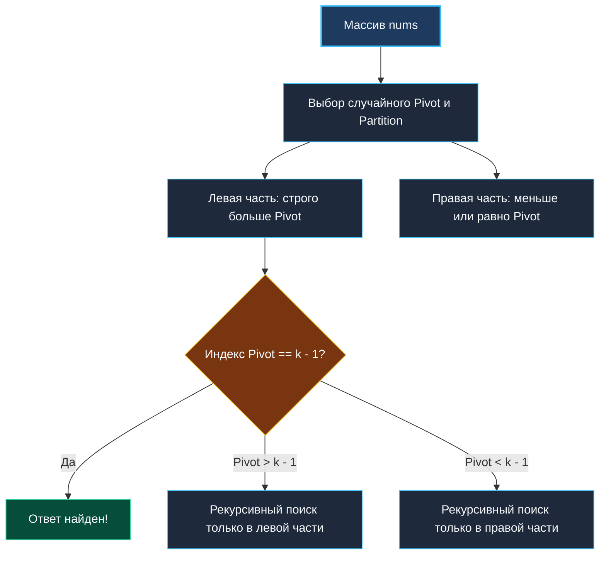

> *«Быстрая сортировка делит мир надвое, но мудрый алгоритм отбрасывает ту половину, в которой нет ответа».*  
> — Чарльз Энтони Ричард Хоар

## K-й наибольший элемент в массиве

Задача **Kth Largest Element in an Array** (LeetCode №215) — абсолютная классика алгоритмических собеседований в BigTech.

**Условие:** Дан массив целых чисел `nums` и целое число `k`. Требуется вернуть $k$-й по величине элемент в массиве.  
*Примечание:* Ищется $k$-й элемент в отсортированном порядке, а не $k$-й уникальный элемент (дубликаты учитываются).

Задача служит эталонным тестом на понимание компромиссов между временем исполнения, потреблением оперативной памяти и механикой кэша CPU. Ниже детально сопоставлены три ведущих подхода: **pdqsort**, **Min-Heap** и **Quickselect**.

---

## Подход 1: Сортировка среза (pdqsort в Go)

```go
package main

import "slices"

func findKthLargestSort(nums []int, k int) int {
	slices.Sort(nums)
	return nums[len(nums)-k]
}
```

> [!NOTE]
> **Под капотом: Pattern-Defeating Quicksort (pdqsort)**  
> Начиная с Go 1.19, стандартный пакет сортировки использует алгоритм **pdqsort**. Он работает за $O(N)$ на почти отсортированных данных и гарантирует $O(N \log N)$ в худшем случае. За счет расположения данных in-place на массивах до $10^5$ элементов этот подход на практике чрезвычайно быстр. Однако он требует загрузки всех данных в RAM и модифицирует срез.

---

## Подход 2: Min-Heap размера K (Потоковый стандарт)

Для нахождения $K$ максимальных элементов используется **Min-Heap размера $K$** (см. [[2. Задачи Top K]]).

```go
package main

import "container/heap"

type MinHeap []int

func (h MinHeap) Len() int           { return len(h) }
func (h MinHeap) Less(i, j int) bool { return h[i] < h[j] }
func (h MinHeap) Swap(i, j int)      { h[i], h[j] = h[j], h[i] }

func (h *MinHeap) Push(x any) {
	*h = append(*h, x.(int))
}

func (h *MinHeap) Pop() any {
	old := *h
	n := len(old)
	x := old[n-1]
	*h = old[0 : n-1]
	return x
}

// findKthLargestHeap находит k-й наибольший элемент через кучу.
// Временная сложность: O(N * log K).
// Пространственная сложность: O(K) — идеально для потоковых данных.
func findKthLargestHeap(nums []int, k int) int {
	h := make(MinHeap, 0, k)

	for _, num := range nums {
		if h.Len() < k {
			heap.Push(&h, num)
		} else if num > h[0] {
			// Оптимизация Senior: замена корня на месте без перевыделения слайса
			h[0] = num
			heap.Fix(&h, 0)
		}
	}

	return h[0]
}
```

> [!TIP]
> **Mechanical Sympathy: Оптимизация через `heap.Fix`**  
> Замена пары `heap.Pop(&h)` + `heap.Push(&h, num)` на `h[0] = num` с последующим вызовом `heap.Fix(&h, 0)` исключает вызовы `append` и манипуляции с длиной среза. `heap.Fix` выполняет чистый Sift Down за $O(\log K)$ без аллокаций.

---

## Подход 3: Quickselect (Алгоритм Хоара)

Если требуется математически строгое среднее время $O(N)$, стандартом является **Quickselect**.  
В отличие от классической быстрой сортировки, алгоритм рекурсивно спускается только в ту половину массива, которая содержит целевой индекс `k - 1`.



```go
package main

import "math/rand/v2"

// findKthLargest находит k-й наибольший элемент за O(N) в среднем через Quickselect.
func findKthLargest(nums []int, k int) int {
	targetIndex := k - 1 // 0-based индекс искомого элемента в убывающем порядке

	var quickSelect func(left, right int) int
	quickSelect = func(left, right int) int {
		if left == right {
			return nums[left]
		}

		// Рандомизация опорного элемента (math/rand/v2) для защиты от худшего случая O(N^2)
		pivotIdx := left + rand.IntN(right-left+1)
		nums[pivotIdx], nums[right] = nums[right], nums[pivotIdx]
		pivot := nums[right]

		storeIndex := left
		for i := left; i < right; i++ {
			if nums[i] > pivot { // Сортировка по убыванию
				nums[storeIndex], nums[i] = nums[i], nums[storeIndex]
				storeIndex++
			}
		}

		nums[storeIndex], nums[right] = nums[right], nums[storeIndex]

		if storeIndex == targetIndex {
			return nums[storeIndex]
		} else if storeIndex > targetIndex {
			return quickSelect(left, storeIndex-1)
		} else {
			return quickSelect(storeIndex+1, right)
		}
	}

	return quickSelect(0, len(nums)-1)
}
```

---

## Архитектурное резюме: Что выбрать на практике?

| Критерий | Min-Heap размера $K$ | Quickselect |
|---|---|---|
| **Время** | $O(N \log K)$ детерминированно | $O(N)$ в среднем, $O(N^2)$ в худшем |
| **Память** | $O(K)$ | $O(1)$ при итеративной реализации |
| **Потоковые данные (Streaming)** | Поддерживает (данные с сокета/Kafka) | Не поддерживает (требует полный массив в RAM) |
| **Мутация входа** | Не изменяет входной срез | Переставляет элементы in-place |

В следующей статье мы объединим кучу с хэш-таблицей для ранжирования по частоте: [[4. Top K Frequent Elements]].