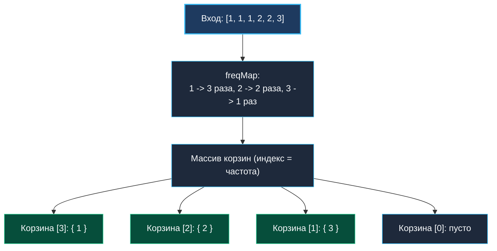

> *«Знание того, что происходит часто, важнее знания того, что происходит вообще».*  
> — Брайан Керниган

## Бизнес-ценность частотности: От абстракции к аналитике

В задаче [[3. Kth Largest Element in Array]] мы находили $k$-й по величине элемент, ранжируя сами числовые значения. В промышленной разработке чаще требуется ранжировать сущности по **частоте их появления (Frequency)**:
- **Rate Limiting / WAF:** выявление $10$ наиболее активных IP-адресов, создающих паразитный трафик.
- **E-Commerce:** вывод $5$ наиболее продаваемых товаров на главной витрине (Trending Items).
- **Кэширование (LFU):** определение наименее востребованных ключей для вытеснения из оперативной памяти.

Задача **Top K Frequent Elements** (LeetCode №347) требует вернуть $K$ наиболее часто встречающихся элементов из массива.

Решение задачи строится в два этапа:
1. **Агрегация:** подсчет частот через `map[int]int`.
2. **Ранжирование:** выбор топ-$K$ кандидатов с помощью **Min-Heap** либо **Bucket Sort**.

---

## Шаг 1: Агрегация частот

```go
freqMap := make(map[int]int, len(nums))
for _, num := range nums {
	freqMap[num]++
}
```

> [!NOTE]
> **Mechanical Sympathy: Емкость хэш-таблицы**  
> Предварительное задание `capacity` через `make(map[int]int, len(nums))` минимизирует количество эвакуаций бакетов (map growth/rehashing) в рантайме Go, избавляя сборщик мусора от лишней работы.

---

## Подход 1: Min-Heap размера K

Мы применяем Min-Heap, где элементы упорядочены **по частоте встречаемости**. Корень кучи всегда содержит элемент с минимальной частотой из текущего топ-$K$.

```go
package main

import "container/heap"

type Item struct {
	val   int
	count int
}

type MinHeap []Item

func (h MinHeap) Len() int           { return len(h) }
func (h MinHeap) Less(i, j int) bool { return h[i].count < h[j].count } // Сравнение по частоте
func (h MinHeap) Swap(i, j int)      { h[i], h[j] = h[j], h[i] }

func (h *MinHeap) Push(x any) {
	*h = append(*h, x.(Item))
}

func (h *MinHeap) Pop() any {
	old := *h
	n := len(old)
	x := old[n-1]
	*h = old[0 : n-1]
	return x
}

// topKFrequentHeap находит K самых частых элементов через Min-Heap.
// Временная сложность: O(N * log K).
// Пространственная сложность: O(N) для map + O(K) для кучи.
func topKFrequentHeap(nums []int, k int) []int {
	freqMap := make(map[int]int)
	for _, num := range nums {
		freqMap[num]++
	}

	h := make(MinHeap, 0, k)

	for val, count := range freqMap {
		if h.Len() < k {
			heap.Push(&h, Item{val: val, count: count})
		} else if count > h[0].count {
			h[0] = Item{val: val, count: count}
			heap.Fix(&h, 0)
		}
	}

	res := make([]int, 0, k)
	for _, item := range h {
		res = append(res, item.val)
	}

	return res
}
```

---

## Подход 2: Корзинная сортировка (Bucket Sort) за O(N)

Частота любого числа не может превышать общего размера массива $N$.  
Это позволяет применить **Bucket Sort**: массив корзин размером $N + 1$, где **индекс** — это частота, а **значение** — срез элементов с данной частотой.



```go
package main

// topKFrequent находит K частых элементов за линейное время O(N) через Bucket Sort.
func topKFrequent(nums []int, k int) []int {
	freqMap := make(map[int]int)
	for _, num := range nums {
		freqMap[num]++
	}

	// Создаем корзины размером len(nums) + 1
	buckets := make([][]int, len(nums)+1)
	for val, count := range freqMap {
		buckets[count] = append(buckets[count], val)
	}

	res := make([]int, 0, k)
	// Сбор элементов с конца (от максимальной частоты к минимальной)
	for i := len(buckets) - 1; i >= 0 && len(res) < k; i-- {
		if len(buckets[i]) > 0 {
			for _, val := range buckets[i] {
				res = append(res, val)
				if len(res) == k {
					return res
				}
			}
		}
	}

	return res
}
```

---

## Архитектурное сравнение подходов

1. **Bucket Sort ($O(N)$ время, $O(N)$ память):**
   - Максимальная теоретическая скорость.
   - **Недостаток в Enterprise:** при $N = 10^7$ создание разреженного массива корзин `make([][]int, N+1)` выделит миллионы заголовков слайсов (`SliceHeader` по $24$ байта), порождая колоссальное давление на память и GC.
2. **Min-Heap ($O(N \log K)$ время, $O(K)$ дополнительная память):**
   - Идеально для потоковой аналитики (Kafka-консьюмеры, streaming aggregators).
   - Размер кучи строго равен $K$ и полностью помещается в кэш процессора.

В следующей статье мы применим кучи для слияния распределенных потоков: [[5. Merge K Sorted Lists]].