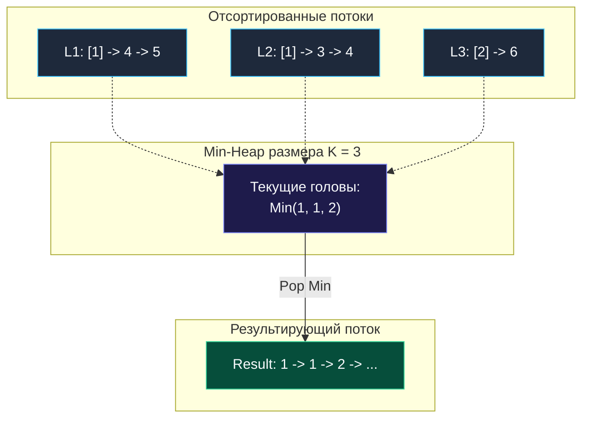

> *«Слияние упорядоченных последовательностей — самый естественный способ построения порядка из разрозненных фрагментов».*  
> — Джон фон Нейман

## Оркестрация потоков: Слияние отсортированных данных

В архитектуре высоконагруженных хранилищ и баз данных регулярно возникает задача **агрегации упорядоченных шардов**.  
Представьте кластер из $K$ узлов шардированной БД (PostgreSQL, ClickHouse). Выполняется запрос: `SELECT * FROM logs ORDER BY timestamp ASC`. Каждый шард возвращает клиенту *свой* отсортированный поток данных.  
Задача балансировщика — на лету объединить эти $K$ потоков в единую глобально отсортированную последовательность, не буферизируя терабайты данных в RAM.

Эта механика лежит в основе внешней сортировки (External Merge Sort). Задача **Merge k Sorted Lists** (LeetCode №23) моделирует данный процесс на связных списках.

**Условие:** Дан массив из $k$ связных списков, каждый из которых упорядочен по возрастанию. Требуется объединить их в один отсортированный связный список и вернуть его голову.

---

## Подход 1: Min-Heap (Потоковая агрегация)

В любой момент времени наименьший из невыбранных элементов гарантированно находится среди **голов (первых элементов)** текущих $K$ списков.

**Алгоритм:**
1. Помещаем головы всех непустых списков в Min-Heap.
2. Извлекаем минимальный узел из кучи (`Pop`). Этот узел является глобальным минимумом текущего состояния.
3. Добавляем его в результирующий список.
4. Если у извлеченного узла существует следующий элемент (`node.Next != nil`), добавляем его в кучу (`Push`).
5. Повторяем шаг до полного исчерпания кучи.



```go
package main

import "container/heap"

type ListNode struct {
	Val  int
	Next *ListNode
}

// MinHeap для указателей на узлы списка
type MinHeap []*ListNode

func (h MinHeap) Len() int           { return len(h) }
func (h MinHeap) Less(i, j int) bool { return h[i].Val < h[j].Val }
func (h MinHeap) Swap(i, j int)      { h[i], h[j] = h[j], h[i] }

func (h *MinHeap) Push(x any) {
	*h = append(*h, x.(*ListNode))
}

func (h *MinHeap) Pop() any {
	old := *h
	n := len(old)
	x := old[n-1]
	*h = old[0 : n-1]
	return x
}

// mergeKListsHeap объединяет K списков через Min-Heap.
// Временная сложность: O(N * log K), где N — суммарное число узлов, K — число списков.
// Пространственная сложность: O(K) для кучи.
func mergeKListsHeap(lists []*ListNode) *ListNode {
	h := &MinHeap{}
	heap.Init(h)

	for _, list := range lists {
		if list != nil {
			heap.Push(h, list)
		}
	}

	// Паттерн Dummy Node для упрощения работы с головой списка
	dummy := &ListNode{}
	curr := dummy

	for h.Len() > 0 {
		minNode := heap.Pop(h).(*ListNode)
		curr.Next = minNode
		curr = curr.Next

		if minNode.Next != nil {
			heap.Push(h, minNode.Next)
		}
	}

	return dummy.Next
}
```

---

## Подход 2: Разделяй и властвуй (Divide & Conquer)

Если все списки уже загружены в оперативную память, можно применить попарное слияние (Divide & Conquer) без использования дополнительных структур данных:

1. Сливаем списки попарно: $0$-й с $1$-м, $2$-й с $3$-м и т.д.
2. Количество списков уменьшается вдвое: с $K$ до $K/2$.
3. Повторяем процедуру за $\lceil\log_2 K\rceil$ раундов.

```go
package main

func mergeTwoLists(l1, l2 *ListNode) *ListNode {
	dummy := &ListNode{}
	curr := dummy

	for l1 != nil && l2 != nil {
		if l1.Val < l2.Val {
			curr.Next = l1
			l1 = l1.Next
		} else {
			curr.Next = l2
			l2 = l2.Next
		}
		curr = curr.Next
	}

	if l1 != nil {
		curr.Next = l1
	} else {
		curr.Next = l2
	}

	return dummy.Next
}

// mergeKLists объединяет K списков методом Divide & Conquer.
// Временная сложность: O(N * log K).
// Пространственная сложность: O(1) in-place при попарной склейке.
func mergeKLists(lists []*ListNode) *ListNode {
	if len(lists) == 0 {
		return nil
	}

	for len(lists) > 1 {
		var merged []*ListNode

		for i := 0; i < len(lists); i += 2 {
			l1 := lists[i]
			var l2 *ListNode
			if i+1 < len(lists) {
				l2 = lists[i+1]
			}
			merged = append(merged, mergeTwoLists(l1, l2))
		}

		lists = merged
	}

	return lists[0]
}
```

---

## Архитектурное сравнение

- **Min-Heap:** $O(K)$ памяти, идеально для потоковых данных (Lazy Evaluation / Streaming). Узлы считываются по одному по мере продвижения.
- **Divide & Conquer:** $O(1)$ памяти, превосходная производительность на массивах в оперативной памяти (отсутствует overhead на интерфейсы `container/heap`).

Далее мы разберем паттерн балансировки двух куч для расчета динамической медианы в реальном времени: [[6. Find Median from Data Stream]].