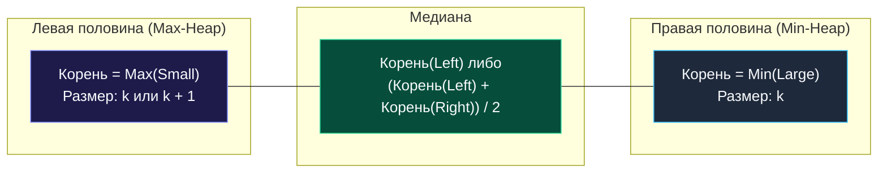

> *«Истинный баланс достигается не тогда, когда всё замерло, а когда две противоположные силы уравновешивают друг друга в непрерывном движении».*  
> — Дональд Эрвин Кнут

## Баланс двух сил: Динамический поиск медианы

В предыдущих задачах мы задействовали одиночные кучи для извлечения экстремумов. Однако в статистике и мониторинге (расчет 50-го перцентиля задержек p50 Latency в потоке метрик) требуется непрерывно удерживать фокус в **центре упорядоченных данных**.

Задача **Find Median from Data Stream** (LeetCode №295) — фундаментальный образец архитектурного проектирования потоковых структур.

**Условие:** Реализовать структуру `MedianFinder`:
1. `AddNum(num int)` — добавление нового числа из потока.
2. `FindMedian() float64` — возвращение медианы всех накопленных чисел за $O(1)$.

---

## Архитектурный паттерн: Two Heaps (Две кучи)

Чтобы не сортировать массив за $O(N \log N)$ на каждом шаге, мы делим числовой поток на две половины:

1. **Левая половина (Small):** хранит меньшую половину чисел. Нам требуется за $O(1)$ получать *наибольшее* из них. Для этого используется **Max-Heap**.
2. **Правая половина (Large):** хранит большую половину чисел. Нам требуется за $O(1)$ получать *наименьшее* из них. Для этого используется **Min-Heap**.



### Инварианты балансировки:

1. Любой элемент в `Max-Heap` $\le$ любого элемента в `Min-Heap`.
2. Длины куч различаются не более чем на $1$ элемент: `small.Len() >= large.Len()`.

При вызове `AddNum(num)`:
1. Добавляем `num` в `small` (Max-Heap).
2. Выталкиваем вершину из `small` и переносим в `large` (Min-Heap) — это гарантирует инвариант упорядоченности.
3. Если `large` стал больше `small`, возвращаем наименьший элемент из `large` обратно в `small`.

---

## Идиоматичная реализация на Go

```go
package main

import "container/heap"

// Универсальная куча с переключателем Min/Max
type IntHeap struct {
	arr   []int
	isMax bool
}

func (h IntHeap) Len() int           { return len(h.arr) }
func (h IntHeap) Swap(i, j int)      { h.arr[i], h.arr[j] = h.arr[j], h.arr[i] }
func (h IntHeap) Less(i, j int) bool {
	if h.isMax {
		return h.arr[i] > h.arr[j] // Max-Heap
	}
	return h.arr[i] < h.arr[j] // Min-Heap
}

func (h *IntHeap) Push(x any) {
	h.arr = append(h.arr, x.(int))
}

func (h *IntHeap) Pop() any {
	old := h.arr
	n := len(old)
	x := old[n-1]
	h.arr = old[0 : n-1]
	return x
}

type MedianFinder struct {
	small *IntHeap // Max-Heap для нижней половины
	large *IntHeap // Min-Heap для верхней половины
}

func Constructor() MedianFinder {
	s := &IntHeap{isMax: true}
	l := &IntHeap{isMax: false}
	heap.Init(s)
	heap.Init(l)
	return MedianFinder{small: s, large: l}
}

func (this *MedianFinder) AddNum(num int) {
	// 1. Помещаем в Max-Heap
	heap.Push(this.small, num)

	// 2. Балансировка: наибольший из малых уходит в правые
	heap.Push(this.large, heap.Pop(this.small))

	// 3. Поддержание инварианта размера: small.Len() >= large.Len()
	if this.large.Len() > this.small.Len() {
		heap.Push(this.small, heap.Pop(this.large))
	}
}

func (this *MedianFinder) FindMedian() float64 {
	if this.small.Len() > this.large.Len() {
		return float64(this.small.arr[0])
	}
	return float64(this.small.arr[0]+this.large.arr[0]) / 2.0
}
```

---

## Асимптотический анализ

- **`AddNum`:** $O(\log N)$ — фиксированное количество операций `Push`/`Pop`.
- **`FindMedian`:** $O(1)$ — прямое чтение вершин срезов `small.arr[0]` и `large.arr[0]`.
- **Память:** $O(N)$ для хранения потока чисел.

> [!TIP]
> **Вопрос на System Design: Ограниченный диапазон значений**  
> Если $99\%$ поступающих чисел лежат в диапазоне $[0, 100]$ (например, возраст или процентили задержек в миллисекундах), две кучи можно заменить плоским массивом счетчиков `counts [101]int`. Это обеспечит $O(1)$ на добавление и $O(1)$ на расчет медианы с нулевыми аллокациями.

Далее мы применим приоритетные очереди к моделированию процессорного времени: [[7. Task Scheduler]].